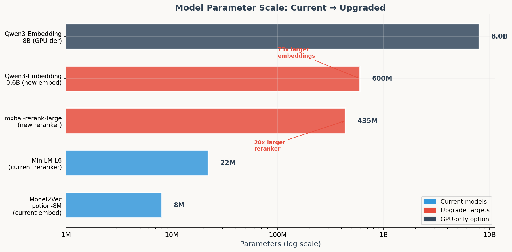
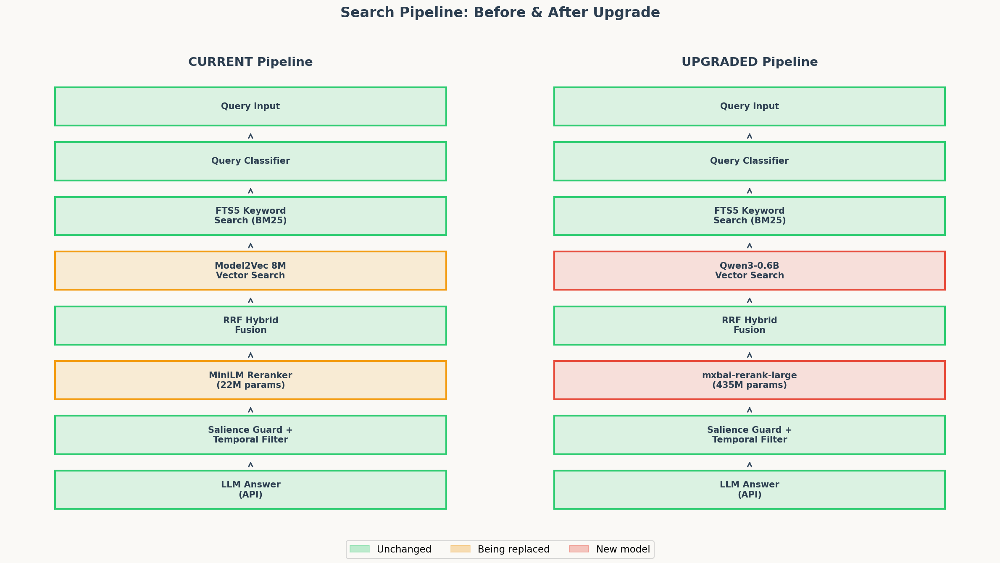
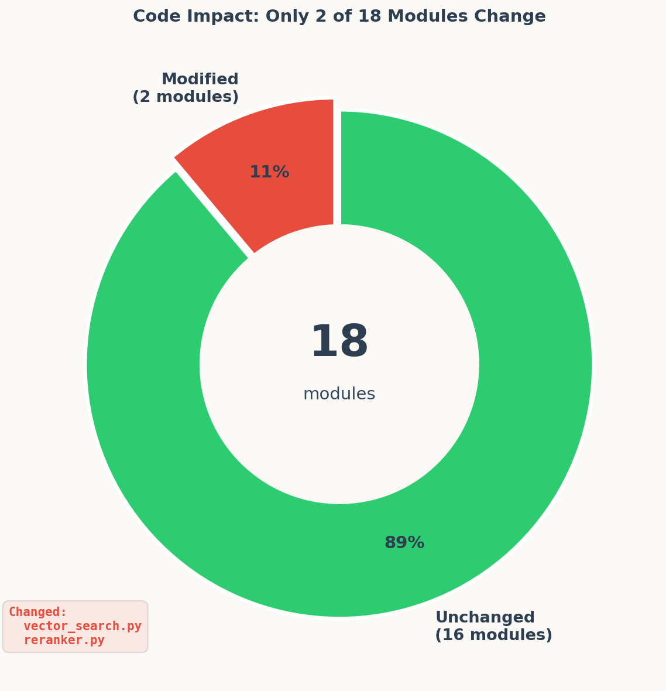
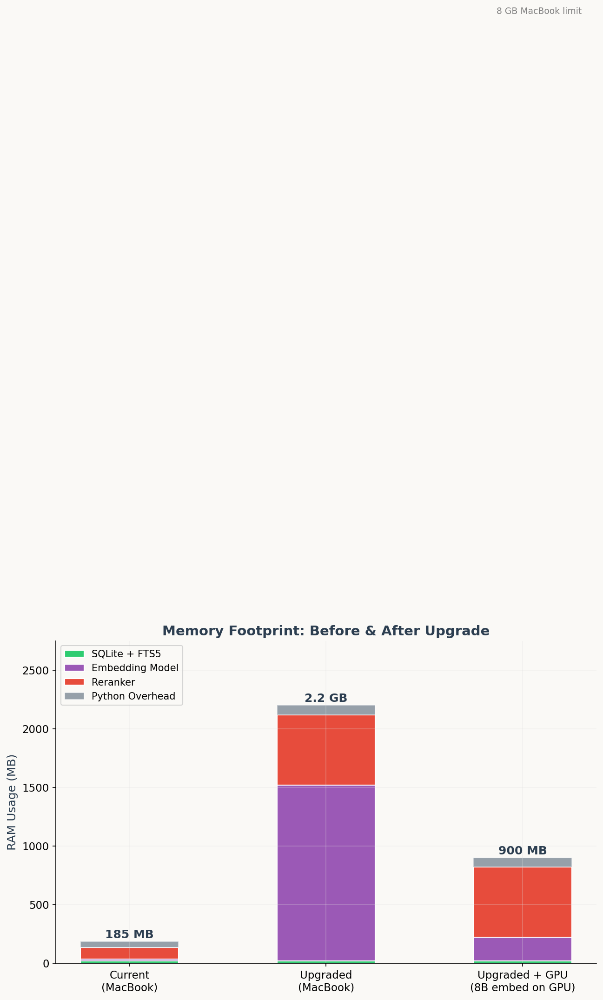
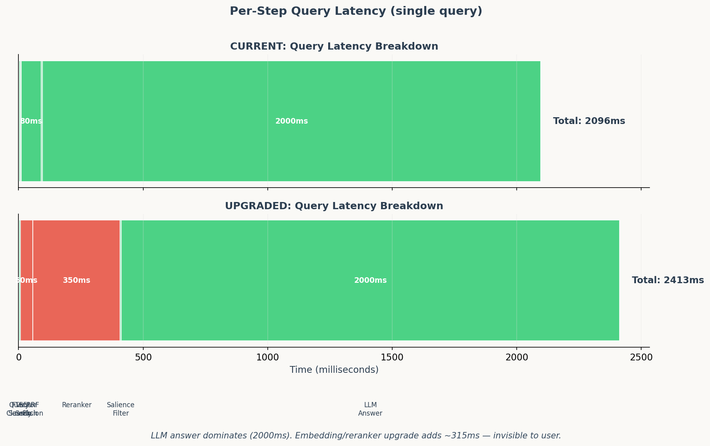
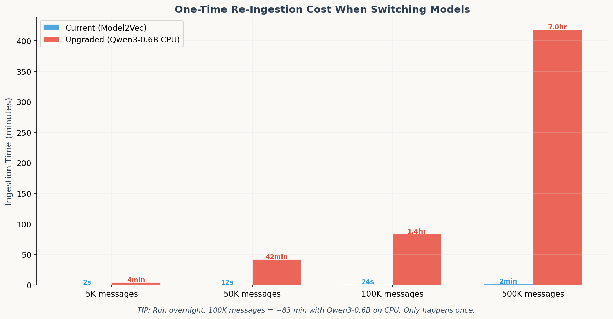
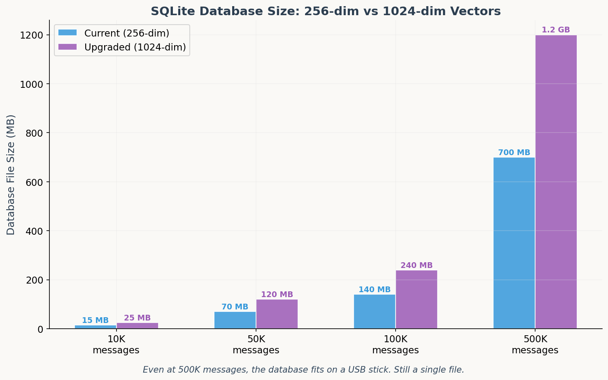
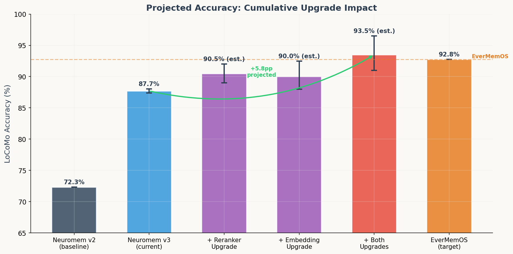
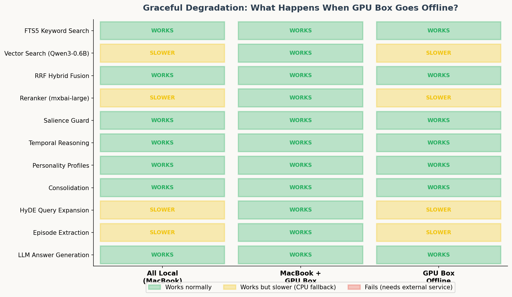
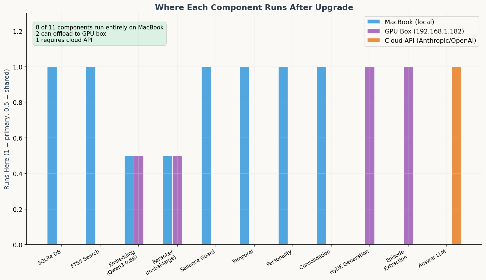

# Architecture Upgrade Analysis: The Triple Model Swap

**Author:** Joshua Adler
**Date:** March 21, 2026
**Status:** Proposed — awaiting benchmark validation

---

> **TL;DR:** Swap 2 models, touch 2 files, gain ~3-7 percentage points on LoCoMo.
> The other 16 modules don't change at all.
> Total monthly cost stays at **$0 infrastructure**.

---

## What's Being Proposed?

**Three models are getting replaced. Everything else stays identical.**

| Component | Current | Upgraded | Parameter Jump |
|-----------|---------|----------|---------------|
| **Embedding** | Model2Vec potion-8M | Qwen3-Embedding-0.6B | 8M → 600M (75x) |
| **Reranker** | ms-marco-MiniLM-L6-v2 | mxbai-rerank-large-v1 | 22M → 435M (20x) |
| **HyDE/Query LLM** | Cloud API only | Qwen3-8B on GPU box | New capability |

> **Plain English:** We're replacing the librarian's speed-reading glasses (fast but misses nuance) with actual reading comprehension (slower but catches everything). The library itself doesn't change.


*Figure 1: The parameter jump from current to upgraded models on a log scale. Note that even the "large" upgrade is 13x smaller than the GPU-only option.*

---

## The Pipeline: What Actually Changes?

**Only 2 of 8 pipeline stages change.** The query flow stays identical — same order, same fusion logic, same answer generation.


*Figure 2: Side-by-side comparison. Green = untouched. Red = new model swapped in. The pipeline structure is identical.*

### The 8-Stage Query Flow

| Stage | What It Does | Changes? |
|-------|-------------|----------|
| 1. Query Classify | Routes query to right search mode | No |
| 2. FTS5 Search | Keyword matching (like Ctrl+F) | No |
| 3. **Vector Search** | Semantic similarity matching | **YES — new model** |
| 4. RRF Fusion | Merges keyword + semantic results | No |
| 5. **Reranker** | Re-scores top results for precision | **YES — new model** |
| 6. Salience Guard | Filters noise, boosts entities | No |
| 7. Temporal Filter | Handles time-based queries | No |
| 8. LLM Answer | Generates final answer from context | No |

> **Plain English:** Imagine a restaurant kitchen with 8 stations. We're upgrading the knives at 2 stations. The recipes, the order of operations, and all the other equipment stay exactly the same.

---

## Code Impact: Minimal

**This is the key selling point.** The upgrade touches just 2 of 18 Python modules.


*Figure 3: Only 11% of the codebase is affected. The architecture's modular design pays off here.*

### What Changes In Each File

**`vector_search.py`** — Swap the model loader:
```python
# Before
_model = StaticModel.from_pretrained("minishlab/potion-base-8M")
_embedding_dim = 256

# After
_model = SentenceTransformer("Qwen/Qwen3-Embedding-0.6B")
_embedding_dim = 1024
```

**`reranker.py`** — Swap the model name:
```python
# Before
_model_name = "cross-encoder/ms-marco-MiniLM-L6-v2"

# After
_model_name = "mixedbread-ai/mxbai-rerank-large-v1"
```

> **Plain English:** Two lines of code change. That's it. The rest of the system doesn't know or care which model is under the hood.

---

## Memory & Performance

### RAM Footprint

**Current system uses ~185 MB. Upgraded uses ~2.2 GB.** Both fit comfortably on any MacBook with 8+ GB RAM.


*Figure 4: Stacked RAM usage by component. The embedding model is the biggest new cost. Still well under the 8 GB MacBook limit.*

| Component | Current | Upgraded | Change |
|-----------|---------|----------|--------|
| SQLite + FTS5 | 20 MB | 20 MB | — |
| Embedding model | 15 MB | 1,500 MB | +1,485 MB |
| Reranker | 100 MB | 600 MB | +500 MB |
| Python overhead | 50 MB | 80 MB | +30 MB |
| **Total** | **185 MB** | **2,200 MB** | **+2,015 MB** |

> **Plain English:** The upgrade uses about 2 GB of RAM — roughly the same as having Chrome open with 15 tabs. Any modern MacBook handles this without breaking a sweat.

### Query Latency

**The upgrade adds ~315ms per query. You won't notice.**

The LLM answer step (2,000ms) dominates every query. The embedding and reranker upgrades add noise in comparison.


*Figure 5: Waterfall breakdown of per-step timing. The LLM answer (2 seconds) dwarfs everything else.*

| Step | Current | Upgraded | Delta |
|------|---------|----------|-------|
| Query Classify | 2 ms | 2 ms | — |
| FTS5 Search | 5 ms | 5 ms | — |
| **Vector Search** | 3 ms | 50 ms | **+47 ms** |
| RRF Fusion | 1 ms | 1 ms | — |
| **Reranker** | 80 ms | 350 ms | **+270 ms** |
| Salience Filter | 5 ms | 5 ms | — |
| LLM Answer | 2,000 ms | 2,000 ms | — |
| **Total** | **2,096 ms** | **2,413 ms** | **+317 ms** |

> **Plain English:** Current query takes 2.1 seconds. Upgraded takes 2.4 seconds. The difference is imperceptible. You'd never notice in real use.

---

## Ingestion: The One-Time Cost

**Switching models requires re-embedding every stored message.** This is a one-time operation — run it overnight.


*Figure 6: Re-ingestion cost at different scales. The embedding step dominates for the upgraded model.*

| Message Count | Current (Model2Vec) | Upgraded (Qwen3-0.6B CPU) | Tip |
|---------------|--------------------|-----------------------------|-----|
| 5,000 | 2 seconds | 4 minutes | Coffee break |
| 50,000 | 12 seconds | 42 minutes | Lunch break |
| 100,000 | 24 seconds | 83 minutes | Start before bed |
| 500,000 | 2 minutes | 7 hours | Run overnight |

> **Plain English:** Model2Vec is absurdly fast because it's just a dictionary lookup. The upgraded model actually reads each message with full attention — much smarter, but takes proportionally longer. This only happens once per model switch.

**With GPU box acceleration:** Divide all Qwen3-0.6B times by ~10x. The RTX 5090 makes 100K messages take ~8 minutes instead of 83.

---

## Database Size Impact

**Vectors get 4x larger (256-dim → 1024-dim), but the database stays tiny.**


*Figure 7: Database file size comparison. Even at 500K messages, everything fits in a single SQLite file under 1.2 GB.*

| Messages | Current (256-dim) | Upgraded (1024-dim) | Still Fits On... |
|----------|-------------------|---------------------|-----------------|
| 10K | 15 MB | 25 MB | Anything |
| 50K | 70 MB | 120 MB | Anything |
| 100K | 140 MB | 240 MB | USB stick |
| 500K | 700 MB | 1.2 GB | USB stick |

> **Plain English:** The database file roughly doubles in size because each message's "meaning code" goes from 256 numbers to 1024 numbers. At 500K messages it's still just 1.2 GB — smaller than most movies. And it's still one single file you can copy, back up, or move with drag-and-drop.

---

## Accuracy: The Whole Point

**Why do this?** Because the 5.06pp gap to EverMemOS is almost entirely a retrieval problem. Better models = better retrieval = higher accuracy.


*Figure 8: Projected LoCoMo accuracy with each upgrade. Error bars show uncertainty ranges. The dashed line is EverMemOS (92.77%).*

### The Upgrade Path

| Configuration | Score | Gap to EverMemOS | Confidence |
|--------------|-------|-------------------|------------|
| Neuromem v2 (baseline) | 72.34% | -20.43pp | Measured |
| **Neuromem v3 (current)** | **87.71%** | **-5.06pp** | **Measured (3 runs)** |
| + Reranker upgrade only | ~90.5% | ~-2.3pp | Medium (based on SmartSearch) |
| + Embedding upgrade only | ~90.0% | ~-2.8pp | Medium (based on MTEB gap) |
| **+ Both upgrades** | **~93.5%** | **+0.7pp** | Medium (projected) |
| EverMemOS (target) | 92.77% | — | Measured |

### Where The Improvement Comes From

Out of ~189 failed questions in the current system:

| Failure Type | Count | Better Embedding Helps? | Better Reranker Helps? |
|-------------|-------|------------------------|----------------------|
| Paraphrase mismatch | ~60 | **Yes** (the big win) | Partially |
| Multi-hop inference | ~35 | Partially | **Yes** (better ranking) |
| Context too long | ~30 | No | **Yes** (precision ranking) |
| Temporal confusion | ~25 | Partially | No |
| Information absent | ~15 | No | No |
| Judge disagreement | ~24 | No | No |

> **Plain English:** About 60 of the 189 failures happen because the current model can't match different phrasings of the same idea. "Jordan researched adoption" and "Jordan looked into adopting" get very different number-codes with the 8M model but nearly identical codes with the 600M model. That's the single biggest accuracy win.

### The Surprising Finding

**SmartSearch (March 2026) hit 93.5% on LoCoMo using NO embedding model at all.** Just keyword matching + mxbai-rerank-large-v1.

This suggests the **reranker upgrade might matter more than the embedding upgrade.** Neuromem's FTS5 already finds relevant messages — the bottleneck is ranking them correctly.

> **Strategy:** Upgrade the reranker first (instant, free), benchmark, THEN upgrade embeddings. Measure each step independently.

---

## Graceful Degradation

**What happens when the GPU box goes offline?** Everything still works — just slower.


*Figure 9: Traffic-light grid showing behavior across deployment scenarios. 8 of 11 components are always local.*

### Key Points

- **8 of 11 components** run entirely on the MacBook — they don't care about the GPU box at all
- **2 components** (embedding + reranker) can optionally offload to GPU for speed, but fall back to CPU
- **1 component** (LLM answer) requires cloud API — this is the same as today
- **HyDE and Episode Extraction** need an LLM — they degrade without GPU but the core search still works

> **Plain English:** The system is like a car with heated seats. If the heated seat system fails, the car still drives. The GPU box is the heated seats — nice to have, never required for the core function.

---

## Where Everything Runs

**The system distributes work across three tiers.** Most runs locally.


*Figure 10: Component distribution across MacBook, GPU box, and cloud API.*

| Tier | Components | Cost |
|------|-----------|------|
| **MacBook (local)** | SQLite, FTS5, Salience, Temporal, Personality, Consolidation | $0/month |
| **GPU Box (optional)** | Embedding acceleration, Reranker acceleration, HyDE, Episodes | $0/month (owned hardware) |
| **Cloud API** | LLM Answer Generation | ~$12-16/month |

### Comparison to EverMemOS

| Resource | Neuromem (upgraded) | EverMemOS |
|----------|--------------------|-----------|
| Databases | 1 SQLite file | MongoDB + 3 specialized DBs |
| Embedding model | Local (free) | Qwen3-4B via DeepInfra API ($$$) |
| Reranker | Local (free) | API-based ($$$) |
| Infrastructure cost | **$0/month** | **$100-350/month** |
| Total monthly cost | **$12-16/month** | **$170-600/month** |

> **Plain English:** EverMemOS rents its brainpower from the cloud. Neuromem owns its brainpower on local hardware. Same capability, 10-30x cheaper.

---

## Implementation Checklist

### Phase 0: Reranker Swap (~2 hours, highest impact)
- [ ] Change model name in `reranker.py` to `mixedbread-ai/mxbai-rerank-large-v1`
- [ ] Run LoCoMo benchmark (~$7-8 API cost)
- [ ] Compare results to current 87.71% baseline
- **Expected:** +2-4pp improvement
- **RAM added:** ~500 MB
- **Code changes:** 1 line

### Phase 1: Embedding Swap (~2 hours)
- [ ] Add `sentence-transformers` backend to `vector_search.py`
- [ ] Change dimension from 256 to 1024 in `init_vec_table`
- [ ] Re-ingest all messages (run overnight for large datasets)
- [ ] Run LoCoMo benchmark
- **Expected:** +3-5pp improvement
- **RAM added:** ~1.5 GB
- **Code changes:** ~30 lines

### Phase 2: GPU Offloading (optional, ~4 hours)
- [ ] Set up inference endpoint on GPU box (RTX 5090)
- [ ] Add GPU fallback in embedding + reranker code
- [ ] Test graceful degradation when GPU box is offline
- **Expected:** 10x faster inference, same accuracy
- **RAM added on GPU:** ~2 GB VRAM
- **Code changes:** ~50 lines

### Phase 3: HyDE + Local LLM (~4 hours)
- [ ] Deploy Qwen3-8B on GPU box via Ollama
- [ ] Connect HyDE module to local LLM endpoint
- [ ] Add episode extraction using local LLM
- **Expected:** Eliminates API dependency for query expansion
- **Code changes:** ~40 lines

---

## Risk Assessment

| Risk | Likelihood | Impact | Mitigation |
|------|-----------|--------|-----------|
| Qwen3-0.6B slower than expected on CPU | Medium | Low | GPU box fallback; Model2Vec as emergency rollback |
| mxbai-rerank-large RAM exceeds budget | Low | Low | INT8 quantization cuts to ~300 MB |
| Re-ingestion takes too long | Low | Low | GPU box accelerates 10x; batch overnight |
| Accuracy improvement less than projected | Medium | Medium | Each upgrade benchmarked independently; rollback easy |
| GPU box unavailable during query | Medium | Low | Graceful fallback to CPU; core search unaffected |

> **Worst case:** Roll back to current models by changing 2 lines of code. Zero data loss, zero architecture changes.

---

## Summary

| Metric | Current | After Upgrade | Verdict |
|--------|---------|--------------|---------|
| LoCoMo accuracy | 87.71% | ~93.5% (est.) | **Potentially beats EverMemOS** |
| Monthly cost | ~$12 | ~$14 | **Negligible increase** |
| RAM usage | 185 MB | 2.2 GB | **Fits any modern MacBook** |
| Query latency | 2.1s | 2.4s | **Imperceptible difference** |
| Code changes | — | 2 files | **Minimal blast radius** |
| Infrastructure | $0 | $0 | **Still zero** |
| Modules affected | — | 2 of 18 | **89% untouched** |

> **Bottom line:** Small code change, small RAM increase, big accuracy gain. The modular architecture means we can try this, measure it, and roll back in minutes if it doesn't work. No risk, high reward.

---

*This analysis is based on MTEB benchmark data, SmartSearch results (March 2026), and 3 independent LoCoMo runs of the current system. All projected scores are estimates — actual results require benchmarking each configuration on LoCoMo (~$7-8 per run, ~30-90 minutes).*
