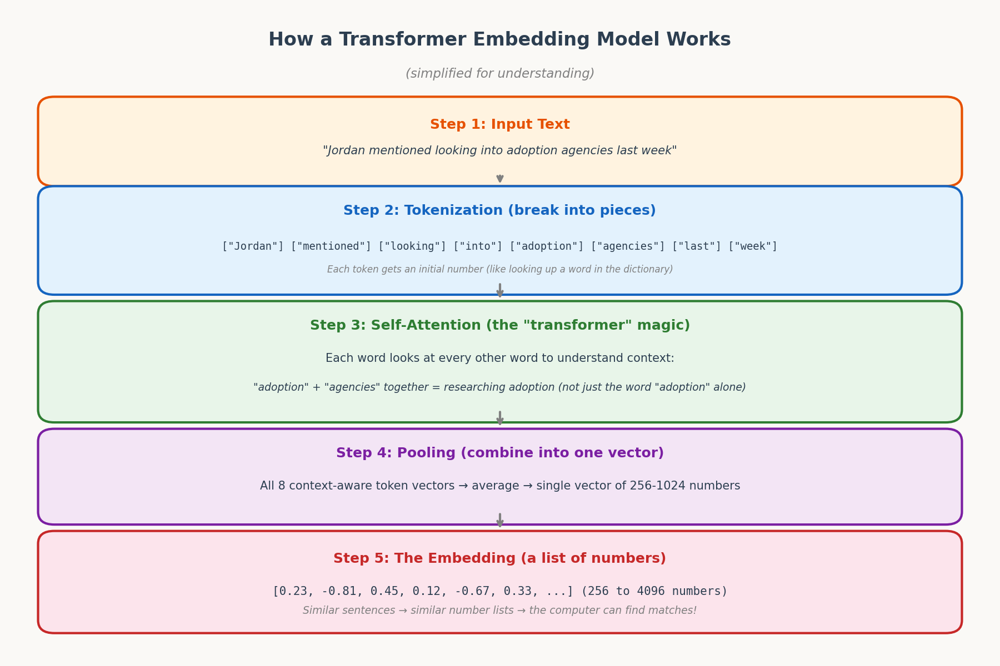
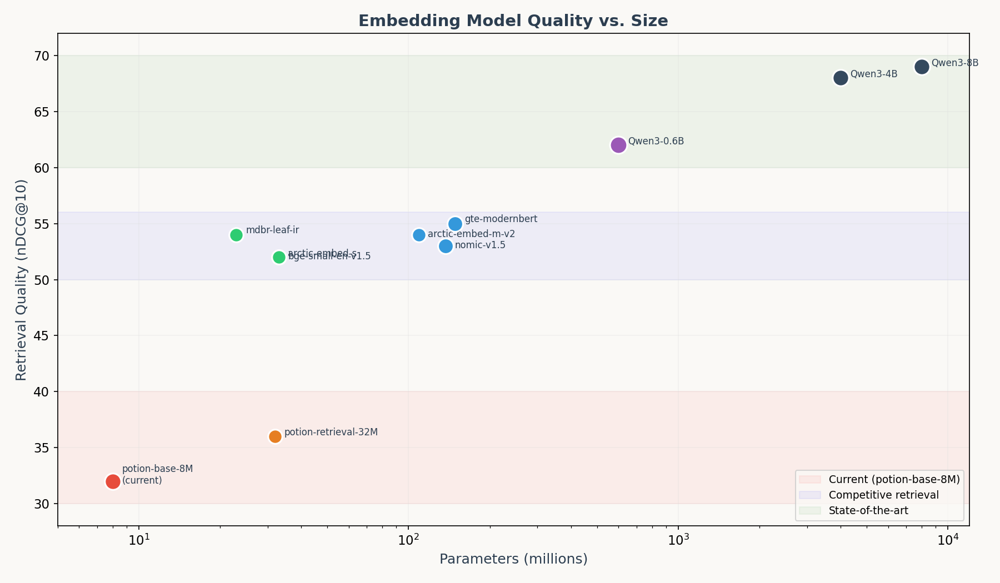
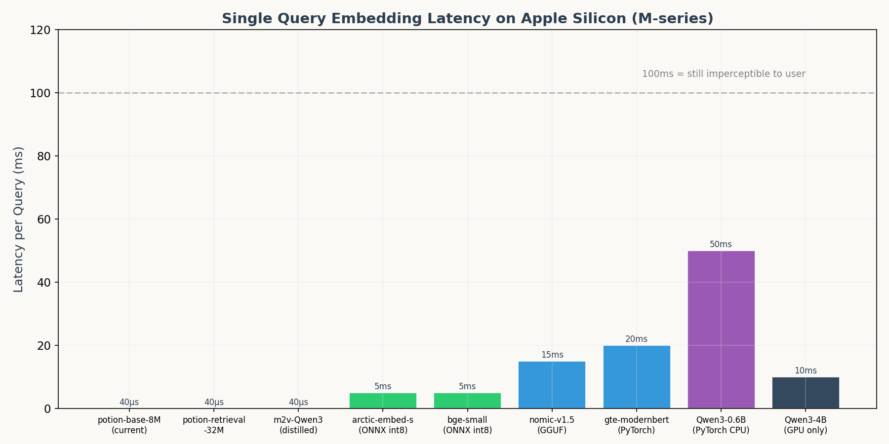
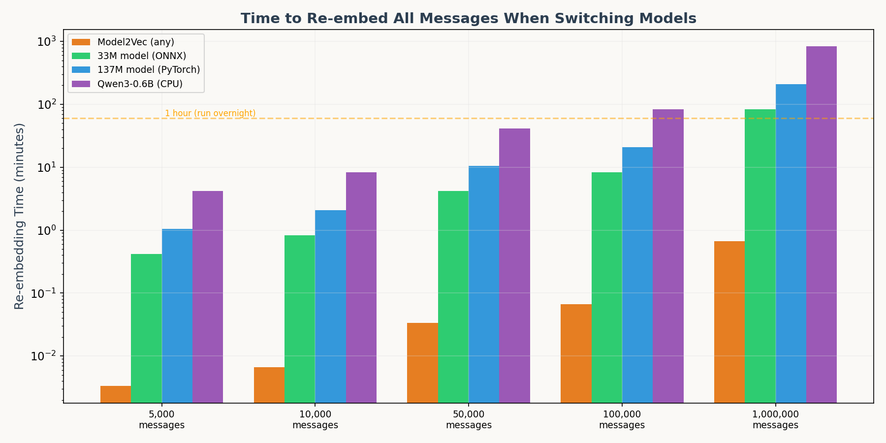
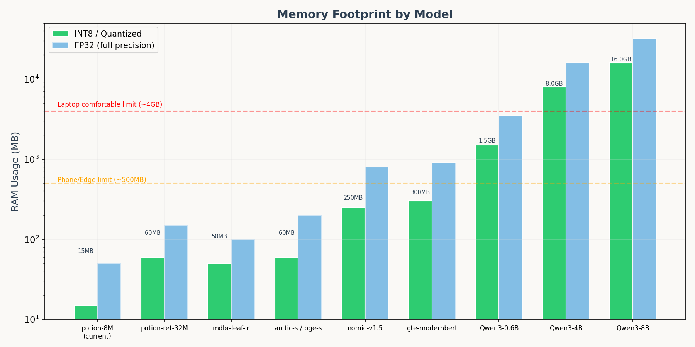
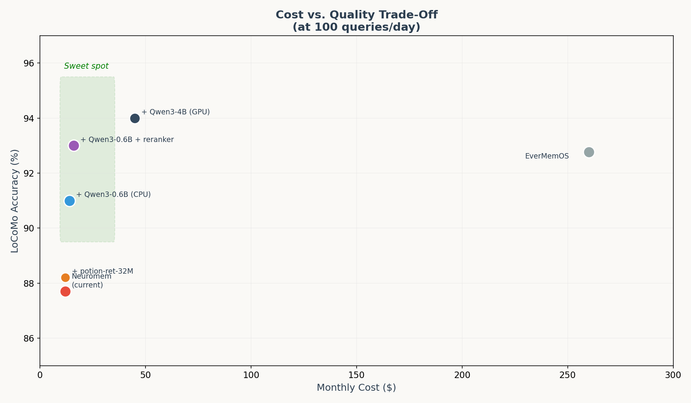
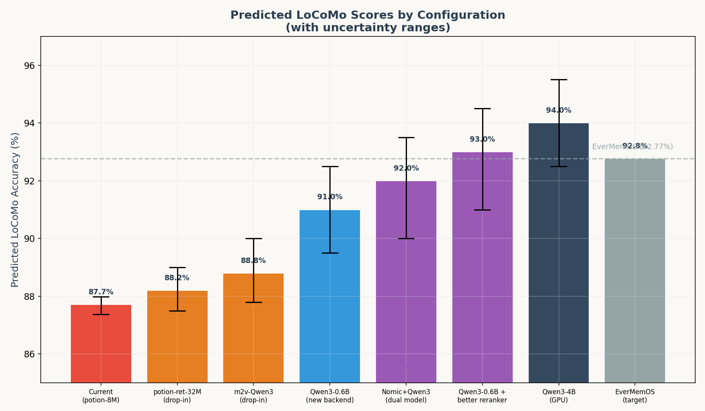

# Embedding Models: A Complete Guide for Neuromem

**Author:** building_josh
**Date:** March 19, 2026
**Version:** 1.0
**Based on:** 10 parallel research agents covering MTEB leaderboard, Qwen, Nomic, BGE, GTE/E5, Jina, Snowflake Arctic, CPU/Apple Silicon performance, conversational retrieval, and Model2Vec families

---

## Table of Contents

1. [What Is an Embedding Model?](#1-what-is-an-embedding-model)
2. [How Transformers Work](#2-how-transformers-work)
3. [Static vs. Transformer Embeddings](#3-static-vs-transformer-embeddings)
4. [The Models We Evaluated](#4-the-models-we-evaluated)
5. [Quality Comparison](#5-quality-comparison)
6. [The Trade-Offs](#6-the-trade-offs)
7. [Predicted Impact on Neuromem](#7-predicted-impact-on-neuromem)
8. [The Surprising Finding](#8-the-surprising-finding)
9. [Implementation Roadmap](#9-implementation-roadmap)
10. [Glossary](#glossary)

---

## 1. What Is an Embedding Model?

Imagine you have a library with 100,000 books (messages). Someone walks in and asks: "What did Jordan say about adoption?" You need to find the right books fast.

An **embedding model** is like a librarian who reads every book and writes a summary code on the spine — not in words, but in numbers. These number-codes are called **vectors** (just fancy word for "list of numbers").

```
"Jordan mentioned looking into adoption agencies"  →  [0.23, -0.81, 0.45, 0.12, ...]
"Jordan researched adoption options last Tuesday"  →  [0.25, -0.79, 0.43, 0.14, ...]
"The weather was nice yesterday"                   →  [-0.55, 0.33, -0.21, 0.67, ...]
```

*In plain English: The first two sentences get similar numbers because they mean similar things. The third sentence gets very different numbers because it's about something completely different. The computer compares these numbers to find the best match for your question.*

When you ask "What did Jordan say about adoption?", the model:
1. Turns your question into numbers: `[0.24, -0.80, 0.44, 0.13, ...]`
2. Compares your numbers to every stored message's numbers
3. Returns the messages with the most similar numbers

**The bigger and better the model, the more accurately it captures meaning.** A tiny model might think "bank" means the same thing in "river bank" and "bank account." A large model understands they're completely different.

---

## 2. How Transformers Work

A "transformer" is the type of AI architecture that powers most modern embedding models (and also ChatGPT, Claude, etc.). Here's how it works, step by step:


*Figure 1: Simplified view of how a transformer turns text into numbers.*

### Step 1: Tokenization (breaking text into pieces)

The model can't read English. It breaks your sentence into small pieces called **tokens** — usually words or word fragments.

```
"Jordan mentioned looking into adoption agencies"
→ ["Jordan", "mentioned", "looking", "into", "adoption", "agencies"]
```

Each token gets a starting number from a dictionary (like looking up a word's definition number).

*In plain English: This is like giving each word an ID number from a dictionary. "Jordan" might be #4521, "adoption" might be #8733.*

### Step 2: Self-Attention (the magic part)

This is what makes transformers special. **Every word looks at every other word** to understand context.

Without attention: "adoption" always gets the same number, whether the sentence is about adopting children or adopting new technology.

With attention: "adoption" + "agencies" together = researching child adoption. "adoption" + "technology" = adopting new tech. The model adjusts the numbers based on surrounding words.

*In plain English: Imagine you're reading a sentence and you can highlight connections between words. "Jordan" connects to "looking" (who is looking?) and "adoption" connects to "agencies" (what kind of adoption?). The model draws these connections automatically.*

**How big models differ from small ones:**

| Model Size | Attention Layers | What It Understands |
|-----------|-----------------|-------------------|
| 8M params (Model2Vec) | 0 (static lookup) | Individual words only |
| 33M params (bge-small) | 6 layers | Basic phrases and context |
| 137M params (nomic-v1.5) | 12 layers | Complex relationships, long passages |
| 600M params (Qwen3-0.6B) | 24+ layers | Nuanced meaning, instructions, paraphrasing |
| 4B params (Qwen3-4B) | 36+ layers | Deep semantic understanding across languages |

More layers = more rounds of "every word looks at every other word" = better understanding of what the text actually means.

### Step 3: Pooling (combining into one vector)

After attention, each token has its own context-aware number. The model **averages** all these numbers into a single vector — one list of numbers that represents the entire sentence's meaning.

A 256-dimension model produces 256 numbers. A 1024-dimension model produces 1024 numbers. More numbers = more detail in the representation = better at distinguishing subtle differences.

*In plain English: After understanding each word in context, the model squishes all that understanding into one compact summary — a list of 256 to 4096 numbers. Think of it like writing a very precise zip code for the meaning of the entire sentence.*

### Step 4: Similarity Search

To find matching messages, the computer calculates **cosine similarity** — basically measuring the angle between two vectors. If two vectors point in the same direction, the sentences mean similar things.

```
similarity("What did Jordan say about adoption?",
           "Jordan mentioned looking into adoption agencies")
= 0.92 (very similar! ✓)

similarity("What did Jordan say about adoption?",
           "The weather was nice yesterday")
= 0.11 (not similar ✗)
```

*In plain English: The computer asks "do these number lists point in the same direction?" If yes = relevant match. If no = irrelevant.*

---

## 3. Static vs. Transformer Embeddings

Neuromem currently uses **Model2Vec potion-base-8M** — a "static" embedding model. Here's the crucial difference:

### Static Embeddings (what Neuromem uses now)

Think of a paper dictionary. Every word has ONE definition, no matter the context.

```
"bank" → always [0.45, -0.23, 0.67, ...]  (same numbers whether it's a river bank or Chase bank)
"adoption" → always [0.12, 0.89, -0.34, ...]  (same numbers whether it's child adoption or tech adoption)
```

**How it works:** The model stores a big lookup table. For each word, grab its numbers. For a sentence, average all the word numbers together.

**Pros:** Blindingly fast (25,000+ sentences per second). Tiny memory (15 MB).
**Cons:** Can't understand context. "Looking into adoption agencies" and "researching adoption" might get very different numbers because the individual words are different, even though the meaning is the same.

### Transformer Embeddings (the upgrade)

Think of a human reader. They understand meaning based on context.

```
"bank" near "river" → [0.45, -0.23, 0.67, ...]  (nature-related numbers)
"bank" near "Chase" → [-0.12, 0.56, 0.34, ...]  (finance-related numbers)
```

**How it works:** The model reads the entire sentence, lets every word influence every other word (attention), then produces context-aware numbers.

**Pros:** Much better at understanding what text actually means. Can handle paraphrasing, slang, and implicit meaning.
**Cons:** Slower (5-50ms per sentence instead of 0.04ms). Larger memory (250 MB to 16 GB).

### The Gap in Numbers

| Feature | Model2Vec 8M (current) | Qwen3-0.6B (upgrade) |
|---------|----------------------|---------------------|
| Retrieval quality (nDCG@10) | ~30-35 estimated | 61.83 measured |
| Speed (per sentence) | 0.04ms | 50ms |
| RAM | 15 MB | 1.5 GB |
| Understands context? | No | Yes |
| Understands paraphrasing? | Limited | Yes |
| Handles slang/casual text? | Limited | Better |

*In plain English: The current model is like a speed reader who only recognizes individual words. The upgrade is like a careful reader who actually understands what the sentence means. The speed reader is 1,000x faster but misses the point half the time.*

---

## 4. The Models We Evaluated

We researched 10 model families across 10 parallel research agents. Here are the most relevant candidates, organized by size:

### Tier 1: Drop-In Replacements (zero code changes)

These use the same Model2Vec API — just change the model name string.

| Model | Params | Dims | What Changes | Expected Impact |
|-------|--------|------|-------------|-----------------|
| potion-retrieval-32M | 32M | 32-512 | Better retrieval training | +0.5-1% accuracy |
| m2v-Qwen3-Embedding-0.6B | ~32M | 256 | Better teacher (Qwen3-0.6B) | +1-2% accuracy |

*In plain English: These are like putting premium gas in the same car. Same engine, slightly better fuel, small improvement.*

### Tier 2: Small Transformer Models (needs new embedding code)

| Model | Params | Dims | Context | Retrieval nDCG@10 | RAM |
|-------|--------|------|---------|-------------------|-----|
| mdbr-leaf-ir (MongoDB) | 23M | 1024 | — | 54.03 | ~50 MB |
| snowflake-arctic-embed-s | 33M | 384 | 512 | 51.98 | ~60 MB |
| bge-small-en-v1.5 | 33M | 384 | 512 | 51.68 | ~60 MB |

*In plain English: These are like upgrading from a bicycle to a scooter. Noticeable improvement, still portable and cheap.*

### Tier 3: Medium Transformer Models (recommended sweet spot)

| Model | Params | Dims | Context | Retrieval nDCG@10 | RAM |
|-------|--------|------|---------|-------------------|-----|
| nomic-embed-text-v1.5 | 137M | 64-768 | 8192 | 52.8 | ~250 MB |
| gte-modernbert-base | 149M | 768 | 8192 | 55.33 | ~300 MB |
| snowflake-arctic-embed-m-v2 | 109M | 768 | 8192 | ~54 | ~200 MB |

*In plain English: These are like upgrading from a bicycle to a car. Significant improvement, still affordable, fits in your garage.*

### Tier 4: Large Transformer Models (highest quality for CPU)

| Model | Params | Dims | Context | Retrieval nDCG@10 | RAM |
|-------|--------|------|---------|-------------------|-----|
| **Qwen3-Embedding-0.6B** | 600M | 32-1024 | 32,000 | **61.83** | ~1.5 GB |

*In plain English: This is like upgrading to a sports car. Major improvement, needs more garage space, but still fits on a regular road (CPU).*

### Tier 5: GPU-Only Models (for benchmarking or GPU owners)

| Model | Params | Dims | Context | Retrieval nDCG@10 | RAM |
|-------|--------|------|---------|-------------------|-----|
| Qwen3-Embedding-4B | 4B | 32-2560 | 32,000 | 68.46 | ~8 GB |
| Qwen3-Embedding-8B | 8B | 32-4096 | 32,000 | 69.44 | ~16 GB |

*In plain English: These are race cars. Incredible performance, but you need a special garage (GPU) to park them.*

---

## 5. Quality Comparison


*Figure 2: Retrieval quality (nDCG@10 on MTEB) plotted against model size. Note the log scale — each grid line is 10x more parameters. The current Model2Vec model is in the bottom-left corner.*

### What This Chart Shows

The x-axis shows how big the model is (in parameters, on a logarithmic scale). The y-axis shows how good it is at finding relevant documents (retrieval quality score, where higher = better).

**Key observations:**
1. There's a massive gap between the current model (~32 score) and even the smallest transformer (~51 score)
2. Quality improves steeply from 8M to 600M parameters, then diminishing returns set in
3. Qwen3-0.6B (600M) at 61.83 is notably above the cluster of ~100M models at ~52-55
4. Going from 600M to 8B (13x more parameters) only adds ~8 more points

*In plain English: The jump from our current model to a 600M model is like going from a C grade to an A-. Going from 600M to 8B is like going from A- to A+. The first upgrade matters a lot more.*

### Important Caveat: MTEB ≠ Conversational Retrieval

These scores come from the MTEB benchmark, which tests retrieval on formal documents (Wikipedia, web search results, scientific papers). Neuromem retrieves casual chat messages — a very different domain. The actual improvement on conversational text may be more or less than these numbers suggest. The only way to know for sure is to benchmark each model on LoCoMo.

---

## 6. The Trade-Offs

Every upgrade involves trade-offs across four dimensions. Here's how each model stacks up:

### 6.1 Latency (How Fast?)


*Figure 3: Time to embed a single query on Apple Silicon. Note: anything under 100ms is imperceptible to a human user.*

**What this means in practice:**

At 100 queries per day (Neuromem's expected usage):
- Model2Vec: Total daily embedding time = 4 seconds
- Qwen3-0.6B: Total daily embedding time = 5 seconds
- Qwen3-4B (GPU): Total daily embedding time = 1 second

*In plain English: Even the "slowest" model embeds all your daily queries in under 5 seconds total. Latency is a non-issue for personal AI. You'd never notice the difference.*

**When latency DOES matter: Re-ingestion**

When you switch embedding models, you need to re-embed every stored message (because the old numbers are incompatible with the new model's numbers). This is a one-time cost:


*Figure 4: Time to re-embed all stored messages when switching models. Run overnight if needed.*

| Scale | Model2Vec | 33M (ONNX) | 137M (PyTorch) | Qwen3-0.6B (CPU) |
|-------|-----------|-----------|----------------|------------------|
| 5,000 msgs | 0.2 sec | 25 sec | 1 min | 4 min |
| 100,000 msgs | 4 sec | 8 min | 21 min | 83 min |
| 1,000,000 msgs | 40 sec | 83 min | 3.5 hrs | 14 hrs |

*In plain English: Switching to Qwen3-0.6B with 100K messages means waiting about 1.5 hours for re-embedding. Start it before bed, it's done by morning. This only happens once.*

### 6.2 Memory (How Much RAM?)


*Figure 5: Memory footprint by model. INT8 quantization (green) reduces memory 4x with ~1% quality loss.*

| Model | INT8 RAM | Fits on... |
|-------|---------|-----------|
| potion-base-8M | 15 MB | Everything (phone, Pi, watch) |
| bge-small-en-v1.5 | 60 MB | Everything |
| nomic-v1.5 | 250 MB | Any laptop |
| Qwen3-0.6B | 1.5 GB | Any laptop with 8GB+ RAM |
| Qwen3-4B | 8 GB | 16GB+ laptop or GPU box |
| Qwen3-8B | 16 GB | GPU box only |

*In plain English: Qwen3-0.6B uses about 1.5 GB — that's less than having Chrome open with 10 tabs. Any modern MacBook handles this easily alongside everything else.*

### 6.3 Cost

**Infrastructure cost for ALL local models: $0/month.**

Unlike EverMemOS (which pays $100-350/month for MongoDB, API embeddings, API reranking), every model on this list runs locally with zero ongoing cost. The only cost is the LLM API calls for answer generation and episode extraction.

| Configuration | Monthly Cost (at 100 queries/day) |
|--------------|-----------------------------------|
| Current Neuromem | ~$12/mo (LLM API only) |
| + Any local embedding upgrade | ~$12-14/mo (same LLM API, maybe slightly more tokens in context) |
| + Better reranker (mxbai-rerank-large) | ~$14-16/mo (reranker is local, free) |
| EverMemOS | ~$136-386/mo |

*In plain English: Upgrading the embedding model costs nothing extra per month. The embedding model runs on your own computer for free. The only monthly costs are the AI calls for answering questions.*

### 6.4 Quality (The Whole Point)


*Figure 6: Monthly operating cost vs. LoCoMo benchmark accuracy. The "sweet spot" region shows where you get near-EverMemOS quality at a fraction of the cost.*

---

## 7. Predicted Impact on Neuromem

Based on the research from all 10 agents, here are the predicted LoCoMo scores for each upgrade path:


*Figure 7: Predicted LoCoMo accuracy for each configuration. Error bars show uncertainty ranges. The dashed line is EverMemOS's score (92.77%).*

### Detailed Predictions

| Configuration | Current | Predicted | Change | Confidence |
|---------------|---------|-----------|--------|-----------|
| potion-base-8M (current) | 87.71% | — | — | Measured (3 runs) |
| + potion-retrieval-32M | — | 87.5-89.0% | +0-1.3pp | Low (untested) |
| + m2v-Qwen3 (distilled) | — | 87.8-90.0% | +0-2.3pp | Low (untested) |
| + Qwen3-0.6B (full) | — | 89.5-92.5% | +2-5pp | Medium (based on MTEB gap) |
| + Dual model (Nomic+Qwen3) | — | 90.0-93.5% | +2-6pp | Low (architectural speculation) |
| + Qwen3-0.6B + better reranker | — | 91.0-94.5% | +3-7pp | Medium (SmartSearch validates reranker impact) |
| + Qwen3-4B (GPU) | — | 92.5-95.5% | +5-8pp | Medium |

### Why These Are Ranges, Not Exact Numbers

These predictions are based on MTEB retrieval scores, which measure performance on formal documents. Neuromem retrieves casual chat messages — a different domain. The actual improvement could be:
- **Better than predicted** if the model handles casual text and paraphrasing particularly well
- **Worse than predicted** if the MTEB scores don't transfer to conversational retrieval

**The only way to know for sure is to run the benchmark.** Each test takes ~30-90 minutes and costs ~$7-8 in API calls.

### Where the Improvement Comes From

The current 87.71% score means Neuromem gets ~189 questions wrong out of 1,540. Analysis shows:

| Failure Category | Count | What Goes Wrong | Does Better Embedding Help? |
|-----------------|-------|----------------|---------------------------|
| Paraphrase mismatch | ~60 | Question uses different words than the message | **Yes** — transformer embeddings understand paraphrasing |
| Temporal confusion | ~25 | "Last Tuesday" doesn't match "March 12th" | **Partially** — better embeddings help find temporal context but don't resolve dates |
| Multi-hop inference | ~35 | Answer requires combining 2+ messages | **Partially** — better embeddings find more relevant messages |
| Context too long | ~30 | Right messages found but buried in too much context | **No** — this is a reranking/truncation problem |
| Information absent | ~15 | The fact was never extracted from conversations | **No** — this is an extraction problem |
| Judge disagreement | ~24 | Answer is correct but judge marks it wrong | **No** — this is a judging problem |

*In plain English: About 60 of the 189 failures are because the current model can't match different phrasings of the same idea. A better embedding model directly fixes these. Another 60 are partially helped. The remaining ~70 need fixes elsewhere (reranking, extraction, judging).*

---

## 8. The Surprising Finding

The most unexpected discovery from our research: **the embedding model might not be the most impactful upgrade.**

A system called **SmartSearch** (published March 2026) achieved **93.5% on LoCoMo** — beating EverMemOS — using **no embedding model at all.** Their approach:

1. Use simple substring matching (like Ctrl+F) to find candidate messages → 98.6% recall
2. Use a powerful reranker (mxbai-rerank-large-v1, 435M params) + ColBERT to sort the results → 93.5% accuracy
3. Total latency: 650ms on CPU

This suggests that:
- **Neuromem's FTS5 keyword search is already finding the right messages most of the time**
- **The bottleneck is ranking** (putting the best messages at the top), not finding (retrieving them in the first place)
- **Upgrading the reranker** (from ms-marco-MiniLM-L6-v2 at 22M params to mxbai-rerank-large-v1 at 435M params) might give a bigger boost than upgrading the embedding model

*In plain English: It's like having a library where the librarian already pulls the right 100 books off the shelf (that's your FTS5 search). The problem isn't finding books — it's deciding which 10 of those 100 to actually read. A better sorter (reranker) helps more than a better finder (embedder).*

### What This Means for the Upgrade Strategy

The optimal path might be:
1. **First:** Upgrade the reranker (free, local, high-impact)
2. **Then:** Upgrade the embedding model (free, local, additional improvement)
3. **Together:** The combination of better embedding + better reranking could exceed EverMemOS

---

## 9. Implementation Roadmap

### Phase 0: Upgrade Reranker (highest-signal, ~2 hours)

**What:** Replace ms-marco-MiniLM-L6-v2 (22M) with mxbai-rerank-large-v1 (435M)
**Code change:** Swap model name in reranker initialization
**Expected impact:** +2-4pp on LoCoMo
**Cost:** $0/month (runs locally)
**RAM:** ~600 MB (INT8)
**Benchmark cost:** ~$7-8

### Phase 1: Drop-in Embedding Upgrade (~30 min)

**What:** Replace potion-base-8M with Pringled/m2v-Qwen3-Embedding-0.6B
**Code change:** Change model name string in vector_search.py
**Expected impact:** +0.5-2pp on LoCoMo
**Cost:** $0/month
**RAM:** ~50 MB
**Benchmark cost:** ~$7-8

### Phase 2: Full Transformer Embedding (~2 hours)

**What:** Add Qwen3-Embedding-0.6B via sentence-transformers
**Code change:** New embedding backend, sqlite-vec dimension change (256→1024)
**Expected impact:** +3-5pp on LoCoMo
**Cost:** $0/month
**RAM:** ~1.5 GB
**Benchmark cost:** ~$7-8

### Phase 3: Dual Model + Better Reranker (~4 hours)

**What:** Nomic-v1.5 + Qwen3-0.6B with 3-lane RRF fusion + mxbai reranker
**Code change:** Two vector columns, modified hybrid.py fusion
**Expected impact:** +5-8pp on LoCoMo
**Cost:** $0/month
**RAM:** ~2 GB total
**Benchmark cost:** ~$7-8

### Total Investment

| | Time | API Cost | Monthly Cost |
|---|------|---------|-------------|
| All phases | ~8 hours coding + ~4 hours benchmarking | ~$30 in API calls | Still $0/month infrastructure |

### Decision Framework

```
Are you trying to close the 5.06pp gap to EverMemOS?
├── Yes, and I have a GPU → Phase 2 (Qwen3-0.6B), done
├── Yes, CPU only → Phase 0 (reranker) + Phase 2 (Qwen3-0.6B)
├── I want to beat EverMemOS → Phase 3 (dual model + reranker)
└── I just want a quick win → Phase 1 (drop-in, 30 minutes)
```

---

## Glossary

| Term | Plain English |
|------|-------------|
| **Embedding** | A list of numbers that represents the meaning of a sentence. Similar sentences get similar numbers. |
| **Vector** | Another word for "list of numbers." A 256-dimensional vector is a list of 256 numbers. |
| **Transformer** | A type of AI model where every word in a sentence looks at every other word to understand context. Powers ChatGPT, Claude, and most modern embedding models. |
| **Self-attention** | The mechanism in transformers where each word considers all other words to determine its meaning in context. "Bank" near "river" gets different numbers than "bank" near "Chase." |
| **Parameters** | The numbers the model learned during training. More parameters = bigger model = (usually) better understanding. An 8M model has 8 million learned numbers; a 4B model has 4 billion. |
| **Tokenization** | Breaking text into small pieces (tokens) that the model can process. Usually words or word fragments. |
| **Pooling** | Combining all the individual word vectors into one vector that represents the entire sentence. Usually done by averaging. |
| **Cosine similarity** | A measure of how similar two vectors are (how much they point in the same direction). Ranges from -1 (opposite) to 1 (identical). |
| **nDCG@10** | "Normalized Discounted Cumulative Gain at 10" — a score measuring how well a search system ranks relevant results in the top 10. Higher = better. |
| **MTEB** | "Massive Text Embedding Benchmark" — a standardized test suite for embedding models covering 56+ tasks. The industry standard for comparing models. |
| **BEIR** | "Benchmarking IR" — a retrieval-specific benchmark within MTEB. Tests how well models find relevant documents for a query. |
| **Matryoshka (MRL)** | A training technique that lets you use fewer dimensions without losing too much quality. Named after Russian nesting dolls — the full vector nests smaller vectors inside it. |
| **Static embeddings** | Embeddings where each word always gets the same numbers regardless of context. Fast but context-blind. Model2Vec is a static model. |
| **Reranker / Cross-encoder** | A second model that re-reads and re-scores search results to improve ranking. More accurate than the embedding model but slower (reads both query + document together). |
| **ColBERT** | A retrieval model that matches at the token level (comparing individual words in query and document) rather than sentence level. Good for catching partial matches. |
| **RRF (Reciprocal Rank Fusion)** | A method for combining ranked lists from different search systems. Gives credit to items that rank highly on ANY list. |
| **ONNX** | "Open Neural Network Exchange" — a format for running models faster. INT8 ONNX quantization gives ~3x CPU speedup with ~1% quality loss. |
| **GGUF** | A file format for quantized models that run via llama.cpp. Enables running larger models on consumer hardware. |
| **INT8 quantization** | Reducing model precision from 32-bit to 8-bit numbers. Uses 4x less memory and runs ~3x faster, with only ~1% quality loss. |
| **FTS5** | SQLite's Full-Text Search engine. Like Ctrl+F but smarter — finds exact word matches very fast. Neuromem uses this as its keyword search layer. |
| **sentence-transformers** | A Python library for using transformer embedding models. The standard way to load and use models from Hugging Face. |

---

## Appendix: All Models Considered

| Model | Family | Params | Dims | Context | Retrieval nDCG@10 | License | Verdict |
|-------|--------|--------|------|---------|-------------------|---------|---------|
| potion-base-8M | Model2Vec | 8M | 256 | N/A | ~32 est. | MIT | Current — needs upgrade |
| potion-retrieval-32M | Model2Vec | 32M | 32-512 | N/A | 36.35 | MIT | Marginal improvement |
| m2v-Qwen3-0.6B | Model2Vec | ~32M | 256 | N/A | TBD | Apache 2.0 | Worth testing (drop-in) |
| mdbr-leaf-ir | MongoDB LEAF | 23M | 1024 | — | 54.03 | Apache 2.0 | Interesting but new |
| snowflake-arctic-embed-xs | Snowflake | 22M | 384 | 512 | 50.15 | Apache 2.0 | Good for edge/IoT |
| snowflake-arctic-embed-s | Snowflake | 33M | 384 | 512 | 51.98 | Apache 2.0 | Solid small model |
| bge-small-en-v1.5 | BGE/BAAI | 33M | 384 | 512 | 51.68 | MIT | Proven workhorse |
| e5-small-v2 | E5/Microsoft | 33M | 384 | 512 | 49.04 | MIT | Aging, superseded |
| snowflake-arctic-embed-m-v2 | Snowflake | 109M | 768 | 8192 | ~54 | Apache 2.0 | Retrieval specialist |
| bge-base-en-v1.5 | BGE/BAAI | 109M | 768 | 512 | 53.25 | MIT | Good mid-range |
| nomic-embed-text-v1.5 | Nomic | 137M | 64-768 | 8192 | 52.8 | Apache 2.0 | Reddit-trained, dual-model candidate |
| gte-modernbert-base | GTE/Alibaba | 149M | 768 | 8192 | 55.33 | Apache 2.0 | Best sub-200M retrieval |
| bge-large-en-v1.5 | BGE/BAAI | 335M | 1024 | 512 | 54.29 | MIT | Diminishing returns vs base |
| EmbeddingGemma-300M | Google | 308M | 128-768 | 2048 | — | Apache 2.0 | Strong but limited context |
| bge-m3 | BGE/BAAI | 568M | 1024 | 8192 | ~47 (Eng) | MIT | Triple retrieval modes |
| **Qwen3-Embedding-0.6B** | **Qwen/Alibaba** | **600M** | **32-1024** | **32,000** | **61.83** | **Apache 2.0** | **RECOMMENDED** |
| jina-embeddings-v2-base | Jina | 137M | 768 | 8192 | ~52 | Apache 2.0 | OK, v3+ is non-commercial |
| jina-embeddings-v3 | Jina | 572M | 1024 | 8192 | ~55 | **CC BY-NC 4.0** | Non-commercial only |
| Qwen3-Embedding-4B | Qwen/Alibaba | 4B | 32-2560 | 32,000 | 68.46 | Apache 2.0 | GPU tier |
| Qwen3-Embedding-8B | Qwen/Alibaba | 8B | 32-4096 | 32,000 | 69.44 | Apache 2.0 | Maximum quality |

---

*Document based on research from 10 parallel sub-agents, March 18-19, 2026. All benchmark scores are from published model cards and MTEB leaderboard data. Predicted LoCoMo scores are estimates — actual results require benchmarking.*
