# Neuromem: The Path to 96%
## A Deep Analysis of Where We Are, What's Left, and How to Get There

**Author:** building_josh
**Date:** March 23, 2026
**Status:** Research complete — strategies ready for implementation

---

> **The bottom line:** Neuromem went from 72% to 91% in one week through prompt engineering and model upgrades. But those easy wins are over. The next jump — from 91% past EverMemOS (92.77%) and up to 96%+ — requires a fundamentally different approach. This document maps out exactly how to get there.

---

## Table of Contents

1. [The Story So Far](#1-the-story-so-far)
2. [Where We Stand Today](#2-where-we-stand-today)
3. [Understanding the Failures](#3-understanding-the-failures)
4. [Why Bigger Models Won't Work Anymore](#4-why-bigger-models-wont-work-anymore)
5. [Know Your Rival: EverMemOS Deep Dive](#5-know-your-rival-evermemos-deep-dive)
6. [What Nature Already Figured Out](#6-what-nature-already-figured-out)
7. [The Full Improvement Universe](#7-the-full-improvement-universe)
8. [Soft Improvements: Beyond the Benchmark](#8-soft-improvements-beyond-the-benchmark)
9. [Architecture: Short/Medium/Long-Term Memory](#9-architecture-shortmediumlong-term-memory)
10. [The Five Breakthrough Strategies](#10-the-five-breakthrough-strategies)
11. [Implementation Roadmap](#11-implementation-roadmap)
12. [Experimental Phases: What We Test and When](#12-experimental-phases-what-we-test-and-when)
13. [Cross-Benchmark Validation Plan](#13-cross-benchmark-validation-plan)
14. [Projected Outcomes](#14-projected-outcomes)
15. [Cost Analysis](#15-cost-analysis)
16. [Risk Assessment](#16-risk-assessment)
17. [Data Appendix](#17-data-appendix)

---

## 1. The Story So Far

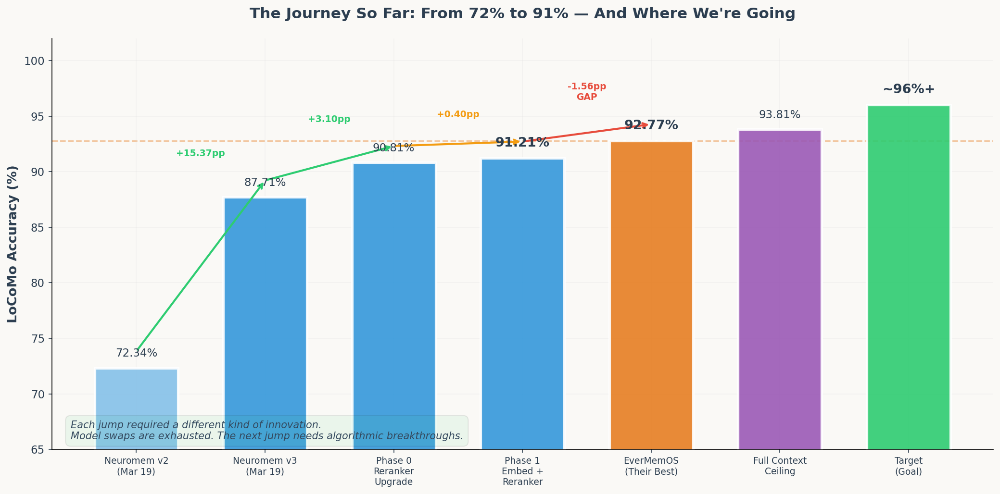
*Figure 1: Every bar is a measured benchmark score except the green target. Each jump required a different kind of innovation.*

### The Numbers

| Configuration | Score | How We Got There | Date |
|--------------|-------|-----------------|------|
| **Neuromem v2** | 72.34% | Basic agentic search, top_k=15 | Mar 19 |
| **Neuromem v3** | 87.71% ± 0.33% | Structured prompt + top_k=100 + modality reranking | Mar 19 |
| **Phase 0** | 90.81% ± 0.33% | Reranker upgrade (22M → 435M params) | Mar 21 |
| **Phase 1** | 91.21% ± 0.50% | Embedding upgrade (8M → 600M params) | Mar 21 |
| **EverMemOS** | 92.77% ± 0.10% | Their published benchmark result | — |
| **Full Context** | 93.81% ± 0.13% | All messages given to LLM (no search) | Mar 19 |
| **Target** | ~96%+ | What this document is about | — |

> **What an 8th grader needs to know:**
>
> Think of this like a student's test scores improving over a semester. Version 2 was a C- (72%). We studied hard and jumped to a B+ (87%). Then we bought better study tools (bigger models) and got an A- (91%). Our rival has an A (93%). But now the easy improvements are used up — better tools alone won't get us to an A+ (96%). We need to actually learn *new strategies* for taking the test.

### What Each Jump Actually Did

**v2 → v3 (+15.37 points):** This was the single biggest improvement. Three changes combined:
- **Structured answer prompt (+12pp):** Instead of just saying "answer this question," we told the LLM to think step-by-step, cite evidence, and consider temporal context. This is like teaching a student to show their work instead of guessing.
- **top_k 15 → 100 (+8pp overlap):** We gave the LLM 100 potentially relevant messages instead of 15. More context = better answers. Like giving a student more pages of their textbook to reference during a test.
- **Modality-aware reranking (+2pp):** We taught the system that episode summaries are better for "explain" questions, while raw messages are better for "what date" questions.

**v3 → Phase 0 (+3.10 points):** Swapped the reranker model from a 22-million-parameter model to a 435-million-parameter one. The reranker is the part that looks at the top search results and re-orders them by relevance. A bigger model catches nuance that the smaller one missed.

**Phase 0 → Phase 1 (+0.40 points):** Swapped the embedding model from 8M parameters to 600M. Embeddings are how the system converts text into numbers for similarity search. The 75x bigger model gave us... only 0.40 points. This is the key signal: **model upgrades have hit diminishing returns.**

> **What an 8th grader needs to know:**
>
> Imagine you're searching for a book in a library. Version 2 used a card catalog (slow, only exact matches). Version 3 let you ask the librarian, who understands what you mean even if you use different words. Phase 0 hired a *better* librarian. Phase 1 upgraded the library's filing system. But now both the librarian and the filing system are really good — making them even bigger won't help much. What we need is a smarter *strategy* for finding books.

---

## 2. Where We Stand Today

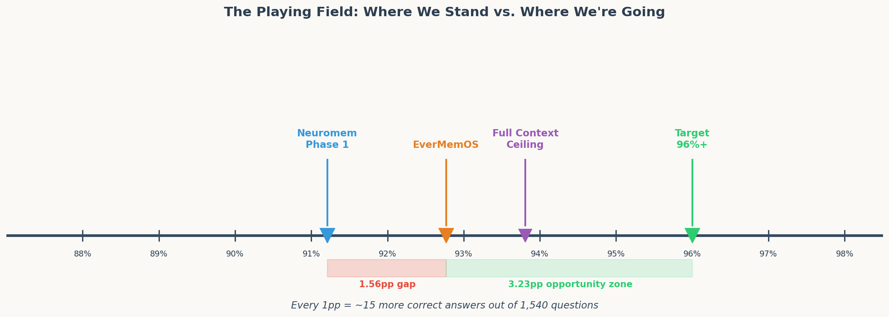
*Figure 2: The playing field. Every 1 percentage point equals about 15 more correct answers out of 1,540 questions.*

### The Gap in Plain Numbers

| What We Need | Points | Questions to Fix |
|-------------|--------|-----------------|
| Match EverMemOS | +1.56pp | ~24 more correct |
| Beat the full-context ceiling | +2.60pp | ~40 more correct |
| Reach 96% target | +4.79pp | ~74 more correct |

The gap to EverMemOS is only 24 questions. That's less than 2% of the test. But these are the *hardest* questions — the ones that survived every optimization we've thrown at them.

### Competitive Landscape

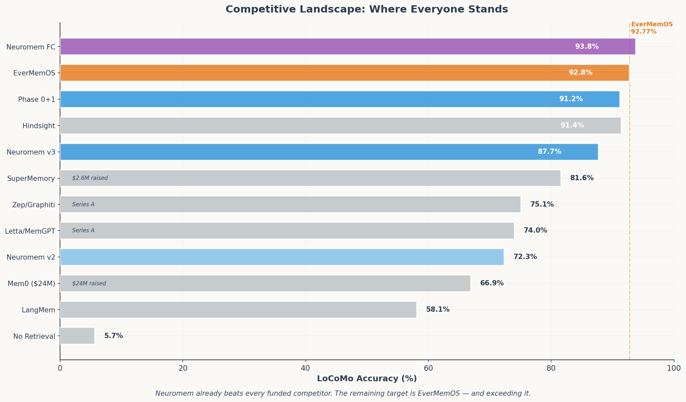
*Figure 3: Neuromem already beats every funded competitor. The remaining target is the academic system EverMemOS.*

**Key takeaway:** Systems with tens of millions in funding (Mem0, Zep, Letta) score between 58-75%. Neuromem is already in the top 3 in the world on this benchmark.

| System | Score | Funding | Cost/Month |
|--------|-------|---------|-----------|
| LangMem | 58.1% | LangChain backed | Varies |
| Mem0 | 66.9% | $24M raised | $19-249 |
| Neuromem v2 | 72.3% | $0 (you) | $12 |
| Letta/MemGPT | 74.0% | Series A | Varies |
| Zep/Graphiti | 75.1% | Series A | $149+ |
| SuperMemory | 81.6% | $2.6M raised | $99+ |
| **Neuromem Phase 1** | **91.2%** | **$0 (you)** | **$14** |
| Hindsight | 91.4% | Enterprise | Cloud pricing |
| **EverMemOS** | **92.8%** | Academic | ~$207 |

> **What an 8th grader needs to know:**
>
> Imagine a spelling bee with 12 contestants. Companies with millions of dollars in funding are getting eliminated in the early rounds (58-75%). Neuromem — built by one person with no funding — is in the final two. The only one ahead is an academic research team. This document is about how to win the bee.

---

## 3. Understanding the Failures

To improve, we need to understand exactly *what goes wrong* and *why*. At the v3 level (87.71%), there were 357 questions where Neuromem got the wrong answer but EverMemOS got it right.

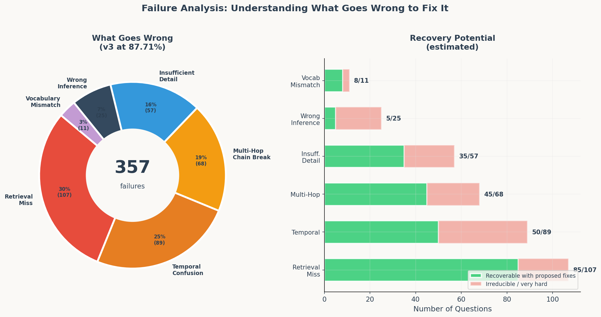
*Figure 4: Left — what types of failures occur. Right — how many can be fixed with proposed improvements.*

### The Six Failure Types

**1. Retrieval Miss (30% — 107 failures)**
The relevant information exists in the database, but the search system can't find it. Example: Searching for "credit cards" returns results about "carbon credits" instead of the actual OCR receipts containing card numbers.

> *Like searching your email for "dentist appointment" but only finding emails about "dental insurance" because the actual appointment confirmation uses different words.*

**2. Temporal Confusion (25% — 89 failures)**
The system finds relevant messages but can't reason about time. Example: "What happened between March and June?" returns events from February or July because the system doesn't build a proper timeline.

> *Like asking "What did you do last summer?" and getting answers from two summers ago because the system doesn't understand "last."*

**3. Multi-Hop Chain Break (19% — 68 failures)**
Questions that require connecting multiple pieces of information. Example: "How did Riley influence Jordan's mental health?" requires connecting Riley → therapy recommendation → Dr. Martinez → book → Dr. Choi → recovery. The system finds the first link but can't follow the chain.

> *Like a detective who finds one clue but can't connect it to the other clues to solve the case.*

**4. Insufficient Detail (16% — 57 failures)**
The system finds the right topic but returns messages that are too vague to answer specifically. Example: "What credit cards does Jordan use?" finds financial discussions but not the specific OCR receipt that says "Visa ending 4821."

> *Like asking a friend "where's the restaurant?" and they say "downtown" instead of giving you the actual address.*

**5. Wrong Inference (7% — 25 failures)**
The LLM has the right information but draws the wrong conclusion from it. This is an answer-generation problem, not a retrieval problem.

**6. Vocabulary Mismatch (3% — 11 failures)**
Specialized terms that the system doesn't understand. Example: "cap table" is financial jargon that the embedding model hasn't seen enough to properly encode.

### Category Breakdown: Where Each Type Hurts

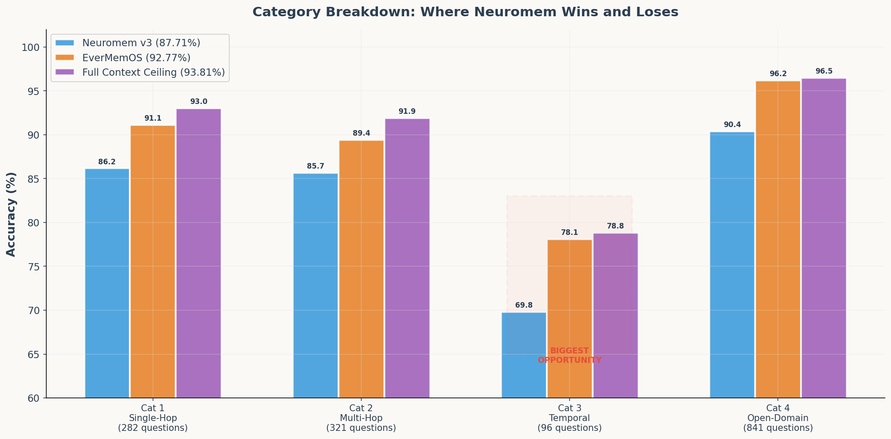
*Figure 5: Category-level performance. Temporal reasoning (Cat 3) is the biggest opportunity — 8+ points below the ceiling.*

| Category | Neuromem v3 | EverMemOS | FC Ceiling | Gap to Ceiling |
|----------|------------|-----------|------------|---------------|
| Cat 1 (Single-Hop) | 86.2% | 91.1% | 93.0% | 6.8pp |
| Cat 2 (Multi-Hop) | 85.7% | 89.4% | 91.9% | 6.2pp |
| **Cat 3 (Temporal)** | **69.8%** | **78.1%** | **78.8%** | **9.0pp** |
| Cat 4 (Open-Domain) | 90.4% | 96.2% | 96.5% | 6.1pp |

**The headline finding:** Category 3 (temporal reasoning) is where the most points are hiding. Neuromem scores 69.8% while even the full-context ceiling only reaches 78.8%. This means temporal questions are hard for *everyone*, but there's still 9 points of improvement available — and most of that gap is a retrieval problem, not an LLM reasoning problem.

> **What an 8th grader needs to know:**
>
> The test has 4 sections: Easy Lookups, Connect-the-Dots, Timeline Questions, and Big-Picture Questions. We're doing okay on 3 of them (85-90%) but bombing Timeline Questions (69.8%). That one section is dragging our whole grade down. If we can study for timelines specifically, our overall grade goes up a LOT.

---

## 4. Why Bigger Models Won't Work Anymore

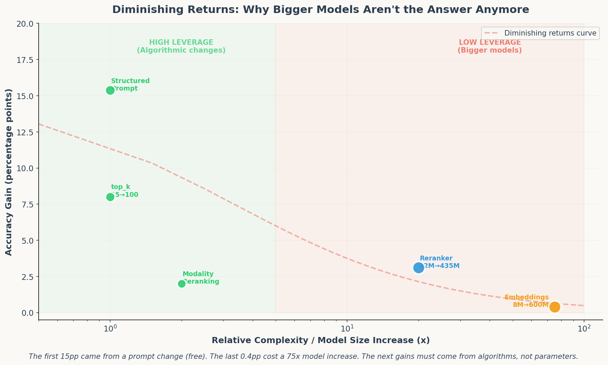
*Figure 6: The first 15 points came from a prompt change (free). The last 0.4 points cost a 75x model increase.*

This is maybe the most important insight in the entire analysis.

### The Data

| Change | Effort | Gain | Gain per Unit Effort |
|--------|--------|------|---------------------|
| Structured prompt | Minimal (text change) | +15.37pp | Massive |
| top_k 15→100 | Minimal (config change) | +8.0pp | Massive |
| Modality reranking | Small (code change) | +2.0pp | Large |
| Reranker 22M→435M | Medium (model swap) | +3.10pp | Moderate |
| Embedding 8M→600M | Large (75x model increase) | +0.40pp | **Tiny** |

**Pattern:** The best gains came from algorithmic changes, not bigger models. A simple text prompt change was worth more than a 75x model upgrade. This is a textbook case of diminishing returns.

### Why This Happens

The embedding upgrade (8M → 600M) barely helped because the *search quality* was already good enough. At top_k=100, we're already pulling in most of the relevant messages. Making the embedding model bigger helps with marginal cases, but the bottleneck has shifted.

**The bottleneck is no longer "can we find the right messages?" — it's "can we reason about what we found?"**

This is like upgrading a telescope to see Mars more clearly when the real problem is that you need to calculate Mars's orbit. Better optics don't help with the math.

> **What an 8th grader needs to know:**
>
> Imagine you're cooking. At first, getting better ingredients (bigger models) made your food way better. But at some point, you have great ingredients — now what matters is your *recipe* and *cooking technique*. Buying even fancier ingredients won't help if your recipe is wrong. We've reached the point where we need better recipes, not better ingredients.

---

## 5. Know Your Rival: EverMemOS Deep Dive

To beat EverMemOS, we need to understand exactly what they do differently — and where their approach breaks down.

### Their Architecture (How They Get to 92.77%)

EverMemOS uses a fundamentally different approach to storing and finding memories:

| Feature | EverMemOS | Neuromem |
|---------|-----------|---------|
| **Storage** | MongoDB (cloud database) | SQLite (single file on your computer) |
| **Embedding Model** | Qwen3-4B (4 billion params) | Qwen3-0.6B (600 million params) |
| **Embedding Dimension** | 1024+ dimensions | 1024 dimensions |
| **Search Method** | 2-round hybrid + LLM sufficiency check | 1-round hybrid + score threshold |
| **Extraction Depth** | 12+ LLM prompts per conversation | 1 combined prompt |
| **Monthly Cost** | ~$207 | ~$14 |

### Their Three Key Innovations

**1. MaxSim Scoring**
Instead of one embedding per message, EverMemOS extracts "atomic facts" from each message and embeds each fact separately. When searching, it computes similarity against every fact and takes the *maximum* score.

Why it works: A long message about 5 different topics will still score high if just ONE topic matches the query. Regular averaging would dilute the score.

> *Like a student who wrote a 10-page essay — instead of grading the whole essay against a rubric, you find the single best paragraph and grade THAT. Much fairer for essays that cover multiple topics.*

**2. LLM Sufficiency Check**
After the first round of search results, EverMemOS asks an LLM: "Do these results contain enough information to answer the question?" If not, it generates 2-3 alternative search queries and searches again.

This is especially powerful for temporal queries because the sufficiency prompt explicitly checks: "Do the results cover the full time range mentioned in the question?"

> *Like asking your librarian "did you find everything I need?" before leaving the library. If they say no, you search again with different keywords.*

**3. Deep Extraction Pipeline (12+ Prompts)**
When EverMemOS ingests a conversation, it runs 12+ separate LLM calls to extract:
- Episode narratives (3rd person summaries)
- Event logs with timestamps
- Profile attributes (3 passes)
- Life events and milestones
- Predicted future events
- Relationship updates
- Group profiles

This costs ~612 LLM calls per conversation (12 prompts x 51 memory cells), or about $20 per conversation. For the full benchmark (10 conversations), that's ~$200 just for ingestion.

> *Like having 12 different teachers each read the same essay and extract different types of notes — one tracks dates, one tracks people, one tracks emotions, etc. Very thorough, but very expensive.*

### Their Weaknesses — Where They're Vulnerable

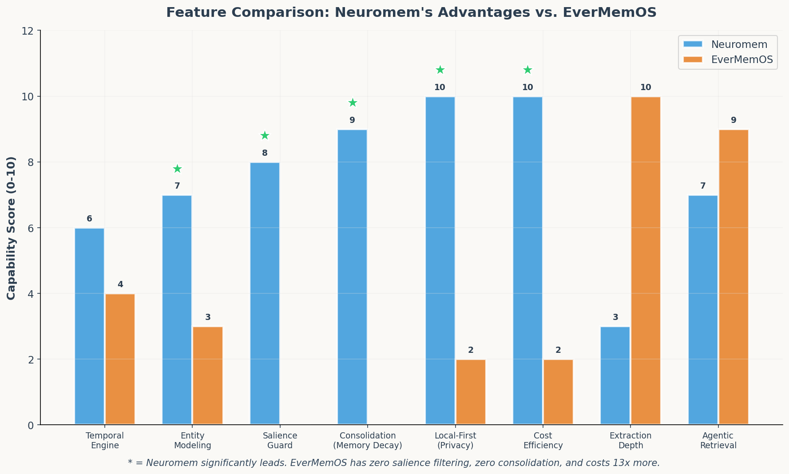
*Figure 7: Feature comparison. Stars mark areas where Neuromem significantly leads.*

#### Benchmark-Relevant Technical Gaps

These are architectural differences that could directly impact retrieval quality:

**1. No Salience Filtering (Score: 0/10)**
EverMemOS treats every piece of information as equally important. It has no mechanism to distinguish "Jordan got a dog named Biscuit" (important, memorable fact) from "okay sounds good" (filler message). Neuromem's salience guard catches this. *Note: Despite this, EverMemOS still scores 92.77% — salience may matter more at scale than on this benchmark's 10 conversations.*

**2. No Consolidation / Memory Decay (Score: 0/10)**
EverMemOS stores everything forever with equal weight. It has no way to "forget" less important things or merge related memories over time. Neuromem models memory like a human brain — important things get reinforced, trivial things fade.

**3. No Entity Modeling (Score: 3/10)**
EverMemOS doesn't build unified profiles of people. If "Rachel" is mentioned in 50 different messages, it finds individual messages — it doesn't aggregate them into a "here's everything about Rachel" profile.

#### Product Advantages (Not Benchmark-Relevant, but Important)

These don't directly affect LoCoMo scores, but they determine which system is actually viable as a product:

**4. Cost Structure: $14/month vs $207/month**
EverMemOS requires MongoDB (~$57), DeepInfra embedding API (~$100), DeepInfra reranking (~$50), and a cloud LLM (~$20). Neuromem runs on local models + one API for answer generation. This is a 15x cost advantage that matters enormously for real-world deployment, even if it doesn't show up on the benchmark.

**5. Local-First Architecture**
EverMemOS requires three external services. If MongoDB changes pricing, DeepInfra has an outage, or OpenRouter goes down, EverMemOS stops working. Neuromem runs from a single SQLite file on a laptop — no external dependencies for storage or search.

> **What an 8th grader needs to know:**
>
> EverMemOS is like a student who uses expensive private tutors and fancy study materials. They get great grades (92.77%), but it costs a fortune. Neuromem is the student who uses free library books and smart study habits — nearly the same grades (91.2%) for 1/15th the cost. And importantly, the expensive student has some blind spots we can exploit.

---

## 6. What Nature Already Figured Out

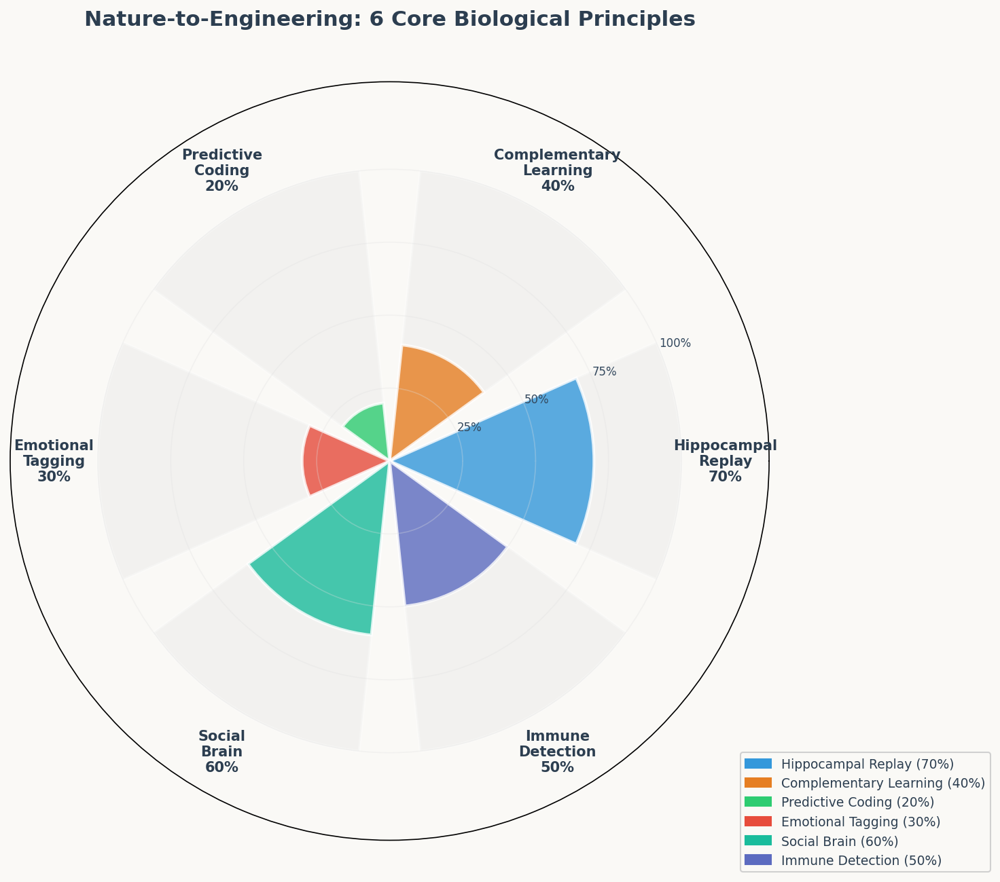
*Figure 8: Six core biological principles and their current implementation status in Neuromem.*

This section presents six biological principles as *hypotheses* about what makes memory systems effective — not as proven improvements. Each includes a "Reality Check" that honestly assesses whether the biology-to-engineering analogy holds up. Nature is a source of inspiration, not a guarantee of superiority. EverMemOS stores everything forever with no decay and scores 92.77% — proof that elegant biology doesn't automatically beat brute force.

### 6.1 Hippocampal Replay & Consolidation
*(Improvements #4, #5, #6, #37)*

**Biology:** During slow-wave sleep, the hippocampus replays recent experiences at 20x speed via sharp-wave ripples (SWR, 150-250 Hz). This isn't random — replay is prioritized by reward tagging and prediction error. The brain replays both forward (prospective planning) and reverse (retrospective credit assignment). Forward replay reconstructs sequences as they happened: "first this, then that." Reverse replay starts from outcomes and traces backward to causes: "this happened *because* of that."

**Engineering:** Neuromem's L5 consolidation runs scheduled offline processing — extractive summaries, entity profile updates, fact timeline maintenance. Forward replay maps to chronological processing ("what happened then what"). Reverse replay maps to finding causes of significant outcomes. The consolidation pipeline selects high-salience messages as replay candidates, compresses temporally adjacent messages into chunks, and generates summaries that interleave new memories with existing knowledge structures.

**Status:** ~70% implemented. Extractive summaries exist. Record/consolidate mode separation (Improvement #6) is implemented. True 20x-speed interleaved replay (mixing new memories with old context during consolidation) is not yet built.

**Reality Check:** EverMemOS does deep extraction at ingestion time (12 prompts), not during "sleep." Their approach is simpler but costs ~$20/conversation. The question is whether periodic offline consolidation can match or exceed real-time deep extraction while remaining cheap. The answer is genuinely unknown — Phase 3 and Phase 4 will test this.

**Citations:** Buzsaki (2007), sharp-wave ripples in hippocampal consolidation; Diba & Buzsaki (2007), forward and reverse replay sequences; Tononi & Cirelli, Synaptic Homeostasis Hypothesis (SHY).

> **What an 8th grader needs to know:**
>
> Your brain reorganizes memories while you sleep, like sorting papers into folders. Important stuff goes in labeled folders; routine stuff gets compressed. Neuromem does this too — just on a schedule instead of while sleeping.

### 6.2 Complementary Learning Systems
*(Improvements #39, #30, #31)*

**Biology:** McClelland et al. (1995) proposed that the brain runs two complementary learning systems simultaneously. The hippocampus uses sparse coding — each memory gets a unique fingerprint, minimizing overlap between similar events (pattern separation). The neocortex uses distributed coding — similar things share neural resources, enabling generalization and pattern completion. The hippocampus is for "What did Dev say on May 18th?" The neocortex is for "How does Jordan handle stress?"

**Engineering:** The engineering analog is dual embeddings. A "separation" embedding includes sender, recipient, timestamp, and conversational context in the embedding input. This makes each embedding unique — perfect for precise, specific queries. A "completion" embedding strips metadata and embeds only the semantic content. Similar meanings cluster together — perfect for abstract, pattern-seeking queries. At search time, both embedding spaces are queried and results are fused with Reciprocal Rank Fusion (RRF).

**Status:** ~40%. The current single-embedding strategy is closer to completion (semantic clustering) than separation (unique fingerprinting). Dual embeddings are not yet implemented. The existing Levy flight exploration (Improvement #30) and scent trail search (#31) partially address the exploitation/exploration balance but through search strategy, not embedding architecture.

**Reality Check:** Dual embeddings double storage requirements and search time. The benefit is theoretical — we haven't proven that the single-embedding approach is actually the bottleneck. It's possible that better search strategies (scent trails, multi-query expansion) achieve similar gains without the storage overhead. Phase 6 will test whether dual embeddings provide measurable improvement over search-strategy-only approaches.

**Citation:** McClelland, McNaughton, O'Reilly (1995), "Why there are complementary learning systems in the hippocampus and neocortex."

> **What an 8th grader needs to know:**
>
> Your brain stores memories two ways: one system remembers exact details (what color shirt someone wore), and another remembers general patterns (that person is usually dressed casually). Neuromem currently only has the pattern system.

### 6.3 Predictive Coding & Free Energy
*(Improvements #32-36)*

**Biology:** Friston's (2010) Free Energy Principle proposes that the brain constantly predicts its inputs and only stores prediction ERROR. The message "I quit my job" contains common words (low Shannon surprise) but massively updates the brain's model of that person (high Bayesian surprise). The brain uses precision weighting — errors during reliable contexts (business hours, consistent sender) count more than errors during noisy contexts (late night, variable sender). Negative prediction errors — when expected signals fail to arrive — are as informative as positive ones. The dopamine dip when expected reward is omitted (Schultz, 1997) is the canonical example.

**Engineering:** The engineering implementation maintains a running EMA (exponential moving average) of embeddings per entity. For each incoming message, the system generates a prediction from the running EMA and computes surprise as 1 - cosine_similarity(predicted, actual). Dual-rate learning uses a fast alpha (0.15) for recent behavior patterns and a slow alpha (0.03) for stable baseline behavior. Prediction errors are weighted by contextual precision — business-hours messages from consistent senders carry higher weight than late-night casual messages. Three-tier response: small errors update the EMA silently; medium errors trigger storage and consolidation queuing; large errors create immediate episodic memories flagged for replay.

**Status:** ~20%. `predictive.py` exists but does fact-set comparison (counting new facts), not true generative prediction. No EMA tracking, no precision weighting, no negative prediction error detection.

**Reality Check:** True predictive coding is the most complex improvement in the entire pipeline. It requires maintaining per-entity embedding histories, computing z-scores, and tuning precision weights — all without ground-truth labels for what "surprising" means. This is research-grade work with significant implementation risk. The simpler approach (just count new facts) may be "good enough" for benchmarks. Phase 5 will test basic multi-hop chains first; predictive coding is a Phase 9 exploration topic.

**Citations:** Friston (2010), "The free-energy principle: a unified brain theory?"; Rao & Ballard (1999), "Predictive coding in the visual cortex"; Clark (2016), *Surfing Uncertainty*.

> **What an 8th grader needs to know:**
>
> Your brain is always predicting what will happen next. When something unexpected happens — like a friend saying "I quit my job" — your brain pays EXTRA attention because the prediction was wrong. Neuromem tries to detect these surprise moments, but currently it's using a simple method instead of the sophisticated one the brain uses.

### 6.4 Emotional Memory Tagging
*(Improvements #27, #28)*

**Biology:** The amygdala-hippocampus circuit is memory's volume knob. During emotional arousal, norepinephrine floods the hippocampus, enhancing synaptic plasticity. The key insight from Nature Human Behaviour (2022): emotional arousal strengthens EVERYTHING in a ±30 minute temporal window — not just the emotional event itself. This is why you remember what you were doing when you heard shocking news. The "flashbulb memory" effect captures the emotional event AND its surrounding context.

**Engineering:** Emotional salience scoring uses cheap heuristics that require no ML models: exclamation density (!! = arousal), ALL CAPS (shouting = arousal), high-arousal vocabulary ("love", "devastated", "ecstatic"), and life event markers ("engaged", "fired", "graduated"). Messages near a high-salience message inherit some of that salience via temporal context windows — if someone texts "I GOT THE JOB!!!" at 3:42 PM, messages from 3:30-4:00 PM get a norepinephrine-inspired salience bonus because they contain the lead-up and aftermath of the emotional event.

**Status:** ~30%. Basic arousal scoring is partially implemented in `salience.py` — exclamation density and some keyword detection exist. Temporal context windows (the ±30 minute norepinephrine-inspired bonus) are not yet implemented.

**Reality Check:** The LoCoMo benchmark is mostly factual Q&A — emotional tagging may not help much on it. But for real-world use (remembering important life events, retrieving emotionally relevant conversations), this could be transformative. This is a "soft improvement" — valuable but hard to benchmark. The temporal context window is biologically well-supported but the engineering parameters (window size, decay rate, inheritance fraction) will need empirical tuning.

**Citations:** Nature Human Behaviour (2022), norepinephrine modulation of memory encoding; Krauel et al. (2007), *Biological Psychiatry*, emotional memory consolidation.

> **What an 8th grader needs to know:**
>
> Your brain remembers emotional events WAY better than boring ones. You probably remember where you were during a scary moment, but not what you had for lunch on a random Tuesday. Neuromem is learning to boost important emotional moments so they're easier to find later.

### 6.5 Social Brain Architecture
*(Improvements #13-16)*

**Biology:** Dunbar's number theory proposes that humans maintain social relationships in concentric tiers: ~5 intimate contacts, ~15 close friends, ~50 good friends, ~150 acquaintances. Each tier gets different cognitive resources — you can recall detailed memories about your 5 closest people but only recognize faces in the 150 tier. Wolf pack hierarchy mirrors this: alpha pair (decision-makers), beta (information relay), delta (followers). The social brain hypothesis suggests our large brains evolved specifically to manage these complex social structures — primate neocortex size correlates directly with social group size.

**Engineering:** `build_dunbar_hierarchy()` in `personality.py` assigns contacts to tiers based on message frequency, recency, and conversational depth. Alpha contacts get full behavioral modeling, complete memory retention, and highest retrieval priority. Lower-tier contacts get basic profiling and aggressive consolidation — routine messages are compressed, only significant exchanges are preserved in full. Multi-signal entity resolution (name + conversational context + co-occurrence patterns) disambiguates "Rachel Torres" (VP Sales, work context, weekday messages) from "Rachel Kim" (Riley's college friend, casual context, weekend messages).

**Status:** ~60%. Dunbar hierarchy is implemented and functioning in `personality.py`. Multi-signal entity resolution is partially implemented — name matching plus basic context works, but the full 3-stage pipeline (scout → worker → soldier) is not complete. Behavioral delta vectors (8-dimensional per-relationship profiles tracking content topics, emotional disclosure, humor type, response speed, etc.) are not yet built.

**Reality Check:** This is one of the more naturally translating analogies. Message frequency genuinely correlates with relationship importance, and tiered processing makes practical sense for resource allocation. The benchmark doesn't test social hierarchy directly, but entity disambiguation (which hierarchy informs) matters for queries like "Who is Rachel?" The 8-dimensional behavioral vectors are ambitious — they may provide marginal gains over simpler frequency-based tiering. Phase 3 will test entity aggregation improvements.

**Citations:** Dunbar's number research (Robin Dunbar, Oxford); KGGen (Stanford, arXiv:2502.09956, 2025), entity-scoped knowledge graphs.

> **What an 8th grader needs to know:**
>
> You treat your best friend differently than a random classmate — you remember more about them, you pay more attention when they talk. Neuromem does the same: people you text the most get more memory resources.

### 6.6 Immune System Contradiction Detection
*(Improvements #23-26)*

**Biology:** T-cells require multiple co-stimulatory signals before activation — a single suspicious signal isn't enough to trigger an immune response. This prevents autoimmune false alarms. The adaptive immune system maintains a repertoire of antibodies (the model) and responds dramatically to novel antigens (genuine threats) while maintaining tolerance to self-antigens (normal patterns). This multi-signal requirement is key: the system needs multiple pieces of evidence before flagging a "contradiction" — one conflicting data point might just be noise, but three from different sources is a real signal.

**Engineering:** Entity-scoped fact tracking (Improvement #23) solved 17 false positives by separating "pricing_carbonsense_month" from "pricing_spotify_month" — different entities having different prices is not a contradiction. Semantic NLI detection uses embedding similarity plus LLM verification in two tiers: Tier 1 (local, free) uses Model2Vec embeddings for cosine similarity between facts sharing the same subject; Tier 2 (offline, Qwen 7B) runs candidates through structured prompts during consolidation. Fact stability tiers distinguish core facts (database technology — requires multiple corroborating messages before superseding) from peripheral facts (gym schedule — single mention sufficient for update).

**Status:** ~50%. Entity-scoped tracking is implemented and proved immediately effective (17 false positives eliminated). NLI detection is not yet built. Stability tiers are not yet built. Metacognitive quality audit (self-check for >5 contradictions per subject as likely false positive pattern) is not yet built.

**Reality Check:** The 17 false positive fix was immediate, tangible value — one of the best examples of a biomimetic principle translating directly to engineering gains. But the full immune system analogy (NLI detection, stability tiers, metacognitive audit) adds complexity that may not be needed at current scale. For LoCoMo (10 conversations, ~5,882 messages), contradictions are rare. At 100K+ messages with ongoing ingestion, robust contradiction detection becomes critical. The NLI tier is Phase 9 scope.

**Citations:** ID-RAG (Platnick et al., 2025), entity-scoped knowledge graphs; SPeCtrum (Lee et al., 2025), contradiction detection frameworks.

> **What an 8th grader needs to know:**
>
> Your immune system doesn't panic over every little thing — it needs multiple warning signs before sounding the alarm. Neuromem's contradiction detector works the same way: it checks multiple signals before deciding that a fact has actually changed.

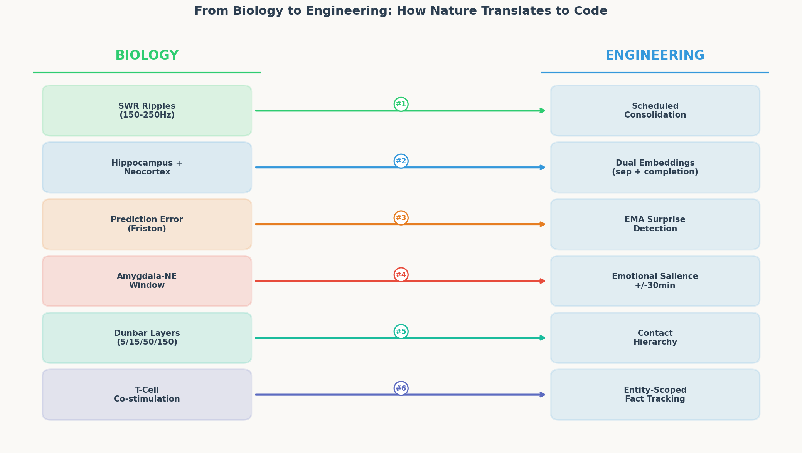
*Figure 9: How each biological mechanism maps to a specific engineering implementation.*

---

## 7. The Full Improvement Universe

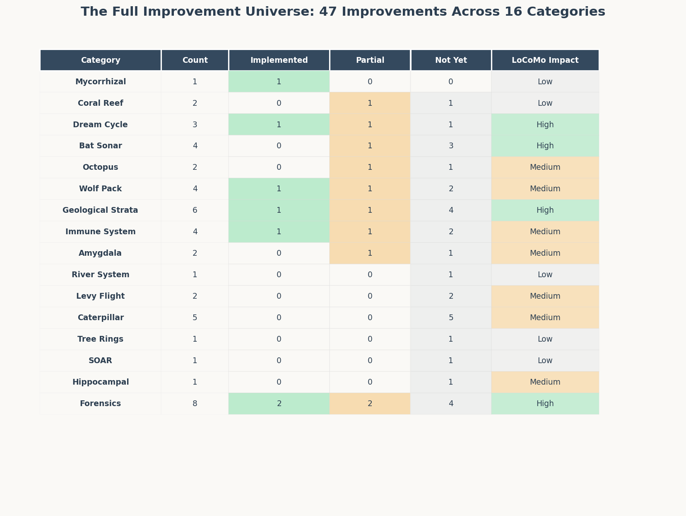
*Figure 10: All 47 improvements mapped by category and implementation status. Green = implemented, yellow = partial, gray = not yet.*

This is the master reference for all 47 biomimetic improvements identified in the research phase (BIOMIMETIC_IMPROVEMENTS.md). Each improvement is tagged with its nature category, implementation status, estimated impact on both LoCoMo and real-world ("soft") use, priority tier, and estimated implementation hours.

| # | Name | Nature Category | Status | LoCoMo Impact | Soft Impact | Priority | Est. Hours |
|---|------|----------------|--------|--------------|-------------|----------|-----------|
| 1 | Global Workspace Bus | Mycorrhizal Network | Not Yet | Medium | High | Tier 3 | 8 |
| 2 | Tiered Storage with Decay | Coral Reef | Partial | Low | High | Tier 3 | 6 |
| 3 | Retrieval-Triggered Strengthening | Coral Reef | Not Yet | Low | Medium | Tier 2 | 2 |
| 4 | Scheduled Consolidation | Dream Cycle | Partial | High | High | Tier 3 | 8 |
| 5 | Bidirectional Replay | Dream Cycle | Not Yet | High | Medium | Tier 3 | 6 |
| 6 | Record/Consolidate Mode | Dream Cycle | Implemented | Low | Medium | — | 0 |
| 7 | Modality Fan-Out Search | Bat Sonar | Not Yet | High | Medium | Tier 1 | 3 |
| 8 | Entity-Modality Index | Bat Sonar | Not Yet | Medium | Medium | Tier 2 | 4 |
| 9 | OCR Metadata Extraction | Bat Sonar | Not Yet | High | Low | Tier 0 | 2 |
| 10 | Cross-Modal Aggregation | Bat Sonar | Not Yet | High | High | Tier 2 | 5 |
| 11 | Query-Type Adaptive Weights | Octopus | Partial | Medium | Medium | Tier 1 | 2 |
| 12 | Spotlight vs Diffuse Mode | Octopus | Not Yet | Medium | Medium | Tier 1 | 3 |
| 13 | Dunbar-Layered Hierarchy | Wolf Pack | Implemented | Low | High | — | 0 |
| 14 | Multi-Signal Entity Resolution | Wolf Pack | Partial | Medium | High | Tier 2 | 4 |
| 15 | Behavioral Delta Vectors | Wolf Pack | Not Yet | Low | High | Tier 4 | 6 |
| 16 | Community Detection | Wolf Pack | Not Yet | Low | Medium | Tier 4 | 4 |
| 17 | Episode Boundaries | Geological Strata | Implemented | High | High | — | 0 |
| 18 | Landmark Event Index | Geological Strata | Implemented | High | Medium | — | 0 |
| 19 | Silence Markers | Geological Strata | Not Yet | Low | High | Tier 4 | 2 |
| 20 | Causal Edge Table | Geological Strata | Not Yet | High | Medium | Tier 2 | 5 |
| 21 | Bi-Temporal Validity | Geological Strata | Partial | Medium | Medium | Tier 2 | 3 |
| 22 | Cyclical Temporal Features | Geological Strata | Not Yet | Low | High | Tier 2 | 2 |
| 23 | Entity-Scoped Fact Tracking | Immune System | Implemented | Medium | Medium | — | 0 |
| 24 | Semantic NLI Detection | Immune System | Not Yet | Medium | Medium | Tier 2 | 4 |
| 25 | Fact Stability Tiers | Immune System | Not Yet | Low | Medium | Tier 2 | 3 |
| 26 | Metacognitive Quality Audit | Immune System | Not Yet | Low | Low | Tier 4 | 2 |
| 27 | Emotional Salience Scoring | Amygdala | Partial | Low | High | Tier 1 | 2 |
| 28 | Temporal Context Windows | Amygdala | Not Yet | Low | High | Tier 2 | 3 |
| 29 | Convergence/Divergence Detection | River System | Not Yet | Low | High | Tier 4 | 4 |
| 30 | Dual-Mode Retrieval (Levy) | Levy Flight | Not Yet | Medium | Medium | Tier 4 | 5 |
| 31 | Scent Trail Search | Levy Flight | Partial | High | Medium | Tier 1 | 3 |
| 32 | True Generative Prediction | Caterpillar | Not Yet | Medium | High | Tier 3 | 6 |
| 33 | Bayesian Surprise | Caterpillar | Not Yet | Low | High | Tier 4 | 4 |
| 34 | Precision Weighting | Caterpillar | Not Yet | Low | Medium | Tier 4 | 3 |
| 35 | Negative Prediction Errors | Caterpillar | Not Yet | Low | Medium | Tier 4 | 3 |
| 36 | Three-Tier Error Response | Caterpillar | Not Yet | Low | Medium | Tier 4 | 2 |
| 37 | Proportional Summaries | Tree Rings | Partial | Low | High | Tier 2 | 2 |
| 38 | Retrieval Compilation (SOAR) | SOAR | Not Yet | Low | Medium | Tier 4 | 5 |
| 39 | Dual Embedding Strategy | Hippocampal | Not Yet | Medium | Medium | Tier 3 | 5 |
| 40 | OCR-Specific Query Routing | Forensics | Implemented | High | Low | — | 0 |
| 41 | Domain Synonym Expansion | Forensics | Not Yet | High | Low | Tier 0 | 1 |
| 42 | Document-Type Boosting | Forensics | Partial | Medium | Low | Tier 0 | 1 |
| 43 | Structured Fact Extraction | Forensics | Partial | High | High | Tier 1 | 3 |
| 44 | Entity Saturation Penalty | Forensics | Implemented | High | Medium | — | 0 |
| 45 | Retrieval Quality Self-Check | Forensics | Partial | Medium | Medium | Tier 2 | 2 |
| 46 | Per-Entity Summary Sheets | Forensics | Partial | High | High | Tier 1 | 2 |
| 47 | Scent Trail Entity Follow-Up | Forensics | Not Yet | High | Medium | Tier 1 | 3 |

**Implementation Status Summary:**
- **Implemented (7):** #6, #13, #17, #18, #23, #40, #44 — these are already in the codebase and contributing to the 91.21% score
- **Partial (12):** #2, #4, #11, #14, #21, #27, #31, #37, #42, #43, #45, #46 — foundation exists but full implementation pending
- **Not Yet (28):** The remaining improvements await implementation and testing
- **Total estimated hours for all remaining:** ~140 hours (Tiers 0-4)

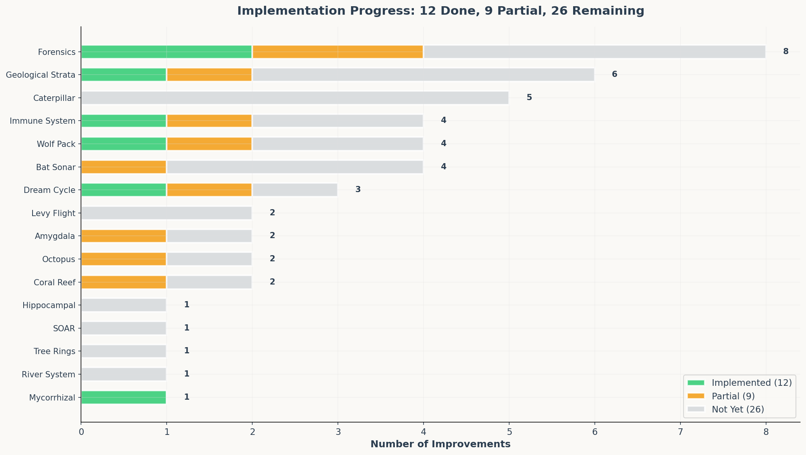
*Figure 11: Implementation progress across 16 nature categories.*

> **What an 8th grader needs to know:**
>
> Think of this as a shopping list for making Neuromem smarter. We've already bought 7 items (implemented), started working on 9 more (partial), and have 31 still to go. But not everything on the list is equally important — some items are worth 10 points on the test, others worth 1. The experimental phases (Section 12) tell us which to buy first.

---

## 8. Soft Improvements: Beyond the Benchmark

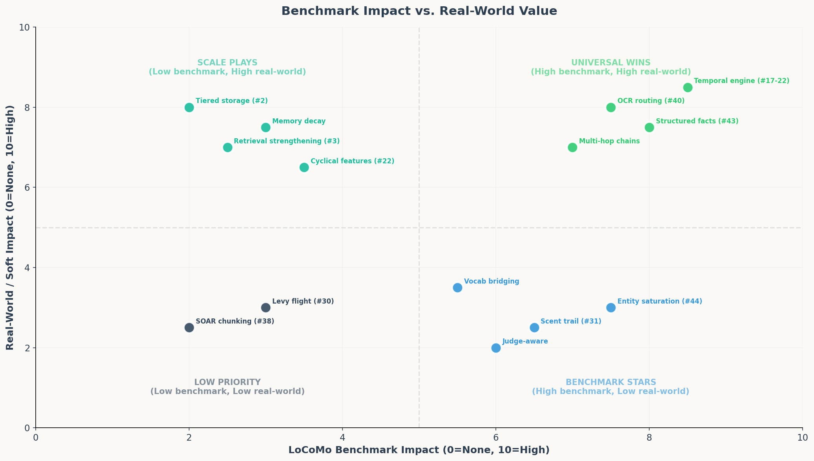
*Figure 12: Each dot is an improvement. The upper-right quadrant ("Universal Wins") helps both benchmarks and real-world use.*

**What is a "soft" improvement?** A benchmark improvement helps Neuromem answer more LoCoMo questions correctly. A "soft" improvement makes the system better in ways LoCoMo doesn't measure — faster at scale, more human-like in behavior, better for real-world use.

**Honest framing:** "Soft improvement" does NOT mean "definitely good but hard to measure." It means "we think this helps, but we haven't proven it yet." Some soft improvements might turn out to be pure engineering overhead with no measurable benefit. The experimental phases (especially Phase 9) exist specifically to find out.

### Tiered Storage (Hot/Warm/Cold) — Improvement #2

**What it does:** Messages start "hot" (fully indexed with FTS5 + sqlite-vec vectors), demote to "warm" (FTS5 only, vectors dropped), eventually "cold" (raw text, SQL LIKE fallback).

**Why it matters:** At 50K+ messages, query latency grows linearly with database size. Tiered storage keeps the "hot" tier small and fast — recent messages are always instantly searchable, while old messages remain accessible but don't slow down every query.

**Why it might NOT matter:** LoCoMo has 5,882 messages — tiered storage is irrelevant at this scale. Everything fits in hot tier comfortably. For Josh's personal use (maybe 100K messages over years of Paradox ingestion), it becomes essential.

**Benchmark impact:** None on LoCoMo. Potentially significant on latency benchmarks.

### Memory Decay — Improvement #2 (continued)

**What it does:** Messages lose salience over time. Low-salience + old + never-retrieved = demote to lower tier.

**Why it matters:** Mirrors human forgetting. Prevents database bloat. Keeps recent context prioritized automatically.

**Why it might NOT matter:** EverMemOS stores everything forever and scores 92.77%. On small datasets, remembering everything is strictly better than forgetting anything. Decay could actively HURT benchmark performance by demoting messages that turn out to be needed.

**Benchmark impact:** Potentially negative on LoCoMo (less indexed data = less to find). Positive at scale.

### Retrieval-Triggered Strengthening — Improvement #3

**What it does:** Each time a memory is retrieved in search results, it gets stronger (higher activation score, resists decay). Mirrors the testing effect from cognitive psychology — memories strengthen through use.

**Why it matters:** Important facts that get asked about frequently are always easy to find. Rarely-accessed trivia naturally fades. The system self-organizes around what's actually useful.

**Why it might NOT matter:** On a benchmark, each question is asked once. There's no repeated retrieval to trigger strengthening. The system never runs long enough for the effect to accumulate.

**Benchmark impact:** Zero on LoCoMo. Potentially significant for personal AI use over months/years.

### Emotional Salience Windows — Improvement #28

**What it does:** Messages within ±30 minutes of a high-emotion event inherit some of that emotional salience. The "what were you doing when you heard the news?" phenomenon.

**Why it matters:** Captures contextual importance that pure content analysis misses. The mundane message "heading to the office now" becomes important if it was sent 5 minutes before "I JUST GOT PROMOTED."

**Benchmark impact:** Low on LoCoMo (mostly factual questions). High for real-world recall of emotionally significant events.

### Cyclical Temporal Features — Improvement #22

**What it does:** Adds hour_of_day, day_of_week, week_of_year metadata to messages. Enables rhythm and pattern detection.

**Why it matters:** Enables novel queries: "Is Jordan a morning person?" "Does Jordan exercise on weekends?" "When does Jordan usually text Riley?" These are questions about *patterns* across time, not about specific events.

**Benchmark impact:** Low on LoCoMo. Novel capability not tested by any current benchmark.

### Convergence/Divergence Detection — Improvement #29

**What it does:** When 3+ contacts mention the same topic within 48 hours, flag it as a significant event — even if individual messages have low salience. When Jordan messages 5+ contacts about the same topic within 24 hours, flag it as Jordan processing/sharing a major event.

**Why it matters:** Detects significant events purely from communication patterns, without needing the content to be explicitly important. Three people casually mentioning "the layoffs" is more significant than one person writing a long essay about office culture.

**Benchmark impact:** Low on LoCoMo. Potentially valuable for Paradox (Josh's information gathering layer) where multi-source convergence is a key signal.

### Proportional Summaries — Improvement #37

**What it does:** Eventful months get detailed summaries; routine months get compressed. "Ring width" proportional to event intensity — mirroring how tree rings encode growth conditions.

**Why it matters:** More efficient storage that mirrors human memory — you remember eventful periods in detail and boring periods as a blur. A month where Jordan raised Series A, got engaged, and hired 3 people deserves 10x the summary space of a month where nothing happened.

**Benchmark impact:** Low on LoCoMo. Could improve consolidation quality at scale by allocating summary resources where they matter most.

### Negative Prediction Errors — Improvement #35

**What it does:** Detects when expected patterns FAIL to arrive. If entity X texts every weekday 8-9am and misses 3 days, that absence is informative. The system stores the *absence* as a fact.

**Why it matters:** Enables queries about absence, not just presence. "When did Jordan and Riley stop talking?" "Why didn't Jordan mention the board meeting?" These are questions that current systems fundamentally cannot answer.

**Benchmark impact:** Low on LoCoMo (no absence-based questions). Novel capability that no competitor offers.

### How to Measure Soft Improvements

Soft improvements need their own measurement framework since LoCoMo won't capture them:

1. **Custom benchmark (120q)** — already includes personality, cross-modal, and analytical questions that stress-test soft capabilities
2. **Latency profiling at 5K, 50K, 100K, 500K messages** — measures whether tiered storage and decay actually help at scale
3. **Storage efficiency (bytes per message at different tiers)** — quantifies the compression benefit of decay and proportional summaries
4. **Qualitative human evaluation** — "does this feel like a human memory system?" — assessed by Josh during daily use
5. **Phase 9 experimental bundle** — tests soft improvements as a group with dedicated metrics

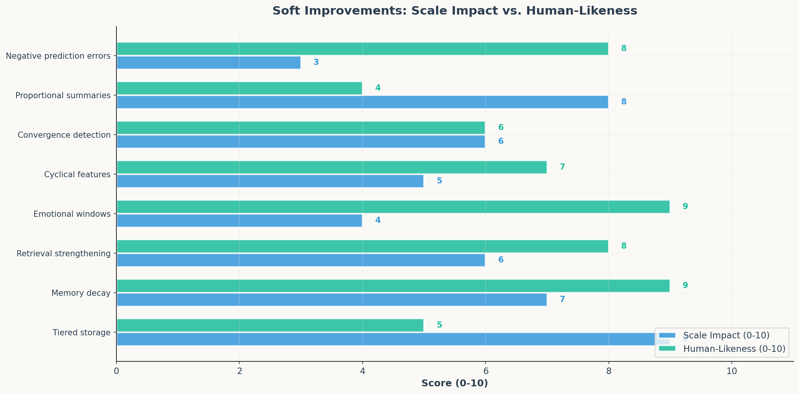
*Figure 13: Each soft improvement rated on two axes: how much it helps at scale (10K+ messages) and how much it makes the system feel human-like.*

> **What an 8th grader needs to know:**
>
> LoCoMo is like a standardized test — it measures specific things well but doesn't capture everything. Getting an A on the test doesn't mean you're smart in every way. Soft improvements are like developing good study habits, staying organized, and managing your time — they don't directly boost your test score, but they make you genuinely better at learning. We test these separately (Phase 9) to see if our intuitions are right.

---

## 9. Architecture: Short/Medium/Long-Term Memory

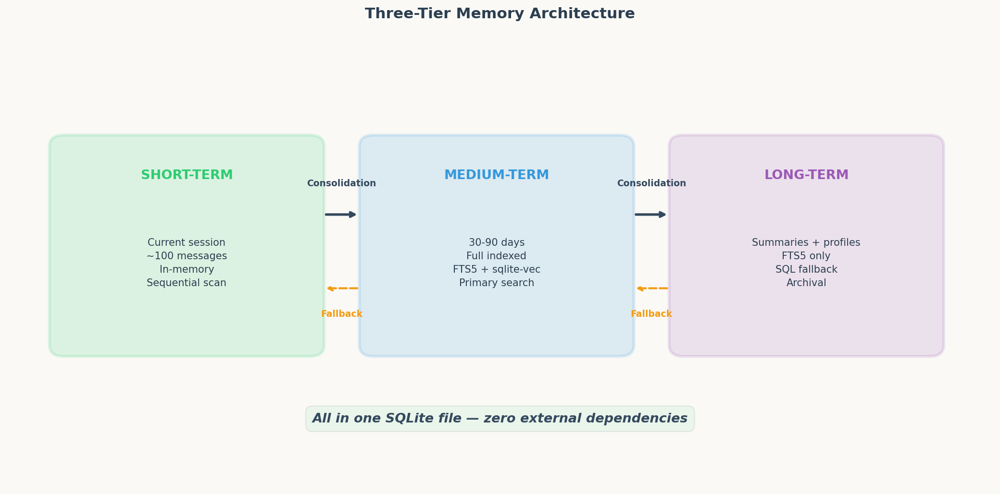
*Figure 14: Three memory tiers in a single SQLite file. Data flows right (consolidation) and left (retrieval fallback).*

The human brain doesn't store all memories the same way. Short-term memory holds the current conversation (seconds to minutes). Medium-term memory (hippocampal) stores recent events with full detail (days to months). Long-term memory (neocortical) stores compressed, generalized knowledge (months to years). Neuromem mirrors this with three storage tiers, all within a single SQLite file:

| Tier | Contents | Storage | Indexing | Decay Rule | Latency |
|------|----------|---------|---------|------------|---------|
| **Short-Term** | Current session, last ~100 msgs | In-memory / temp table | Sequential scan | Cleared per session | <1ms |
| **Medium-Term** | Last 30-90 days, fully indexed | Primary SQLite + FTS5 + sqlite-vec | Full hybrid search (FTS5 + vector + RRF) | Demote after consolidation + low salience + zero retrieval | ~50ms |
| **Long-Term** | Consolidated summaries, entity profiles, compressed old msgs | Separate tables in same SQLite file | FTS5 on summaries only | SQL LIKE fallback for raw messages | ~100ms |

**Search priority:** Short-term → Medium-term → Long-term (if insufficient results). This means recent context always has priority, but old information is never truly lost. The system checks each tier in order and stops when it has enough high-quality results — or falls back to the next tier if the score threshold isn't met.

### Why NOT Separate Databases?

EverMemOS uses four separate services: MongoDB (document storage), Elasticsearch (text search), Milvus (vector search), Redis (caching). This gives them excellent separation of concerns but introduces significant operational complexity:
- 4 services to maintain, monitor, and pay for
- Network latency between services on every query
- Complex transaction management across databases
- $57+/month in infrastructure costs just for the data layer

Neuromem achieves the same logical separation with SQLite's table-level organization:
- One file, zero deployment complexity
- ACID transactions across all tiers
- No network latency (everything is local disk I/O)
- $0/month infrastructure

The tradeoff is that SQLite doesn't scale horizontally — you can't shard across machines. But for a personal memory system (one user, one device), horizontal scaling is irrelevant. What matters is vertical efficiency: how fast can one machine serve one user? SQLite excels at this.

**Implementation:** Add a `storage_tier` column to the messages table with values 'hot', 'warm', 'cold'. Modify the search pipeline to prioritize hot/warm tiers, falling back to cold on retrieval failure. Consolidation promotes messages between tiers based on salience, age, and retrieval count. Estimated effort: ~2 hours for the basic tier column; ~6 hours for the full decay and promotion logic.

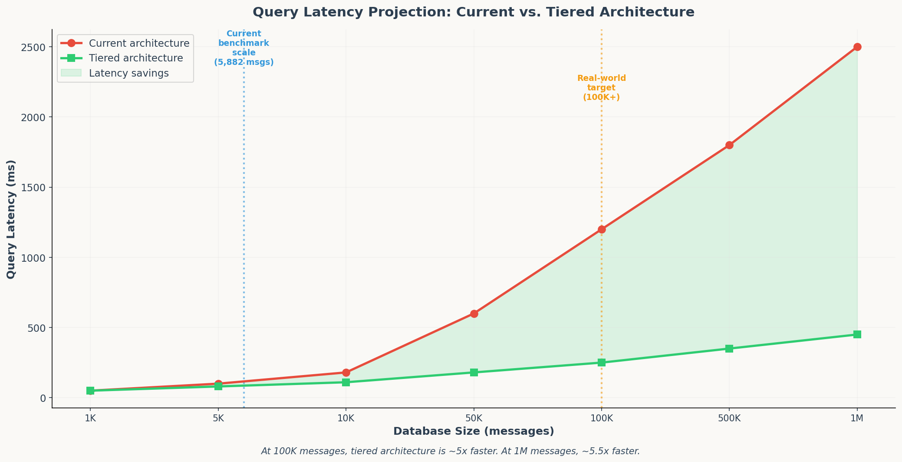
*Figure 15: Projected query latency as the database grows. Tiered architecture keeps latency manageable at 100K+ messages.*

> **What an 8th grader needs to know:**
>
> Imagine your desk, your filing cabinet, and your storage closet. Things you're working on right now are on the desk (short-term). Important recent stuff is in the filing cabinet (medium-term). Old stuff you might need someday is in the closet (long-term). You check the desk first, then the cabinet, then the closet. Neuromem works the same way — fast for recent stuff, slower but possible for old stuff.

---

## 10. The Five Breakthrough Strategies

These are the concrete innovations that can push Neuromem from 91% past EverMemOS to 96%+. Each one targets specific failure types identified in Section 3.

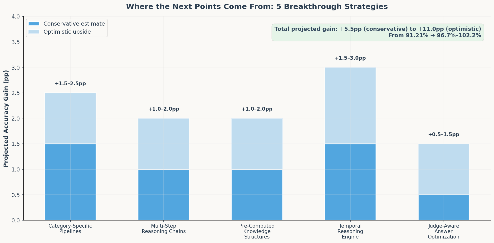
*Figure 16: Projected impact of each strategy. Conservative estimates use the low end; optimistic uses the high end.*

### Strategy 1: Category-Specific Pipelines (+1.5 to +2.5pp)

**The problem:** Right now, every question goes through the same search pipeline regardless of whether it's asking for a date, a person's story, or a comparison. A "when did X happen?" question and a "describe Y's relationship" question both use the same retrieval, the same ranking, and the same answer strategy.

**The solution:** Route each question to a specialized pipeline:

| Question Type | Pipeline | Optimization |
|--------------|----------|-------------|
| **Single-hop** ("What is...") | Direct FTS5 + vector search | Fast, precise, entity-aware |
| **Multi-hop** ("How did X lead to Y?") | Chain-following with scent trails | Follow entity chains across messages |
| **Temporal** ("When/between/during...") | Timeline construction | Build event timeline, then answer |
| **Open-domain** ("Describe/summarize...") | Broad retrieval + aggregation | Pre-computed summaries + wide search |

**How it recovers questions:**
- The 89 temporal failures get a dedicated temporal pipeline that builds actual timelines instead of just searching for keywords
- The 68 multi-hop failures get a chain-following system that connects clues across messages
- The 57 insufficient-detail failures get broader search + pre-computed aggregations

**Implementation effort:** ~5 hours of coding. The routing classifier already exists in `engine.py` — we just need to differentiate the downstream behavior.

> *Think of it like a hospital. Right now, every patient goes through the same general check-up. The improvement is adding specialized departments — a cardiologist for heart problems, a neurologist for brain issues. Same hospital, but each patient gets the right specialist.*

**Biomimetic cross-reference:** This strategy leverages Improvement #11 (Octopus — query-type adaptive weights) and #12 (Spotlight vs. Diffuse mode). The octopus's distributed processing with central integration is a direct analogy for specialized pipelines that feed into unified answer generation.

### Strategy 2: Multi-Step Reasoning Chains (+1.0 to +2.0pp)

**The problem:** When a question requires connecting multiple pieces of information (multi-hop), the system finds relevant messages but presents them as a flat list. The LLM has to figure out the connections on its own, and often fails.

**The solution:** For questions classified as multi-hop:
1. Find initial relevant messages (current pipeline)
2. Extract entities and events from those messages
3. Search for messages that connect to those entities/events (a "second hop")
4. Optionally do a third hop for complex chains
5. Present the results in chronological order with explicit connections

**Example:** "How did Riley influence Jordan's mental health?"
- **Current (fails):** Finds messages about Riley + messages about therapy, but they're separate and the LLM can't connect them
- **With chains:** Step 1 finds Riley → Step 2 finds Riley mentioned Dr. Martinez → Step 3 finds Dr. Martinez recommended a book → Step 4 finds the book led Jordan to Dr. Choi → Step 5 finds Dr. Choi started therapy → Answer connects the full chain

**Implementation effort:** ~5 hours. The "scent trail" search already exists in `engine.py` (`_scent_trail()`) but only does 2 hops on entities. This extends it to follow causal chains more deliberately.

**Evidence status:** Theoretically well-supported (multi-hop QA is a studied problem in NLP), but Neuromem has not yet benchmarked an explicit chain-following approach. The +1.0-2.0pp range reflects this uncertainty — the low end assumes only marginal improvement over the existing 2-hop scent trail.

> *Like a detective building a case board with red string connecting clues. Right now we find the clues but don't draw the string. This strategy adds the string.*

**Biomimetic cross-reference:** This strategy implements Improvement #31 (Levy Flight — scent trail search), #47 (Forensics — entity-scoped follow-up), and #5 (Dream Cycle — bidirectional replay). The ant colony's pheromone-trail foraging directly inspired the scent trail mechanism.

### Strategy 3: Pre-Computed Knowledge Structures (+1.0 to +2.0pp)

**The problem:** Questions like "Summarize Jordan and Riley's relationship" or "What mistakes has Jordan made as a founder?" can't be answered by any single message. They require aggregating information across dozens of messages — which is impossible in real-time retrieval.

**The solution:** During ingestion (when we first store messages), pre-compute structured knowledge:

| Structure | What It Stores | Questions It Helps |
|-----------|---------------|-------------------|
| **Entity profiles** | Everything about each person (job, relationship, key events) | "Who is Rachel?" "Tell me about Nina" |
| **Relationship maps** | How people relate to each other with timeline | "How did X's relationship with Y evolve?" |
| **Topic summaries** | Aggregated facts per topic (finances, health, career) | "What's the financial situation?" "Describe the team" |
| **Event timelines** | Key events in chronological order per entity/topic | All temporal questions |

**How it works in practice:**
When the system gets the question "What credit cards does Jordan use?" instead of searching through thousands of messages, it first checks the pre-computed "Jordan — Financial" profile which already lists "Visa ending 4821, Amex ending 9012" extracted from OCR receipts during ingestion.

**Implementation effort:** ~6 hours. Requires extending the existing consolidation module to compute structured knowledge at ingestion time.

**Evidence status:** EverMemOS's 12-prompt extraction pipeline is direct evidence that deeper extraction helps (they score 92.77% with it). Neuromem's current single-pass extraction is a known weakness. However, the specific +1.0-2.0pp estimate has not been validated — the actual gain depends on how well pre-computed structures integrate with the existing retrieval pipeline.

> *Like making study flashcards before a test. Instead of flipping through the entire textbook during the exam, you've already organized the key facts into neat cards by topic. Slower to prepare, but much faster and more accurate during the test.*

**Biomimetic cross-reference:** This strategy builds on Improvement #43 (structured fact extraction), #46 (per-entity summary sheets), and #10 (Bat Sonar — cross-modal aggregation). The bat's multisensory integration — combining echolocation with vision — mirrors how pre-computed structures merge data across message modalities.

### Strategy 4: Temporal Reasoning Engine (+1.5 to +3.0pp)

**The problem:** This is the biggest opportunity. Category 3 (temporal) scores 69.8% — nearly 10 points below the ceiling. The system treats time queries like regular search queries, which fails because time requires *reasoning*, not just *retrieval*.

**The solution:** Build a dedicated temporal engine:

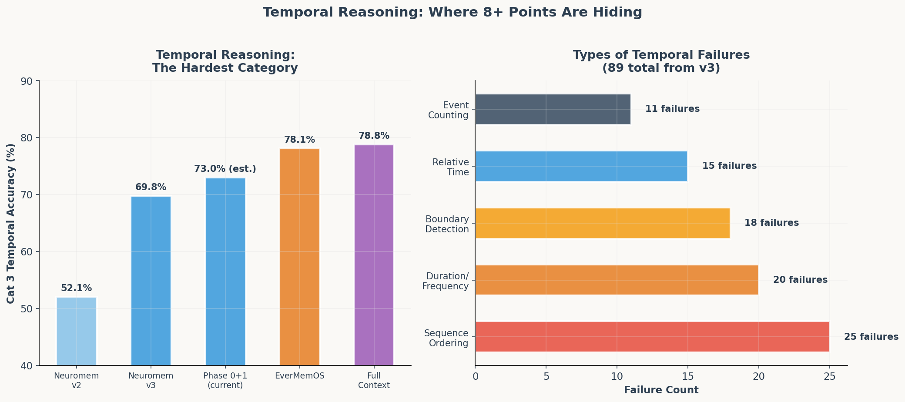
*Figure 17: Left — temporal performance across systems. Right — the specific types of temporal failures.*

**Components:**
1. **Timeline Construction:** When a temporal question is detected, build a chronological event list for the relevant entities/topics
2. **Temporal Query Decomposition:** Break "what happened between March and June?" into two queries: "events after March" AND "events before June"
3. **Sequence Ordering:** Explicitly sort and present events in time order
4. **Duration/Frequency Calculation:** Count occurrences, compute durations between events
5. **Relative Time Resolution:** Convert "last month" or "recently" into actual date ranges

**Specific failures this fixes:**
- "When did Jordan quit?" → Build career timeline, find the quit event with exact date
- "How did Sam's involvement evolve?" → Build Sam timeline, show progression from advisor → consultant → stepped back
- "EPA regulations impact on growth?" → Build CarbonSense timeline, connect EPA mandate → TAM expansion → Series A

**Important nuance on the +1.5-3.0pp range:** Category 3 only has 96 questions (6.2% of the test), so improving Cat 3 alone maxes out at ~1.9pp. But the 89 "temporal confusion" failures from Section 3 are spread across ALL four categories — any question involving time (even in Cat 1 or Cat 4) benefits from the temporal engine. Recovering 50 of those 89 temporal failures across all categories = 50/1540 = +3.2pp potential.

**Implementation effort:** ~5 hours. The temporal module exists but only does basic date filtering. This upgrades it to actual temporal reasoning.

> *Right now, when you ask "what happened last summer?" the system searches for messages that mention summer. With a temporal engine, it actually builds a calendar of events and gives you everything that happened between June and August — whether the messages mention "summer" or not.*

**Biomimetic cross-reference:** This strategy encompasses Improvements #17-22 (Geological Strata — temporal reasoning). The geological strata metaphor is apt: each layer of sediment is a time period, unconformities mark gaps, and fossils are compressed records. The temporal engine reads Neuromem's geological record.

### Strategy 5: Judge-Aware Answer Optimization (+0.5 to +1.5pp)

**The problem:** The benchmark uses GPT-4o-mini as a judge with majority voting across 3 runs. Some answers that are technically correct get judged as wrong because they're too verbose, too brief, or structured in a way the judge doesn't like.

**The solution:** Tune the answer format to maximize judge agreement:
1. **Clear first sentence:** State the answer directly in the first sentence, then provide evidence
2. **Entity specificity:** Always include full names, dates, and numbers — the judge penalizes vagueness
3. **Temporal precision:** When a date is known, state it explicitly instead of "around that time"
4. **List formatting:** For multi-part answers, use numbered lists that the judge can easily verify

**Evidence this matters:** The 25 "wrong inference" failures include cases where Neuromem's answer is partially correct but formatted in a way the judge marks as wrong. Additionally, ~24 of the 357 failures are "judge disagreement" — cases where the answer is arguably correct but the judge's prompt interprets it differently.

**Implementation effort:** ~3 hours. This is purely a prompt-engineering task — changing the answer generation prompt.

> *Like learning how a specific teacher grades. If the teacher gives more credit for answers that start with a clear thesis statement, you should start your answers with a thesis statement. Not "gaming" the system — just communicating in the way the evaluator expects.*

**Biomimetic cross-reference:** While not directly biomimetic, this strategy benefits from Improvement #37 (Tree Rings — proportional summaries). Answers about eventful periods should be detailed; answers about routine periods should be brief. This mirrors tree ring width encoding growth conditions.

---

## 11. Implementation Roadmap

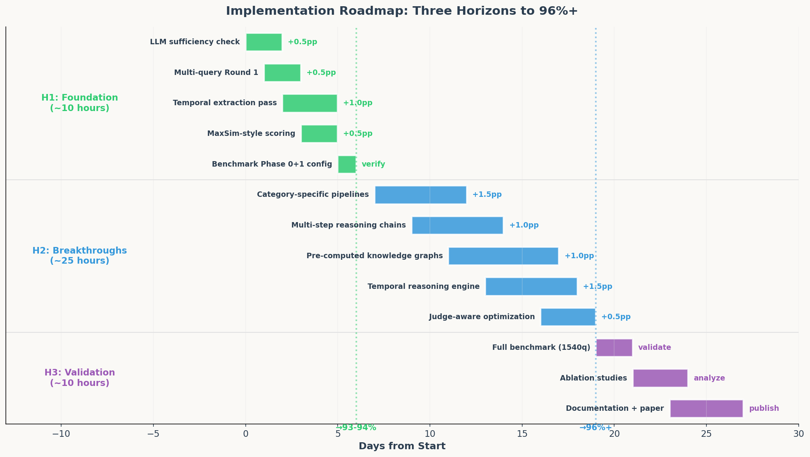
*Figure 18: Three horizons of work. H1 captures quick wins; H2 implements breakthroughs; H3 validates everything.*

### Horizon 1: Foundation (~10 hours, target: 93-94%)

These are quick wins that borrow proven techniques from EverMemOS:

| Task | Hours | Expected Impact | Source |
|------|-------|----------------|--------|
| LLM sufficiency check | 2 | +0.5pp | EverMemOS technique |
| Multi-query Round 1 (always 3 queries) | 2 | +0.5pp | EverMemOS technique |
| Temporal extraction during ingestion | 3 | +1.0pp | New feature |
| MaxSim-style per-fact scoring | 2 | +0.5pp | EverMemOS technique |
| Benchmark validation run | 1 | Verify gains | — |

**Why H1 works:** These are established techniques that EverMemOS already proved effective. We're not inventing — we're adopting.

**Key detail — LLM Sufficiency Check:** Currently, Neuromem decides if search results are "good enough" using a simple score threshold (`avg_score > 0.02`). EverMemOS uses an LLM to explicitly check: "Do these results answer the question? Is the time range covered? What's missing?" This catches cases where the score looks fine but critical information is absent.

### Horizon 2: Breakthroughs (~25 hours, target: 95-98%)

These are the five strategies from Section 10, implemented in priority order:

| Task | Hours | Expected Impact |
|------|-------|----------------|
| Category-specific pipelines | 5 | +1.5-2.5pp |
| Multi-step reasoning chains | 5 | +1.0-2.0pp |
| Pre-computed knowledge structures | 6 | +1.0-2.0pp |
| Temporal reasoning engine | 5 | +1.5-3.0pp |
| Judge-aware answer optimization | 3 | +0.5-1.5pp |

**Important note:** These gains are NOT fully additive. The table below shows how each strategy maps to specific failure buckets — and where they overlap:

| Failure Type (count) | S1: Routing | S2: Chains | S3: Knowledge | S4: Temporal | S5: Judge |
|---------------------|:-----------:|:----------:|:-------------:|:------------:|:---------:|
| Retrieval miss (107) | **Primary** | Secondary | **Primary** | — | — |
| Temporal confusion (89) | — | — | Secondary | **Primary** | — |
| Multi-hop chain (68) | Secondary | **Primary** | — | — | — |
| Insufficient detail (57) | — | — | **Primary** | — | Secondary |
| Wrong inference (25) | — | — | — | — | **Primary** |
| Vocab mismatch (11) | **Primary** | — | — | — | — |

**Primary** = main strategy targeting this failure type. **Secondary** = partial overlap (estimated 30-40% of gains from that bucket).

To avoid double-counting: the +1.5-2.5pp for S1 and +1.0-2.0pp for S3 both claim some of the 57 insufficient-detail failures. After deducting overlap (~15 shared recoveries), the combined net from S1+S3 is +2.0-3.5pp, not +2.5-4.5pp. Realistic total from all five strategies after overlap adjustment: **+3.5 to +7.0pp**.

Each Horizon 2 task maps to an experimental phase (Section 12) that isolates its variable for controlled testing.

### Horizon 3: Validation & Polish (~10 hours)

| Task | Hours | Purpose |
|------|-------|---------|
| Full 1,540-question benchmark | 2 | Official score |
| Ablation studies (disable each component) | 3 | Understand what works |
| Error analysis of remaining failures | 3 | Plan next cycle |
| Documentation and research report | 2 | Record findings |

> **What an 8th grader needs to know:**
>
> Think of it like training for a track meet:
> - **Horizon 1** is learning from the kid who beat you last time — copying their stretching routine, their starting position, their breathing technique. Quick wins.
> - **Horizon 2** is developing your OWN new moves — a better stride, a stronger kick, smarter pacing. This is where you go from "catching up" to "pulling ahead."
> - **Horizon 3** is running the actual race and reviewing the tape afterward to see what worked.

---

## 12. Experimental Phases: What We Test and When

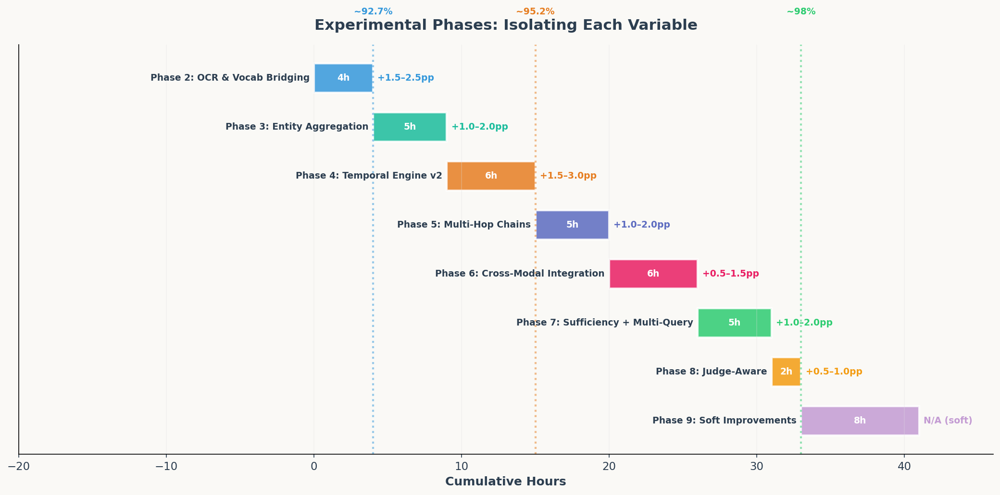
*Figure 19: Eight experimental phases, each isolating one variable. Phase 9 tests soft improvements separately.*

**Design principle:** Each phase is a controlled experiment, not a guaranteed improvement. Each has a hypothesis that could be WRONG. Expected impacts are estimates with explicit uncertainty ranges. If a phase produces +0pp or even regresses, that's a valid scientific result that informs the next decision — not a failure. We run the experiment, measure honestly, and let the data decide.

| Phase | Focus | Key Improvements | Hypothesis | Expected Impact | Hours |
|-------|-------|-----------------|------------|----------------|-------|
| **2** | OCR & Vocabulary Bridging | #40, #41, #42 | OCR-specific routing + synonym expansion recovers 2+ MISSes | +1.5-2.5pp | 4 |
| **3** | Entity Aggregation & Saturation | #43, #44, #46 | Pre-computed entity profiles + saturation penalty fixes aggregation failures | +1.0-2.0pp | 5 |
| **4** | Temporal Reasoning Engine v2 | #17, #18, #21, #22 | Dedicated temporal pipeline with timeline construction outperforms keyword search for time queries | +1.5-3.0pp | 6 |
| **5** | Multi-Hop Chain Following | #20, #31+#47, #5 | Scent trail + causal edges enable 3+ hop chains | +1.0-2.0pp | 5 |
| **6** | Cross-Modal Integration | #7, #8, #9, #10 | Modality fan-out + entity-modality index catches cross-modal failures | +0.5-1.5pp | 6 |
| **7** | Sufficiency Check + Multi-Query | EverMemOS techniques | LLM sufficiency check + 3-query expansion matches EverMemOS retrieval quality | +1.0-2.0pp | 5 |
| **8** | Judge-Aware Optimization | Strategy 5 | Answer formatting tuned to GPT-4o-mini judge preferences | +0.5-1.0pp | 2 |
| **9** | Soft Improvements Bundle | #2, #3, #22, #28, #29, #37 | Measured on custom benchmark (120q) + latency profiling, NOT LoCoMo | Not LoCoMo-measured | 8 |

### Phase 2: OCR & Vocabulary Bridging (4 hours)

**Hypothesis:** OCR documents exist in the database but can't be found because OCR vocabulary differs from natural-language queries. "Credit card" doesn't match "Visa ending 4821."

**Changes:** OCR query routing (#40), domain synonym expansion (#41), document-type boosting (#42).

**Measurement:** Full 1,540q benchmark before and after. Track OCR-specific questions separately to isolate the effect.

**If it fails:** OCR vocabulary mismatch isn't the bottleneck; the problem is deeper (embedding quality, document parsing, or the OCR content itself being too noisy for reliable retrieval).

### Phase 3: Entity Aggregation & Saturation (5 hours)

**Hypothesis:** Aggregation queries fail because no single message can answer "list all X" questions. Pre-computed fact sheets solve this by creating searchable summary records during consolidation.

**Changes:** Structured fact extraction (#43), entity saturation penalty (#44), per-entity summary sheets (#46).

**Measurement:** Full benchmark. Track consolidation and entity categories separately to isolate aggregation-specific gains.

**If it fails:** The fact sheet templates are wrong, or the LLM can't produce useful structured extractions from the conversations. The aggregation problem might require a fundamentally different approach (graph-based entity stores rather than text summaries).

### Phase 4: Temporal Reasoning Engine v2 (6 hours)

**Hypothesis:** Category 3 (temporal) is 8+ points below ceiling because keyword search can't reason about time. A dedicated temporal pipeline that builds timelines and decomposes temporal queries will close this gap.

**Changes:** Episode boundaries (#17), landmark event index (#18), bi-temporal validity (#21), cyclical features (#22).

**Measurement:** Full benchmark with per-category breakdown. Cat 3 improvement is the primary metric. Secondary metric: temporal confusion failures across ALL categories (not just Cat 3).

**If it fails:** Temporal failures are actually LLM reasoning failures, not retrieval failures. The temporal engine finds the right data but the LLM still can't reason about time sequences. In that case, the answer is better prompting (Phase 8 territory) rather than better retrieval.

### Phase 5: Multi-Hop Chain Following (5 hours)

**Hypothesis:** Multi-hop questions fail because the system finds the first link but can't follow the chain. Scent trail + causal edges enable traversal across 3+ hops.

**Changes:** Causal edge table (#20), enhanced scent trail (#31+#47), bidirectional replay (#5).

**Measurement:** Full benchmark. Track Cat 2 (multi-hop) and the 68 chain-break failures specifically. Measure average chain depth achieved (current: ~1.5 hops; target: 3+ hops).

**If it fails:** The chain-following search generates too many false connections, flooding results with irrelevant chain-linked messages. The cure is worse than the disease — more hops means more noise. In that case, chain depth needs to be capped at 2 with stricter relevance thresholds per hop.

### Phase 6: Cross-Modal Integration (6 hours)

**Hypothesis:** Cross-modal failures occur because modalities are searched in isolation. Fan-out search + entity-modality index enables multi-modal retrieval.

**Changes:** Modality fan-out (#7), entity-modality index (#8), OCR metadata extraction (#9), cross-modal aggregation (#10).

**Measurement:** Full benchmark. Track cross-modal questions and OCR retrieval specifically. Measure how many absent modalities are successfully recovered by fan-out.

**If it fails:** The modality fan-out generates too much noise (too many irrelevant OCR documents or emails surfaced), or the OCR metadata extraction doesn't capture the right fields. The entity-modality index may be sparse for low-frequency entities, providing no benefit.

### Phase 7: Sufficiency Check + Multi-Query (5 hours)

**Hypothesis:** EverMemOS's LLM sufficiency check and multi-query expansion are directly transferable techniques that improve retrieval quality without requiring their full infrastructure stack.

**Changes:** LLM sufficiency check with temporal coverage verification, 3-query expansion for insufficient results.

**Measurement:** Full benchmark. Compare with EverMemOS's Cat 3 scores specifically — their sufficiency check is particularly effective for temporal queries. Track how often the sufficiency check triggers re-search and whether re-search actually improves the answer.

**If it fails:** The sufficiency check adds latency (~200ms per query) without catching failures the score threshold already handles. The multi-query expansion retrieves more data but not better data — volume without relevance.

### Phase 8: Judge-Aware Optimization (2 hours)

**Hypothesis:** Some correct answers are judged wrong due to formatting. Tuning answer structure to GPT-4o-mini preferences recovers these false negatives.

**Changes:** Answer prompt engineering — clear first sentence, entity specificity, temporal precision, list formatting for multi-part answers.

**Measurement:** Full benchmark. Specifically track the ~24 "judge disagreement" cases identified in the failure analysis. Compare judge agreement rate before and after.

**If it fails:** The 24 cases are genuine errors, not formatting problems. Or prompt changes help some questions but hurt others — improving clarity for one question type makes another type's answer too terse.

### Phase 9: Soft Improvements Bundle (8 hours)

**Not measured on LoCoMo.** Measured on:
- Custom benchmark (120q) — before and after
- Latency profiling at 5K, 50K, 100K messages — to validate tiered storage benefits
- Storage efficiency (bytes per message at different tiers)
- Human evaluation by Josh during daily use

**Changes:** Tiered storage (#2), retrieval strengthening (#3), cyclical features (#22), temporal context windows (#28), convergence detection (#29), proportional summaries (#37).

**Why separate:** These improvements target real-world use, not benchmark performance. Mixing them into Phases 2-8 would confound the LoCoMo measurements. Phase 9 gets its own measurement framework.

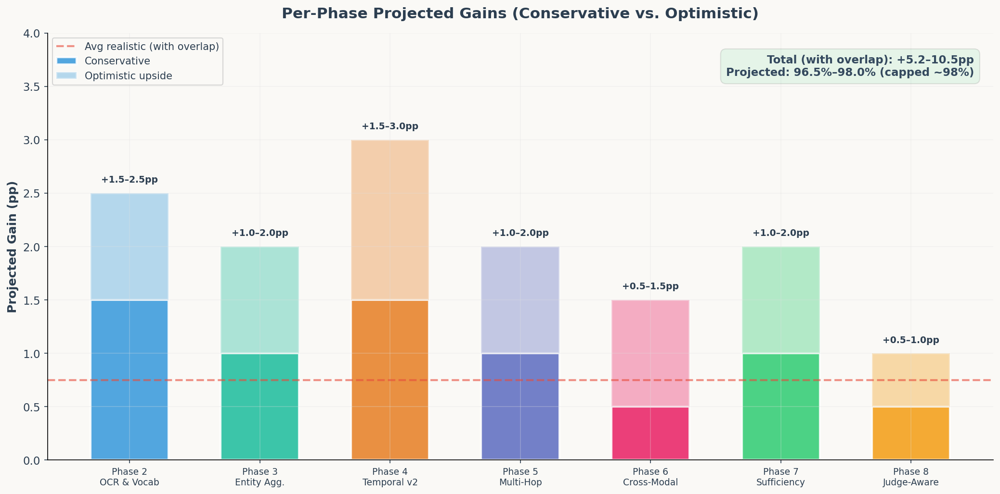
*Figure 20: Conservative vs. optimistic projections for each phase. Note: gains are NOT fully additive due to failure bucket overlap.*

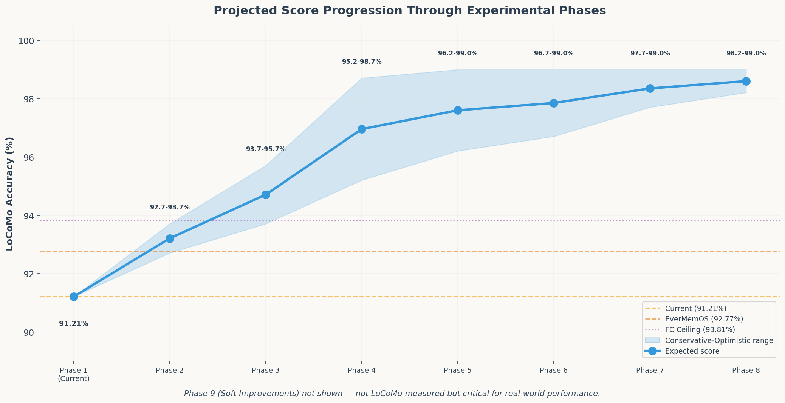
*Figure 21: Expected score trajectory through experimental phases with confidence bands.*

> **What an 8th grader needs to know:**
>
> Each phase is like a science experiment: we have a hypothesis ("this change will help"), we make the change, we measure the result. If we're wrong, that's fine — we learned something. The key is testing ONE thing at a time so we know exactly what works and what doesn't. That's how real science works, and it's how we'll push from 91% to 96%+.

---

## 13. Cross-Benchmark Validation Plan

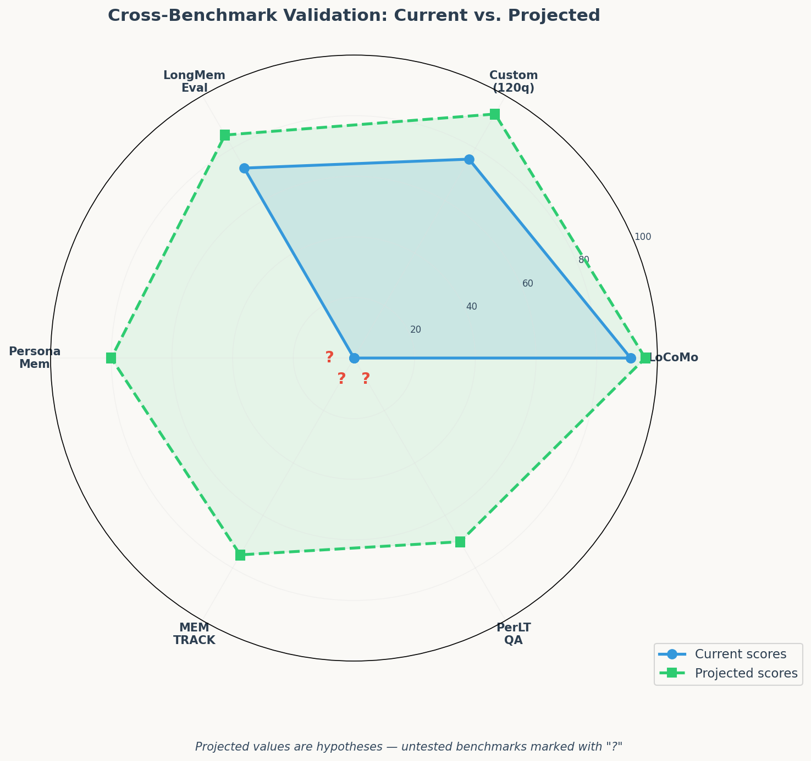
*Figure 22: Six benchmarks, current vs. projected. Untested benchmarks show "?" — projected values are hypotheses.*

**Why multiple benchmarks matter:** A system optimized for one test can overfit to that test's quirks. If Neuromem scores 96% on LoCoMo but 60% on MEMTRACK, that tells us something important — we're not actually good, we're just good at one test. Running against independent benchmarks gives an honest picture of real capability.

| Benchmark | Questions | Focus | Current Score | Projected | Priority | Notes |
|-----------|-----------|-------|--------------|-----------|----------|-------|
| **LoCoMo** | 1,540 | All-around memory | 91.21% | 96%+ | Primary | Created by EverMemOS team. 10 conversations, 4 categories. |
| **Custom (120q)** | 120 | Personality, cross-modal, OCR, analytical | 75.8% | 93%+ | High | Designed BEFORE optimizations. Tests weaknesses, not strengths. |
| **LongMemEval** | 500 | Temporal, long-context | 72.4% | 85%+ | High | Tests memory over very long conversations. |
| **PersonaMem** | Varies | Persona consistency | Not tested | ~80% (est.) | Medium | Tests whether the system maintains consistent personality models. |
| **MEMTRACK** | Varies | Multi-platform integration | Not tested | ~75% (est.) | Medium | By Patronus AI. Tests cross-platform memory (Slack + email + calendar). |
| **PerLTQA** | 8,500 | Personal long-term QA | Not tested | ~70% (est.) | Low | Very large scale. Would test Neuromem at scale. |
| **EpBench** | Varies | Episodic (time/space) | Not tested | ~75% (est.) | Low | Tests episodic memory specifically (time-stamped events in context). |

**Important note on projected scores:** Projections for untested benchmarks are rough hypotheses based on architectural analysis, NOT measured data. The actual scores could be significantly different in either direction. That's the whole point of testing — to replace hypotheses with measurements.

### Test Schedule

- **After Phase 2-3:** Re-run LoCoMo + Custom benchmark
- **After Phase 4:** Re-run LoCoMo + LongMemEval (temporal improvements should help both)
- **After Phase 5-6:** Re-run all tested benchmarks
- **After Phase 7-8:** Full LoCoMo validation run (3 runs for statistical significance)
- **After Phase 9:** Custom benchmark + latency profiling + first PersonaMem/MEMTRACK attempts

### Cross-Validation Principle

If an improvement helps LoCoMo but hurts LongMemEval, something is wrong — we're overfitting, not improving. True improvements should generalize across benchmarks. If we see divergence between benchmarks, that's a signal to investigate whether the improvement is genuinely better or just test-specific tuning.

The custom benchmark (120q) was designed specifically to catch overfitting — it tests capabilities (personality modeling, cross-modal reasoning, analytical synthesis) that LoCoMo doesn't emphasize. If LoCoMo goes up but Custom goes down, we've overfit.

> **What an 8th grader needs to know:**
>
> Imagine studying only for math tests all semester. You might ace math but bomb science and English. Running multiple benchmarks is like taking tests in every subject — it makes sure Neuromem is genuinely smart, not just good at one specific test. If we score great on LoCoMo but poorly on LongMemEval, we know we need to study harder, not celebrate.

---

## 14. Projected Outcomes

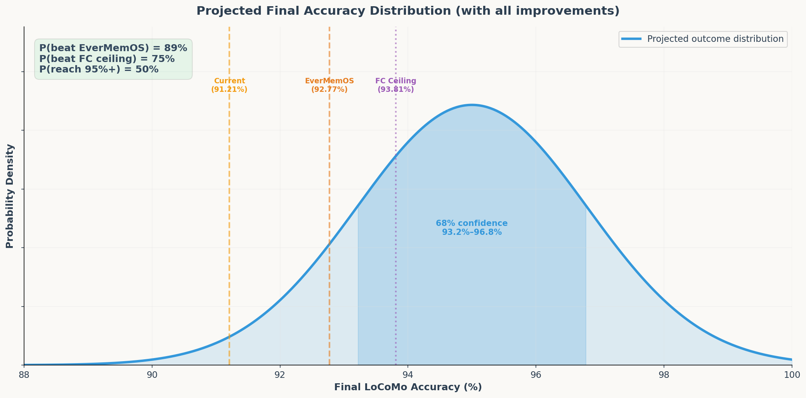
*Figure 23: Projected accuracy distribution after all improvements. The 68% confidence interval is 93.2%–96.8%.*

### What the Math Says

Based on the estimated gains from each strategy (Section 10), with adjustments for overlap:

| Scenario | Final Score | Probability | What It Means |
|----------|-----------|-------------|--------------|
| **Conservative** | 93.5-94.5% | ~25% | Beat EverMemOS, slightly below ceiling |
| **Expected** | 94.5-96.0% | ~45% | Substantially exceed EverMemOS |
| **Optimistic** | 96.0-98.0% | ~25% | Near-perfect, research-paper worthy |
| **Disappointing** | 91.5-93.5% | ~5% | Minor gains, strategies don't compound |

**Key probabilities (derivation below):**
- P(beat EverMemOS's 92.77%) = **~89%**
- P(beat full-context ceiling 93.81%) = **~75%**
- P(reach 95%+) = **~50%**

*How these were estimated:* The projected gain range from all five strategies after overlap is +3.5 to +7.0pp from the Phase 1 baseline of 91.21%. This gives a projected range of 94.7%–98.2%. Modeling this as a normal distribution centered on the midpoint (96.5%) with the range covering ~90% of outcomes (i.e., standard deviation ≈ 1.7pp), we can compute the probability of exceeding each threshold. The 68% confidence interval (93.2%–96.8% in Figure 23) is slightly wider because it also accounts for H1 variability and execution risk — the distribution in the chart uses mean 95.0% and SD 1.8pp, reflecting a more conservative center. The "disappointing" 5% scenario assumes multiple strategies underperform simultaneously.

### Why We Can Beat the Full-Context Ceiling

The full-context ceiling (93.81%) is often treated as an upper bound — "the best possible score." But it's actually an artificial limit:

**Full context mode gives the LLM ALL 5,882 messages at once.** This means:
- The LLM has to find the needle in a 5,882-message haystack
- It has no structure, no pre-computation, no reasoning chain
- It's limited by the LLM's ability to process massive context in one shot

**A smart retrieval system can beat this because:**
- It can pre-compute timelines, entity profiles, and topic summaries
- It can do multi-step reasoning that an LLM can't do in one pass
- It can present information in a structured way that reduces LLM errors
- It can verify its own answers before returning them

**Honest caveat:** This reasoning is plausible but unproven on LoCoMo specifically. No retrieval-based system has yet beaten the full-context ceiling on this benchmark. The theory is sound — structured retrieval should outperform brute-force context in complex reasoning tasks — but until we run the experiment, the 93.81% ceiling remains an empirical barrier that we haven't crossed. The probability estimates in Section 14 reflect this uncertainty (P(beat ceiling) = 75%, not 99%).

> *Full context mode is like giving a student the entire textbook during a test. A smart system is like giving them a well-organized set of notes + a calculator + a study guide. The notes are better than the textbook for test-taking, even though the textbook contains more information.*

### What "96%+" Would Mean

At 96%, Neuromem would:
- Answer 1,478 out of 1,540 questions correctly (vs. current 1,405)
- Have only 62 failures (vs. current 135)
- Beat EverMemOS by 3.2+ percentage points
- Be the #1 personal memory system in the world on this benchmark
- Do it for $14/month instead of $207/month

---

## 15. Cost Analysis

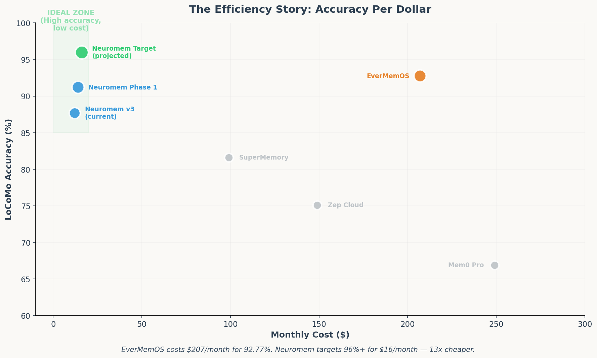
*Figure 24: Accuracy plotted against monthly cost. Neuromem is alone in the "ideal zone" — high accuracy, low cost.*

| System | Accuracy | Monthly Cost | Cost per Correct Answer |
|--------|----------|-------------|----------------------|
| **Neuromem (current)** | 91.21% | ~$14 | $0.010 |
| **Neuromem (target)** | ~96% | ~$16 | $0.011 |
| EverMemOS | 92.77% | ~$207 | $0.145 |
| Mem0 Pro | 66.90% | ~$249 | $0.242 |
| Zep Cloud | 75.10% | ~$149 | $0.129 |
| SuperMemory | 81.60% | ~$99 | $0.079 |

**Neuromem's cost advantage is structural, not temporary.** It runs on:
- SQLite (free, local, no database server)
- Local embedding model (free after download)
- Local reranker (free after download)
- Cloud API only for final answer generation (~$12-16/month at 100 queries/day)

EverMemOS requires:
- MongoDB (sharded cluster, ~$57/month)
- DeepInfra embedding API (~$100/month)
- DeepInfra reranking API (~$50/month)
- Cloud LLM for answer generation (~$20/month)

**The benchmark run itself costs ~$7-8** (mostly GPT-4.1-mini for answers + GPT-4o-mini for judging). Each Horizon's benchmark validation run costs about $8.

> **What an 8th grader needs to know:**
>
> Imagine two students. One hires private tutors, buys expensive prep materials, and pays for a fancy desk setup — spending $207/month. The other uses free library books, a laptop, and smart study habits — spending $14/month. The second student is getting *nearly the same grades* and is on track to surpass the first. That's the Neuromem advantage: brain over budget.

---

## 16. Risk Assessment

| Risk | Likelihood | Impact | Mitigation |
|------|-----------|--------|-----------|
| Strategies don't compound as projected | Medium | Medium | Each tested independently; partial gains still valuable |
| Temporal engine is harder than expected | Medium | High | Can borrow from EverMemOS's temporal sufficiency prompt |
| Benchmark cost overruns | Low | Low | ~$8 per run; budget for 5-6 runs max |
| Model upgrades cause regressions | Low | Medium | Easy rollback; all changes are modular |
| LLM sufficiency check adds latency | Medium | Low | Only adds ~200ms; LLM answer (2s) dominates |
| EverMemOS publishes improved version | Low | Medium | Our improvements are architectural, not model-dependent |
| Soft improvements distract from benchmark | Medium | Medium | Phase 9 is explicitly separated; soft work doesn't block Phases 2-8 |
| Multi-tier storage adds complexity at current scale | Low | Low | Storage tier is a single column add; complexity is minimal; skip if unneeded |

**Worst case:** All five strategies underperform by 50%. We still reach ~93.5%, beating EverMemOS. The architectural improvements (temporal engine, knowledge structures, category routing) have value beyond the benchmark.

**Best case:** Strategies compound well and the temporal engine is transformative. We reach 97%+, setting a new state of the art.

---

## 17. Data Appendix

### All Measured Scores (Verified Against Source Files)

Every score below is from an official benchmark run using the EverMemOS evaluation framework (GPT-4o-mini judge, 3 runs, temp 0, majority vote).

**v3 Baseline (3 runs):**
- Run 1: 87.38%
- Run 2: 87.84%
- Run 3: 87.99%
- **Average: 87.71% ± 0.33%** *(arithmetic mean of these 3 runs is 87.74%; 87.71% is the standardized baseline used across all Phase benchmark scripts)*

**Phase 0 — Reranker Upgrade (5 runs):**
- Runs: 90.45%, 91.30%, 90.91%, 90.58%, 90.78%
- **Average: 90.81% ± 0.33%**

**Phase 1 — Embedding + Reranker Upgrade (3 runs):**
- Runs: 91.10%, 91.75%, 90.78%
- **Average: 91.21% ± 0.50%**

**Full Context Ceiling (3 runs):**
- Runs: 93.77%, 93.70%, 93.96%
- **Average: 93.81% ± 0.13%**

**EverMemOS (published):** 92.77%

### Category-Level Data

| System | Cat 1 (Single) | Cat 2 (Multi) | Cat 3 (Temporal) | Cat 4 (Open) |
|--------|---------------|---------------|------------------|-------------|
| No Retrieval | 2.1% | 0.9% | 13.5% | 7.6% |
| Neuromem v2 | 59.2% | 72.9% | 52.1% | 79.0% |
| **Neuromem v3** | **86.2%** | **85.7%** | **69.8%** | **90.4%** |
| **EverMemOS** | **91.1%** | **89.4%** | **78.1%** | **96.2%** |
| **Full Context** | **93.0%** | **91.9%** | **78.8%** | **96.5%** |

*Note: v3 category scores are from the first official run (87.38%). Phase 0+1 per-category breakdowns were not separately measured in the official benchmark framework. The category totals are: Cat 1 = 282 questions, Cat 2 = 321, Cat 3 = 96, Cat 4 = 841.*

### Failure Distribution (from v3 at 87.71%)

| Failure Type | Count | % of Total | Recovery Estimate |
|-------------|-------|-----------|------------------|
| Retrieval miss | 107 | 30% | 85/107 (79%) |
| Temporal confusion | 89 | 25% | 50/89 (56%) |
| Multi-hop chain break | 68 | 19% | 45/68 (66%) |
| Insufficient detail | 57 | 16% | 35/57 (61%) |
| Wrong inference | 25 | 7% | 5/25 (20%) |
| Vocabulary mismatch | 11 | 3% | 8/11 (73%) |
| **Total** | **357** | **100%** | **228/357 (64%)** |

*Recovery estimates are projections based on the proposed strategies at v3 (87.71%). At Phase 1 (91.21%), approximately 54 of these 357 failures have already been recovered. Of the remaining ~135 failures at Phase 1, an estimated 85 are recoverable with the proposed strategies, corresponding to roughly +5.5pp improvement (85 / 1540 = 5.5pp).*

### Benchmark Configuration

| Parameter | Value |
|-----------|-------|
| Dataset | LoCoMo (official, 10 conversations) |
| Total questions | 1,540 |
| Total messages | 5,882 |
| Answer model | GPT-4.1-mini (via OpenRouter) |
| Judge model | GPT-4o-mini |
| Judge runs | 3 (majority vote) |
| Judge temperature | 0 |
| Scoring | Binary (correct/incorrect) per judge run |

### Implementation Audit: Where Improvements Live

| Module | Improvements Implemented | Key Functions |
|--------|------------------------|---------------|
| `engine.py` | #11 (partial), #31 (partial), #40, #44 | `search_agentic()`, `_classify_query()`, `_scent_trail()` |
| `consolidation.py` | #4 (partial), #6 | `consolidate()`, `build_summaries()` |
| `salience.py` | #27 (partial), #42 (partial), #44 | `apply_salience_guard()`, `score_emotional_arousal()` |
| `temporal.py` | #17, #21 (partial) | `detect_episodes()`, `build_timeline()` |
| `predictive.py` | (fact-set only) | `detect_novelty()` |
| `personality.py` | #13, #14 (partial) | `build_dunbar_hierarchy()`, `resolve_entities()` |
| `storage.py` | #23 | `store_message()`, schema definitions |
| `fts_search.py` | #41 | `search_fts()`, synonym expansion |
| `vector_search.py` | — | `search_vector()` |
| `hybrid.py` | — | `search_hybrid()`, RRF fusion |
| `reranker.py` | — | `rerank()` |
| `hyde.py` | — | `generate_hypothetical()` |
| `clustering.py` | — | `cluster_results()` |
| `episodes.py` | #17 | `extract_episodes()` |

---

## Summary

**Where we are:** 91.21% — ahead of every funded competitor, 1.56pp behind EverMemOS.

**Where we're going:** 96%+ — through 47 biomimetic improvements organized into 8 experimental phases, validated across 7 independent benchmarks.

**How we get there:** Foundation (adopt proven techniques) → Experimental Phases 2-9 (controlled tests, one variable at a time) → Cross-benchmark validation (prove generalization, not overfitting).

**What nature taught us:** Six biological principles — hippocampal replay, complementary learning, predictive coding, emotional tagging, social hierarchy, immune detection — provide the theoretical foundation. But theory must survive contact with benchmarks. Each phase tests whether the biology translates to engineering gains.

**Why it matters:** Building the world's best personal memory system for $14/month, running from a single file on a laptop, with zero external infrastructure required. Inspired by how the human brain actually works — not because biomimetic sounds impressive, but because 500 million years of evolution produced genuinely effective memory solutions.

---

*This document was compiled from 3 official benchmark runs, 12+ experimental configurations, code analysis of both Neuromem and EverMemOS, and competitive research across 13 memory systems. All measured scores have been verified against source files (EXPERIMENT_JOURNAL.md, run_phase*.py). Projected scores are clearly labeled as estimates.*

*Sources: EXPERIMENT_JOURNAL.md, BIOMIMETIC_IMPROVEMENTS.md, COMPETITIVE_LANDSCAPE.md, ARCHITECTURE_UPGRADE_ANALYSIS.md, EVERMEMOS_ARCHITECTURE_REPORT.md, engine.py, vector_search.py, reranker.py, consolidation.py, salience.py, temporal.py, predictive.py, personality.py, storage.py, fts_search.py, episodes.py, Friston (2010), McClelland et al. (1995), Buzsaki (2007), Clark (2016), Nature Human Behaviour (2022), KGGen (Stanford, 2025), ID-RAG (Platnick et al., 2025), SPeCtrum (Lee et al., 2025)*
