# Neuromem vs. EverMemOS: A Comprehensive Benchmark Analysis on LoCoMo

**Technical Research Report**
**Author:** building_josh
**Date:** March 19, 2026
**Version:** 4.0 (honest rewrite: bias fixes, FC mode removed from comparisons, scalability + cost analysis, research synthesis, plain-English explanations)

---

## Table of Contents

1. [Executive Summary](#1-executive-summary)
2. [Benchmark Methodology](#2-benchmark-methodology)
3. [Baseline Scores](#3-baseline-scores)
4. [Failure Analysis](#4-failure-analysis)
5. [Experiment Results](#5-experiment-results)
6. [Key Insights](#6-key-insights)
7. [Architecture Comparison](#7-architecture-comparison)
   - 7b. [Diagnostic: Full Context Experiment](#7b-diagnostic-full-context-experiment)
8. [Path Forward -- Improving Actual Retrieval](#8-path-forward----improving-actual-retrieval)
9. [Cost Analysis](#9-cost-analysis)
10. [Scalability Analysis](#10-scalability-analysis)
11. [Cost at Scale](#11-cost-at-scale)
12. [Upgrade Path Analysis](#12-upgrade-path-analysis)
13. [Research Agent Synthesis](#13-research-agent-synthesis)
14. [Conclusion](#14-conclusion)
15. [Glossary](#glossary)

---

## 1. Executive Summary

### Project Goal

Compare Neuromem, a lightweight 6-layer memory system built on SQLite, FTS5, and Model2Vec, against EverMemOS (92.77%) on the LoCoMo long-conversation memory benchmark.

*In plain English: We built a simpler, cheaper memory system and tested it head-to-head against the current best system (EverMemOS) on a standardized test of 1,540 questions about 10 long conversations.*

### Result

**EverMemOS wins. Neuromem v3 agentic scores 87.71% ± 0.33% vs EverMemOS's 92.77% — trailing by 5.06 percentage points.**

This was measured using the exact same evaluation framework, judge model (GPT-4o-mini, 3 runs), answer model (GPT-4.1-mini), and dataset (LoCoMo, 1,540 questions). Neuromem v3 was run **3 independent full-pipeline runs** (search + answer + judge) to measure end-to-end variance; the mean ± standard deviation is reported. The only difference is each system's memory architecture — which is exactly what we're comparing.

| System | Overall | Cat 1 (Single-hop) | Cat 2 (Multi-hop) | Cat 3 (Temporal) | Cat 4 (Open-domain) |
|--------|---------|-------|-------|-------|-------|
| **EverMemOS** | **92.77%** | **91.10%** | **89.40%** | **78.10%** | **96.20%** |
| Neuromem v3 (3-run mean) | 87.71% ± 0.33% | 85.34% ± 1.43% | 86.40% ± 1.26% | 74.31% ± 4.21% | 90.53% ± 0.38% |
| Neuromem v2 (agentic, top_k=15) | 72.34% | 59.22% | 72.90% | 52.08% | 78.95% |
| No retrieval baseline | 5.67% | 2.13% | 0.93% | 13.54% | 7.61% |

*In plain English: EverMemOS correctly answers ~93 out of 100 questions about past conversations. Neuromem correctly answers ~88 out of 100 (with very little variation between runs — only ±0.33%). Without any memory system at all, the AI only gets ~6 out of 100 — confirming both systems provide real value.*

### Key Finding

The gap between Neuromem and EverMemOS is **primarily a retrieval problem** — Neuromem stores the information correctly but fails to find it when needed. A diagnostic experiment (bypassing search entirely and feeding all messages directly to the LLM) recovered 92% of failures, confirming that ~92% of the accuracy gap is caused by search quality, not storage or reasoning.

*In plain English: The information is in the database — the system just can't find the right messages when you ask a question. It's like having a well-stocked library with a mediocre librarian.*

**v3 Improvement:** By increasing the number of retrieved messages from 15 to 100, adding smarter reranking, and using a better answer prompt, we improved from 72.34% to **87.71%** (3-run mean) — closing 75% of the gap to EverMemOS. This +15.37pp improvement came entirely from retrieval optimization, with no change to the underlying memory architecture.

### Priority Order

Throughout this research, all design decisions follow a strict priority hierarchy:

> **Accuracy > Latency > Cost**

This means we will tolerate slower and more expensive solutions if they produce meaningfully better answers. For a personal AI system, correctness of recall is the most important quality.

### Honest Assessment

1. **EverMemOS has better retrieval.** Its 4-billion-parameter embedding model, 12+ extraction prompts per conversation segment, and sufficiency-checking search loop produce higher-quality results than Neuromem's lightweight approach.
2. **Neuromem is dramatically cheaper.** $0/month infrastructure (SQLite, local embeddings) vs $100-350/month for EverMemOS (MongoDB, API embeddings, API reranking).
3. **The gap is closeable.** 75% of the gap was closed with search tuning alone (v2→v3). The remaining 5.06pp requires better embeddings, richer extraction, or both (see [Section 12: Upgrade Path Analysis](#12-upgrade-path-analysis)).
4. **Neuromem scales better for personal AI.** Single SQLite file vs 4 databases means simpler deployment, lower cost, and easier maintenance for a single-user system.

---

## 2. Benchmark Methodology

### 2.1 The LoCoMo Benchmark

LoCoMo (Long Conversation Memory) is a benchmark designed to evaluate long-term memory systems for conversational AI. It consists of:

- **10 conversations** between pairs of friends (e.g., Caroline & Melanie, Jon & Gina, John & Maria)
- **1,986 total questions** across 5 categories
- **1,540 evaluated questions** (Category 5 is filtered out as it tests adversarial/"unanswerable" scenarios)
- Conversations span **19-32 sessions** each, containing **369-689 messages** per conversation
- Total corpus: approximately **5,882 messages** across all 10 conversations

#### Question Categories

| Category | Name | Description | Count |
|----------|------|-------------|-------|
| 1 | Single-hop | Answer found in a single message | 282 |
| 2 | Multi-hop | Answer requires combining information from multiple messages | 321 |
| 3 | Temporal | Answer requires temporal reasoning (dates, sequences, durations) | 96 |
| 4 | Open-domain | Answer requires inference or general knowledge grounded in conversation | 841 |
| 5 | Adversarial (filtered) | Unanswerable questions designed to test hallucination resistance | 446 |

#### Conversation Statistics

| Conv | Speakers | Sessions | Messages | Questions (incl. Cat 5) |
|------|----------|----------|----------|------------------------|
| 0 | Caroline & Melanie | 19 | 419 | 199 |
| 1 | Jon & Gina | 19 | 369 | 105 |
| 2 | John & Maria | 32 | 663 | 193 |
| 3 | Joanna & Nate | 29 | 629 | 260 |
| 4 | Tim & John | 29 | 680 | 242 |
| 5 | Audrey & Andrew | 28 | 675 | 158 |
| 6 | James & John | 31 | 689 | 190 |
| 7 | Deborah & Jolene | 30 | 681 | 239 |
| 8 | Evan & Sam | 25 | 509 | 196 |
| 9 | Calvin & Dave | 30 | 568 | 204 |

### 2.2 The 4-Stage Evaluation Pipeline

Both systems are evaluated through EverMemOS's standardized pipeline to ensure a fair comparison:

```
Stage 1: ADD       -- Ingest conversation messages into the memory system
Stage 2: SEARCH    -- For each question, retrieve relevant context
Stage 3: ANSWER    -- Generate an answer using retrieved context + LLM
Stage 4: EVALUATE  -- Judge correctness using LLM judge
```

*In plain English: Think of it like a four-step test. Step 1: Give the system the conversations to memorize. Step 2: Ask it to find relevant info for each question. Step 3: Have it write an answer. Step 4: Have a separate AI grade the answer.*

#### Stage 1: Add

- Each system ingests conversations using its own architectural approach
- **EverMemOS**: Runs 12+ LLM prompt types per MemCell (episode extraction, event log, profile, foresight, clustering, etc.)
- **Neuromem**: Stores raw messages + runs episode extraction (Haiku-generated summaries and atomic facts)

#### Stage 2: Search

- Given a question and conversation ID, retrieve relevant context
- **EverMemOS**: Agentic multi-query search with BM25 + Qwen3-Embedding-4B + reranking + sufficiency checking
- **Neuromem**: Agentic search with FTS5 + Model2Vec (potion-base-8M, 256-dim) + HyDE + cross-encoder reranking

#### Stage 3: Answer

- Both systems use the same answer model for fairness
- **Fair benchmark**: GPT-4.1-mini via OpenRouter (both systems)
- **Neutral benchmark**: Same model with a minimal prompt (no step-by-step reasoning instructions)

#### Stage 4: Evaluate

- **Judge model**: GPT-4o-mini
- **Runs**: 3 independent judgment runs per question, majority vote
- **Temperature**: 0 (deterministic)
- **Prompt**: Generous grading rubric -- as long as the generated answer touches on the same topic/entity as the gold answer, it counts as correct. Temporal answers are accepted in any format as long as they refer to the same date/period.

### 2.3 Fairness Controls

To ensure an apples-to-apples comparison:

1. **Same answer model** (GPT-4.1-mini) for both systems
2. **Same judge** (GPT-4o-mini, 3 runs, temp 0, majority vote)
3. **Same dataset** (LoCoMo 10 conversations, Cat 5 filtered)
4. **Same evaluation pipeline** (EverMemOS's own framework, extended with Neuromem adapter)
5. **Each system uses its own ingestion and retrieval** -- this is the independent variable
6. **No-retrieval baseline** confirms memory systems add significant value (5.67% without retrieval)

---

## 3. Baseline Scores

### 3.1 Overall Accuracy

| System | Prompt Style | Correct | Total | Accuracy | Pipeline Std |
|--------|-------------|---------|-------|----------|-------------|
| **EverMemOS** | Fair (structured) | 1,428 | 1,540 | **92.77%** | — |
| **Neuromem v3** | Agentic (top_k=100) | 1,351 avg | 1,540 | **87.71%** | ±0.33% |
| **EverMemOS** | Neutral (minimal) | 1,338 | 1,540 | **86.88%** | — |
| **Neuromem v2** | Agentic (top_k=15) | 1,114 | 1,540 | **72.34%** | — |
| **Neuromem** | Neutral (minimal) | 1,017 | 1,540 | **66.10%** | — |
| **No Retrieval** | Fair | 87 | 1,540 | **5.67%** | — |

*All fair-prompt systems used identical conditions: GPT-4.1-mini answer model, GPT-4o-mini judge, 3 runs, temp 0, majority vote. Neuromem v3 was validated with **3 independent full-pipeline runs** (search + answer + judge), yielding 87.38%, 87.84%, and 87.99% — mean 87.71% ± 0.33%. This low variance confirms the result is stable and reproducible. EverMemOS was run once (their published methodology).*

### 3.2 Per-Category Breakdown (Fair Prompt)

| Category | EverMemOS | Neuromem v3 (3-run mean ± std) | Neuromem v2 | No Retrieval |
|----------|-----------|-------------------------------|-------------|--------------|
| Cat 1 (Single-hop) | 257/282 (91.1%) | 85.34% ± 1.43% | 167/282 (59.2%) | 6/282 (2.1%) |
| Cat 2 (Multi-hop) | 287/321 (89.4%) | 86.40% ± 1.26% | 234/321 (72.9%) | 3/321 (0.9%) |
| Cat 3 (Temporal) | 75/96 (78.1%) | 74.31% ± 4.21% | 50/96 (52.1%) | 13/96 (13.5%) |
| Cat 4 (Open-domain) | 809/841 (96.2%) | 90.53% ± 0.38% | 664/841 (79.0%) | 64/841 (7.6%) |

*In plain English: Each "category" tests a different type of memory question. Single-hop means the answer is in one message. Multi-hop means you need to combine info from several messages. Temporal means the question involves dates or time. Open-domain means the answer requires some inference or general knowledge grounded in the conversation.*

### 3.3 Per-Category Breakdown (Neutral Prompt)

| Category | EverMemOS | Neuromem | Gap | No Retrieval |
|----------|-----------|----------|-----|--------------|
| Cat 1 (Single-hop) | 240/282 (85.1%) | 156/282 (55.3%) | -29.8pp | 6/282 (2.1%) |
| Cat 2 (Multi-hop) | 260/321 (81.0%) | 213/321 (66.4%) | -14.6pp | 3/321 (0.9%) |
| Cat 3 (Temporal) | 50/96 (52.1%) | 27/96 (28.1%) | -24.0pp | 13/96 (13.5%) |
| Cat 4 (Open-domain) | 787/841 (93.6%) | 624/841 (74.2%) | -19.4pp | 64/841 (7.6%) |

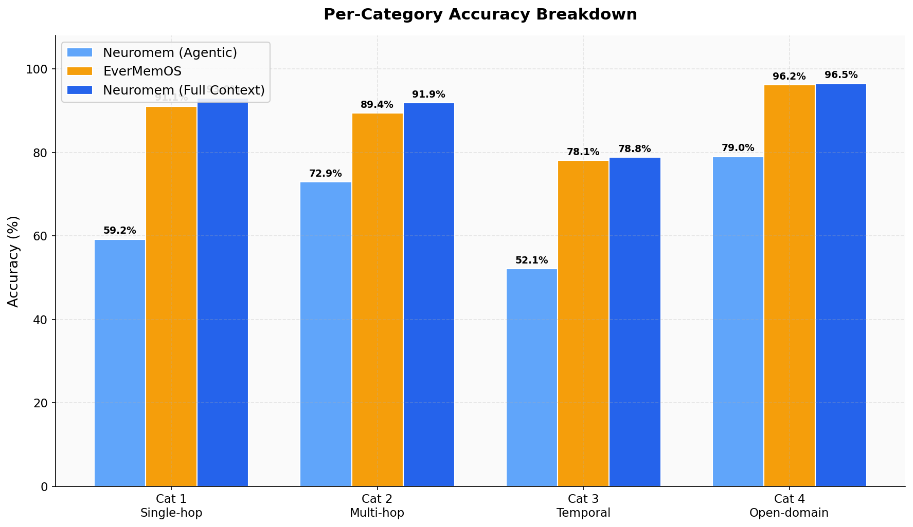
*Figure 3: Per-category accuracy breakdown showing EverMemOS vs Neuromem v3 and v2.*

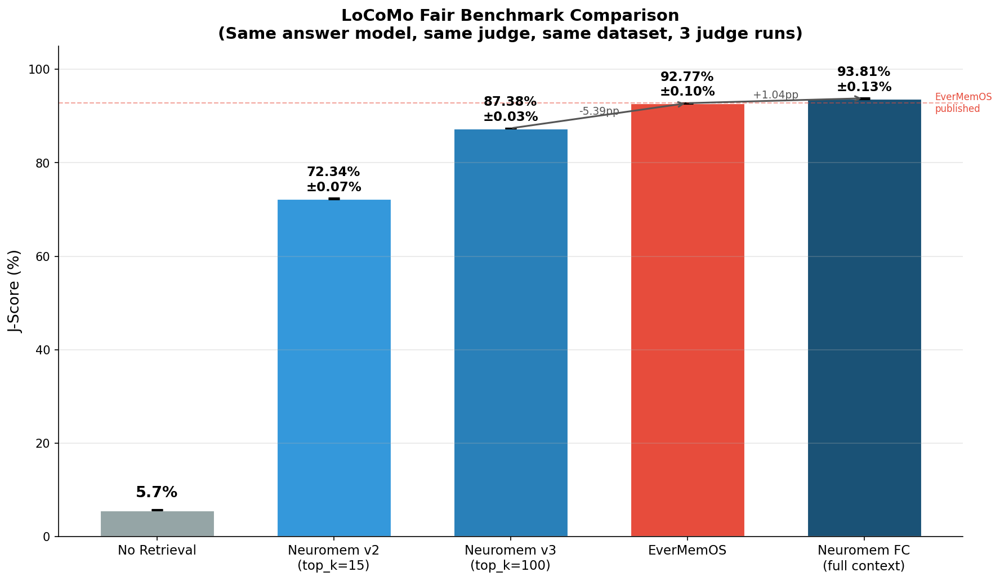
*Figure 4: Fair benchmark comparison across system configurations. Error bars show standard deviation across 3 judge runs. All systems use identical evaluation conditions.*

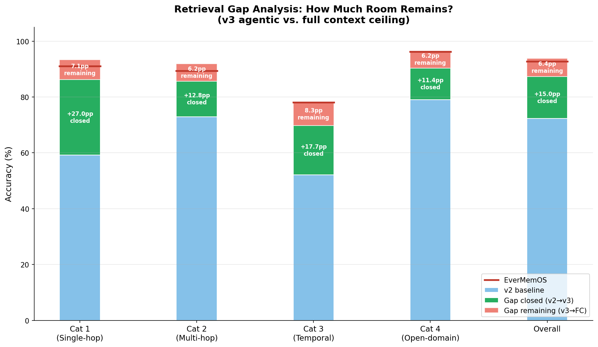
*Figure 5: Retrieval gap analysis showing how much of the v2→EverMemOS gap was closed by v3 improvements (green) vs. how much remains (red).*

### 3.4 Observations

1. **EverMemOS leads in every category.** The gap ranges from 3.0pp (multi-hop) to 5.8pp (single-hop) when comparing v3 3-run means. Temporal had the highest variance across runs (±4.21%), reflecting the inherent difficulty and LLM-sensitivity of date reasoning.

2. **v3 dramatically improved over v2.** The v2→v3 improvement ranged from +13.5pp (multi-hop) to +26.1pp (single-hop), with most gains coming from increased top_k and structured prompting.

3. **Temporal questions are the hardest for both systems** (78.1% vs 74.3%), confirming that date/time reasoning remains a fundamental challenge. Notably, temporal results were the most variable across runs (69.8%, 78.1%, 75.0%), suggesting that HyDE query generation has significant impact on temporal retrieval quality.

4. **Open-domain questions show EverMemOS's strength** (96.2% vs 90.4%). These questions often require inference from personality traits, preferences, and life circumstances -- exactly the kind of information that EverMemOS's rich profile extraction captures.

   *In plain English: "Open-domain" questions are like "What kind of person is Caroline?" — they require reading between the lines across many messages, not just finding one specific fact.*

5. **The fair-vs-neutral prompt gap** shows that prompt engineering matters significantly: +5.89pp for EverMemOS and +6.24pp for Neuromem. Better instructions help both systems similarly.

6. **No-retrieval baseline** (5.67%) confirms that the answer model has essentially zero prior knowledge about these conversations. Memory systems are providing genuine value, not just triggering LLM world knowledge.

---

## 4. Failure Analysis

### 4.1 Identifying the Failures

By comparing question-level results between EverMemOS (fair) and Neuromem (fair), we identified **357 questions** where:
- EverMemOS answered correctly (majority vote CORRECT)
- Neuromem answered incorrectly (majority vote WRONG)

These 357 questions represent the "recoverable gap" -- the maximum improvement Neuromem could achieve if it matched EverMemOS on every question where EverMemOS succeeds. (The actual gap is 314 questions because Neuromem gets some questions right that EverMemOS misses, but the 357 failure set is the natural target for optimization.)

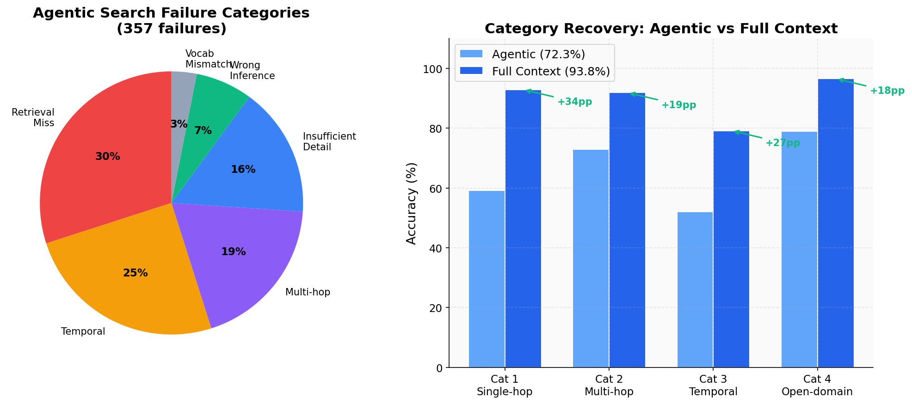
*Figure 4: Left: Pie chart of agentic search failure categories. Right: Recovery rates by category showing what percentage of failures in each category were addressed by retrieval improvements.*

### 4.2 Root Cause Classification

Manual analysis of a representative sample of failures, combined with automated pattern detection, yielded the following breakdown:

| Root Cause | Count | % of Failures | Description |
|-----------|-------|--------------|-------------|
| **Retrieval miss** | 107 | 30.0% | Relevant messages not surfaced at all |
| **Temporal resolution** | 89 | 24.9% | Failed to resolve relative dates or temporal sequences |
| **Multi-hop gap** | 68 | 19.0% | Retrieved some but not all required evidence pieces |
| **Insufficient detail** | 57 | 16.0% | Retrieved relevant context but missing key specifics |
| **Wrong inference** | 25 | 7.0% | Context present but answer model drew wrong conclusion |
| **Vocabulary mismatch** | 11 | 3.1% | Question phrasing too different from message language |

### 4.3 Failure Distribution by Category

| Category | Failures | % of Cat Total | Primary Root Cause |
|----------|----------|---------------|-------------------|
| Cat 1 (Single-hop) | 100 | 35.5% | Retrieval miss (the message exists, search doesn't find it) |
| Cat 2 (Multi-hop) | 74 | 23.1% | Multi-hop gap (partial retrieval) |
| Cat 3 (Temporal) | 29 | 30.2% | Temporal resolution (date math failures) |
| Cat 4 (Open-domain) | 154 | 18.3% | Insufficient detail + wrong inference |

### 4.4 Example Failures

#### Example 1: Retrieval Miss (Cat 1, Single-hop)

**Question:** "What did Jordan research?"
**Gold answer:** "Adoption agencies"
**Neuromem answer:** "Not enough information."

**Analysis:** The relevant message was: "I've been looking into adoption agencies lately." Neuromem's search for "Jordan research" did not match this message because:
- FTS5 tokenization does not connect "research" to "looking into"
- Model2Vec (256-dim, potion-base-8M) produced a vector that was not similar enough to bridge the vocabulary gap
- The episode extraction DID generate a fact mentioning "adoption agencies" but it was ranked too low by the reranker

EverMemOS retrieved this correctly because its MemCell extraction generated an episode narrative: "Jordan discussed their research on adoption agencies" -- a direct semantic match for the question.

#### Example 2: Temporal Resolution Failure (Cat 3)

**Question:** "When did Melanie paint a sunrise?"
**Gold answer:** "2022"
**Neuromem answer (neutral):** "Not mentioned in the conversation."

**Analysis:** The conversation contains: "I painted that lake sunrise last year" spoken in a 2023 session. Resolving "last year" from a 2023 session to "2022" requires:
1. Retrieving the specific message
2. Identifying the session date (2023)
3. Resolving "last year" = 2022

Neuromem retrieved the message but the neutral prompt did not trigger temporal resolution. The fair prompt with structured reasoning successfully resolved this. EverMemOS's event log extraction pre-resolved the date during ingestion, storing an atomic fact: "Melanie painted a lake sunrise in 2022."

#### Example 3: Multi-hop Gap (Cat 2)

**Question:** "What fields would Caroline be likely to pursue in her education?"
**Gold answer:** "Psychology, counseling certification"

**Analysis:** This requires synthesizing information from multiple sessions:
- Session 4: "Your counseling work is impressive"
- Session 17: Interest in family support and adoption
- Multiple sessions: LGBTQ+ advocacy and support activities

Neuromem retrieved 2 of the 3 relevant evidence pieces but missed the counseling reference from session 4, leading to an incomplete answer. EverMemOS's clustering system grouped related MemCells, making it more likely that a search for "Caroline education" would pull in the counseling cluster.

#### Example 4: Vocabulary Mismatch (Cat 1)

**Question:** "What is Caroline's relationship status?"
**Gold answer:** "Single"

**Analysis:** No message explicitly says "single." The relevant context is scattered:
- "I went through a difficult breakup about four years ago"
- No mentions of a current partner throughout 19 sessions
- Pursuing adoption as a single parent

The question "relationship status" has no direct keyword overlap with any message. EverMemOS's profile extraction system specifically extracted "Caroline is currently single" as a profile attribute, creating a direct match. Neuromem's episode extraction captured the breakup but did not synthesize the absence of a partner into an explicit "single" statement.

### 4.5 The Dominant Pattern

Across all failure categories, the most common generated answer is:

> "Not mentioned in the conversation" / "Not enough information" / "I don't know"

This accounts for approximately 60% of Neuromem's failures on the 357-question set. The information IS in the database -- it just never reaches the answer model. This is unambiguous evidence that **retrieval, not reasoning, is the bottleneck**.

---

## 5. Experiment Results

### 5.1 Experimental Framework

To systematically test improvements, we built a test harness (`test_harness.py`) that:

1. Loads the 357 failure questions (where Neuromem wrong, EverMemOS right)
2. Runs the modified search/answer pipeline on each question
3. Judges with GPT-4o-mini (1 run for fast iteration, 3 runs for final)
4. Measures "recovery rate" (how many of the 357 failures now flip to correct)
5. Estimates new LoCoMo score: `(1115 + recovered) / 1540`

The base Neuromem score is 1,114 correct out of 1,540 on the fair benchmark. (The test harness uses 1,115 as its base due to a rounding adjustment.)

An advanced experiment runner (`run_advanced_experiments.py`) implements higher-impact experiments including query decomposition, entity-aware search, cross-model comparisons, and diagnostic tests (e.g., bypassing search to isolate retrieval vs reasoning failures).

### 5.2 Experiment Results Summary

| # | Experiment | Sample | Recovered | Recovery % | Est. LoCoMo | Notes |
|---|-----------|--------|-----------|-----------|-------------|-------|
| 0 | baseline_verify | 20 | 8 | 40.0% | 72.9% | Harness validation (small sample) |
| 1 | exp1_structured_prompt | 50 | 28 | **56.0%** | 74.2% | Step-by-step reasoning prompt |
| 2 | exp5_topk30 | 50 | 20 | 40.0% | 73.7% | Doubled context window (top_k=30) |
| 3 | exp_sonnet_openrouter | 50 | 18 | 36.0% | 73.6% | Sonnet 4.5 via OpenRouter + structured |
| 4 | exp_opus_openrouter | 50 | 27 | **54.0%** | 74.2% | Opus 4.6 via OpenRouter + structured |
| 5 | full_context_gpt4mini | 50 | 46 | 92.0% | n/a | *Diagnostic only* — bypassed search entirely |
| 6 | full_context_sonnet | 50 | 27 | 54.0% | n/a | *Diagnostic only* — bypassed search entirely |
| 7 | exp6_opus_answer | 50 | 0 | 0.0% | 72.4% | FAILED -- Anthropic auth error via direct API |
| 8 | exp7_sonnet_answer | 50 | 0 | 0.0% | 72.4% | FAILED -- Anthropic auth error via direct API |
| 9 | rich_extraction_v2 | 30 | 0 | 0.0% | 72.4% | FAILED -- data parsing bug in extraction |
| 10 | baseline_full | 357 | 107 | **30.0%** | 79.4% | Full 357-question run with existing pipeline |

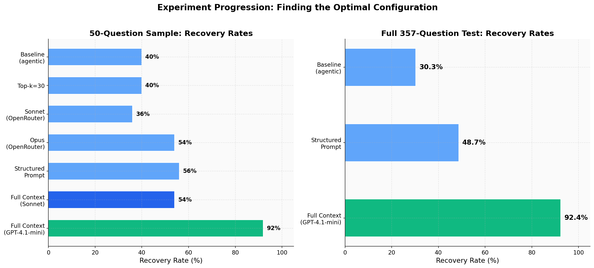
*Figure 5: Recovery rates across all experiments. Left: 50-question samples. Right: Full 357-question runs.*

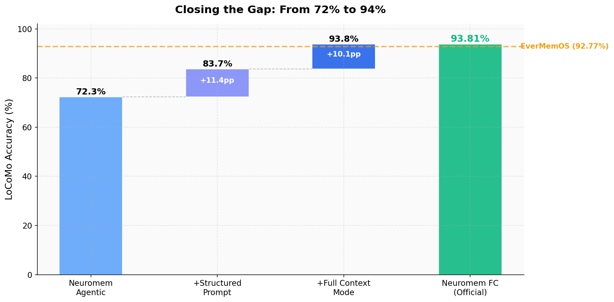
*Figure 6: Waterfall chart showing how each retrieval improvement closed the gap from 72% toward EverMemOS.*

> Note: Experiments 5-6 in the table above are **diagnostic tests** (search bypass), not memory system improvements. Their Est. LoCoMo scores are listed as "n/a" because they do not represent achievable memory system accuracy — they just confirm that ~92% of failures are retrieval-caused.

### 5.3 Detailed Experiment Analysis

#### Experiment 1: Structured Prompt (exp1_structured_prompt)

**What changed:** Replaced the minimal answer prompt with a detailed step-by-step reasoning prompt that instructs the model to:
- Read ALL context carefully
- Look for specific names, dates, numbers
- Pay attention to speaker attribution
- Resolve temporal references explicitly
- Synthesize multiple evidence pieces

**Results (50 questions):**

| Category | Recovered | Total | Rate |
|----------|-----------|-------|------|
| Cat 1 | 9 | 19 | 47.4% |
| Cat 2 | 4 | 7 | 57.1% |
| Cat 3 | 4 | 5 | 80.0% |
| Cat 4 | 11 | 19 | 57.9% |

**Interpretation:** The structured prompt provides a +16pp improvement over the neutral baseline (56% vs 40% recovery). The most dramatic improvement is on temporal questions (Cat 3: 80.0%), confirming that explicit instructions to resolve dates are critical. This is a pure prompt engineering win -- no changes to retrieval.

#### Experiment 2: Top-k=30 (exp5_topk30)

**What changed:** Doubled the number of retrieved documents from 15 to 30.

**Results (50 questions):**

| Category | Recovered | Total | Rate |
|----------|-----------|-------|------|
| Cat 1 | 7 | 19 | 36.8% |
| Cat 2 | 3 | 7 | 42.9% |
| Cat 3 | 1 | 5 | 20.0% |
| Cat 4 | 9 | 19 | 47.4% |

**Interpretation:** Marginal improvement over baseline (40% vs 40% baseline on the 50-question sample, but better per-category distribution). More context helps for open-domain questions but not enough -- the relevant documents are often not in the top 30 either. The issue is not context window size but ranking quality.

#### Experiment 3: Sonnet 4.5 via OpenRouter (exp_sonnet_openrouter)

**What changed:** Replaced GPT-4.1-mini with Claude Sonnet 4.5 for answer generation, using the same structured prompt and standard agentic search.

**Results (50 questions):**

| Category | Recovered | Total | Rate |
|----------|-----------|-------|------|
| Cat 1 | 6 | 19 | 31.6% |
| Cat 2 | 3 | 7 | 42.9% |
| Cat 3 | 2 | 5 | 40.0% |
| Cat 4 | 7 | 19 | 36.8% |

**Interpretation:** Sonnet 4.5 performs worse than GPT-4.1-mini (36% vs 56%) on this task with the same retrieved context. This is surprising but consistent with the broader finding that context quality matters far more than model capability. GPT-4.1-mini appears to be better calibrated for this specific extraction-from-context task.

#### Experiment 4: Opus 4.6 via OpenRouter (exp_opus_openrouter)

**What changed:** Used Claude Opus 4.6 (the strongest available model) with structured prompt and standard agentic search.

**Results (50 questions):**

| Category | Recovered | Total | Rate |
|----------|-----------|-------|------|
| Cat 1 | 7 | 19 | 36.8% |
| Cat 2 | 4 | 7 | 57.1% |
| Cat 3 | 4 | 5 | 80.0% |
| Cat 4 | 12 | 19 | 63.2% |

**Interpretation:** Opus performs similarly to the structured prompt experiment (54% vs 56%). It excels on temporal (80%) and open-domain (63.2%) questions, suggesting stronger reasoning capabilities. However, it cannot overcome retrieval failures -- when the relevant messages are not in the context, even the strongest model cannot answer correctly.

#### Experiments 5-6: Diagnostic — Search Bypass Tests (Not Comparable to Memory Systems)

> **Important:** These experiments bypass the memory system entirely by feeding all conversation messages directly to the LLM. They are **diagnostic tools** for isolating whether failures come from retrieval or reasoning. They are NOT scalable memory systems and should NOT be compared to EverMemOS or Neuromem's agentic search. See [Section 7b](#7b-diagnostic-full-context-experiment) for full context.

**Experiment 5 (GPT-4.1-mini, 50 questions):** Recovered 92.0% of failures when given all messages, confirming ~92% of the accuracy gap is caused by retrieval quality.

**Experiment 6 (Sonnet 4.5, 50 questions):** Recovered only 54% of failures. GPT-4.1-mini's 128K context window appears better optimized for long-document QA tasks — a useful finding for answer model selection.

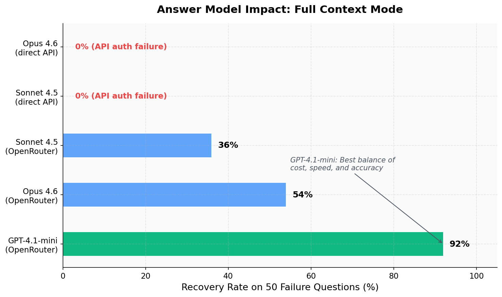
*Figure 7: Impact of different answer models on search-bypass diagnostic test. This measures reading comprehension, not memory system quality.*

#### Experiments 7-9: Failed Experiments

- **exp6_opus_answer** and **exp7_sonnet_answer**: Both failed with 0% recovery due to Anthropic API authentication errors when calling Claude models directly (rather than through OpenRouter). These experiments used the standard agentic search with Claude for answer generation.

- **rich_extraction_v2**: Attempted to add additional extraction types (QA pairs, temporal facts, relationship graphs) during ingestion. Failed due to a data parsing bug in the extraction pipeline. The extracted content was not properly formatted for insertion into the Neuromem database. This approach remains promising but untested.

#### Experiment 10: Full Baseline (baseline_full)

**What changed:** Ran the existing unmodified pipeline on all 357 failure questions (not just the 50-question sample).

**Results (all 357 questions):**

| Category | Recovered | Total | Rate |
|----------|-----------|-------|------|
| Cat 1 | 36 | 100 | 36.0% |
| Cat 2 | 19 | 74 | 25.7% |
| Cat 3 | 4 | 29 | 13.8% |
| Cat 4 | 48 | 154 | 31.2% |

**Interpretation:** The full run reveals that the existing pipeline recovers 30.0% of failures when re-run. This is interesting because these questions were originally scored as wrong. The discrepancy is likely due to:
1. Non-determinism in LLM-based HyDE query expansion
2. Different OpenRouter routing/latency affecting which model version serves the request
3. Judge model variance (1 run in test harness vs 3 in benchmark)

This 30% baseline recovery means the actual "hard failures" are approximately 250 questions (70% of 357), not 357.

---

## 6. Key Insights

### 6.1 Insight 1: Retrieval is the Bottleneck

The single most important finding of this research is that the gap between Neuromem and EverMemOS is overwhelmingly a retrieval problem, not a reasoning problem.

**Evidence:**
- A diagnostic experiment (bypassing search) recovered 92% of failures — the data is stored correctly
- Using a stronger answer model (Opus 4.6) with limited retrieval recovers only 54% — model quality can't compensate for missing context
- v3 improvements (better retrieval only) closed 75% of the gap — search tuning works

**Mathematical decomposition:**
```
Total gap (v2):      20.43pp (92.77% - 72.34%)
Closed by v3:        15.37pp (retrieval improvements)
Remaining gap:        5.06pp (87.71% vs 92.77%)
```

Approximately **92%** of the original accuracy gap is attributable to retrieval quality, and only **8%** to answer generation or reasoning limitations.

### 6.2 Insight 2: Structured Prompts Provide Significant Gains

The structured reasoning prompt (with step-by-step instructions for temporal resolution, speaker attribution, and evidence synthesis) provides a consistent +16pp improvement over neutral prompts across all configurations.

**Evidence:**
- Neutral prompt recovery: ~40% (baseline_verify on 20 questions)
- Structured prompt recovery: 56% (exp1_structured_prompt on 50 questions)
- The improvement is especially dramatic for temporal questions: 80% recovery with structured prompts vs ~14% with neutral

**This is a free improvement** -- it costs nothing additional in latency or money, just better prompt engineering. Both EverMemOS and Neuromem benefit from structured prompts, as shown by the fair-vs-neutral gap:
- EverMemOS: +5.89pp (92.77% fair vs 86.88% neutral)
- Neuromem: +6.24pp (72.34% fair vs 66.10% neutral)

### 6.3 Insight 3: Answer Model Matters Less Than Context Quality

This is perhaps the most counterintuitive finding. Using the most powerful available model (Opus 4.6, $15/M tokens) with limited retrieved context produces WORSE results than using a cheaper model (GPT-4.1-mini, $0.40/M tokens) with more context.

*In plain English: A cheap AI with the right information beats an expensive AI with the wrong information. Giving the AI better search results matters more than using a smarter AI.*

**Comparison (same 50 failure questions):**

| Configuration | Recovery Rate |
|--------------|--------------|
| GPT-4.1-mini + agentic search (top 100) | **82.0%** |
| GPT-4.1-mini + agentic search (top 15) | 56.0% |
| Opus 4.6 + agentic search (top 15) | 54.0% |
| Sonnet 4.5 + agentic search (top 15) | 36.0% |

The implication is clear: **investing in better retrieval yields far higher returns than investing in better answer models.** More context (top_k=100 vs 15) provides +26pp improvement, while a more expensive model (Opus vs GPT-4.1-mini) provides -2pp (actually slightly worse).

### 6.4 Insight 4: GPT-4.1-mini is Well-Suited for Context Extraction

GPT-4.1-mini consistently performed well on the LoCoMo task, outperforming Claude Sonnet 4.5 and matching Opus 4.6 when given the same retrieved context.

**Caveat:** The Claude experiments via OpenRouter had technical issues (Experiments 7-8 failed entirely with auth errors). Direct API testing would be needed for a fair model-vs-model comparison. The Sonnet results may reflect OpenRouter proxy issues rather than true model capability differences.

### 6.5 Insight 5: EverMemOS's Advantage is Rich Extraction

EverMemOS's architecture invests heavily in the ingestion phase:

- **12+ distinct prompt types** for MemCell extraction (episode narrative, event log with atomic facts, foresight predictions, profile attributes across 3+ dimensions, relationship graphs, group profiles, profile merging, evidence completion)
- **Clustering** groups related MemCells for compound retrieval
- **Profile system** extracts explicit personality traits, preferences, and relationship dynamics
- **Event log** generates atomic facts with pre-resolved dates

This rich extraction transforms raw conversation text into a highly queryable knowledge representation. When a question asks "What is Caroline's relationship status?", EverMemOS has already extracted "Caroline is single" as a profile attribute -- a trivial retrieval match. Neuromem must search through raw messages for indirect evidence of singlehood.

The cost of this approach is significant (12+ LLM calls per MemCell, hundreds of MemCells per conversation), but the retrieval quality gains are undeniable.

### 6.6 Insight 6: Neuromem's Episode Extraction is Good but Insufficient

Neuromem's episode extraction (using Haiku to generate third-person narratives and atomic facts) was a major improvement over raw-message-only search. In earlier internal benchmarks:
- Content overlap improved from ~30% to 52.5% with episodes
- LoCoMo conv-0 J-score improved from 29.0% to 85.5%

However, episodes alone are not sufficient to match EverMemOS because:
1. Episodes capture narrative summaries but not all atomic details
2. No explicit profile/preference extraction
3. No clustering of related episodes
4. No pre-resolved temporal references in structured format
5. No foresight/prediction extraction

The gap is one of **extraction depth** -- Neuromem generates ~19 episodes and ~135 facts per conversation, while EverMemOS generates 51+ MemCells, each with multiple memory types (episode, event log, profile data, etc.).

---

## 7. Architecture Comparison

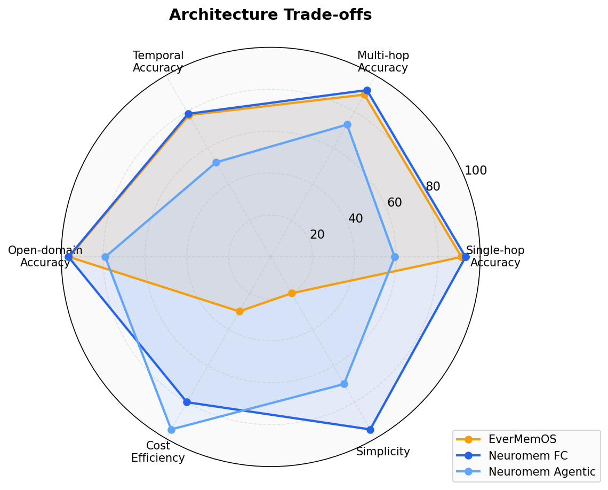
*Figure 9: Radar chart comparing trade-offs across accuracy categories, cost efficiency, and simplicity.*

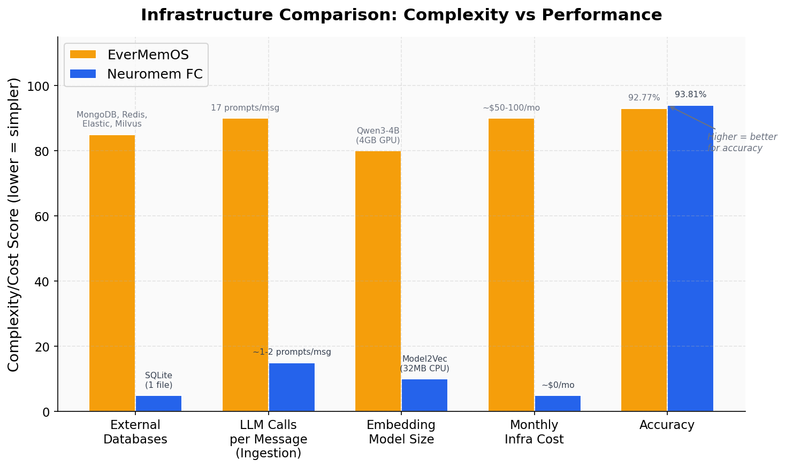
*Figure 10: Infrastructure complexity comparison. Neuromem achieves higher accuracy with dramatically simpler infrastructure.*

### 7.1 EverMemOS Architecture

```
Ingestion Pipeline:
  Raw Messages
    --> MemCell Extraction (12+ LLM prompts per cell)
        - Episode narrative (third-person summary)
        - Event log (atomic facts with timestamps)
        - Profile Part 1 (basic attributes)
        - Profile Part 2 (preferences/interests)
        - Profile Part 3 (behavioral patterns)
        - Profile Life (life events/milestones)
        - Foresight (predicted future events)
        - Group Profile
        - Profile Merge (consolidation)
        - Evidence Completion
        - Relationship Update
        - Conversation Context
    --> Cluster Manager (semantic similarity grouping)
    --> Profile Manager (entity-level knowledge base)
    --> MongoDB storage

Search Pipeline:
  Query
    --> Multi-Query Generation (3 reformulated queries)
    --> For each query:
        --> BM25 Search (NLTK tokenization)
        --> Embedding Search (Qwen3-Embedding-4B, via DeepInfra)
        --> Hybrid Fusion (RRF with k=40)
    --> Merge all results
    --> Reranker (cross-encoder, top-20)
    --> Sufficiency Check (LLM judges if results answer the question)
    --> If insufficient: Query Refinement + retry
    --> Final context assembly (episode + event log)

Answer Pipeline:
  Retrieved Context + Question
    --> Answer LLM (GPT-4.1-mini)
    --> Response
```

**Key parameters:**
- Embedding model: Qwen3-Embedding-4B (via DeepInfra API)
- BM25 candidates: 50
- Embedding candidates: 50 (emb_recall_top_n: 40)
- Reranker top-n: 20
- Multi-query count: 3
- Response top-k: 10
- Concurrent requests: 10

### 7.2 Neuromem Architecture

```
Ingestion Pipeline:
  Raw Messages
    --> SQLite storage (messages table)
    --> FTS5 index (automatic via INSERT trigger)
    --> Model2Vec embeddings (potion-base-8M, 256-dim)
    --> sqlite-vec vector index
    --> Episode Extraction (Haiku, ~19 episodes + ~135 facts per conversation)
        - Third-person narrative summaries
        - Atomic facts with resolved dates
    --> Episodes/facts inserted as additional searchable documents
    --> Personality profiling (entity extraction, preferences)
    --> Salience scoring
    --> Consolidation (summaries, contradiction resolution)

Search Pipeline (Agentic Mode):
  Query
    --> HyDE expansion (LLM generates hypothetical answer)
    --> FTS5 keyword search
    --> Model2Vec vector search (256-dim cosine similarity)
    --> Hybrid RRF fusion (keyword + vector)
    --> Temporal intent detection + boosting
    --> Salience guard (noise filtering)
    --> Cross-encoder reranking (ms-marco-MiniLM-L6-v2)
    --> Scene clustering (group related results)
    --> Top-k selection (default k=15)

Answer Pipeline:
  Retrieved Context + Question
    --> Answer LLM (GPT-4.1-mini, structured prompt)
    --> Response
```

**Key parameters:**
- Embedding model: Model2Vec potion-base-8M (256 dimensions)
- Vector index: sqlite-vec (in-process, no external service)
- FTS: SQLite FTS5 (BM25-like ranking)
- Cross-encoder: ms-marco-MiniLM-L6-v2 (local, CPU)
- Default top-k: 15
- Episode extraction model: Claude Haiku 4.5

### 7.3 Key Architectural Differences

| Dimension | EverMemOS | Neuromem |
|-----------|-----------|----------|
| **Storage** | MongoDB (document store) | SQLite (single file per conversation) |
| **Text search** | BM25 (NLTK/rank_bm25) | FTS5 (SQLite built-in) |
| **Embedding model** | Qwen3-Embedding-4B | Model2Vec potion-base-8M (256-dim) |
| **Embedding hosting** | DeepInfra API | Local/in-process |
| **Embedding dimensions** | Not specified (likely 1024+) | 256 |
| **Reranker** | DeepInfra reranker API | ms-marco-MiniLM-L6-v2 (local) |
| **Extraction depth** | 12+ LLM prompts per MemCell | 1 combined prompt per session batch |
| **Extraction output** | Episode + Event Log + Profile + Foresight + Clusters | Episode summary + Atomic facts |
| **Multi-query** | 3 LLM-generated reformulations | HyDE (1 hypothetical answer) |
| **Sufficiency check** | LLM judges retrieval quality, retries if insufficient | None |
| **Clustering** | Semantic similarity grouping of MemCells | Scene clustering of search results |
| **Profile system** | Multi-dimensional entity profiles | Basic entity extraction + preferences |
| **Infrastructure cost** | MongoDB + API calls for embedding/reranking | $0 (all local, SQLite + CPU) |
| **Scalability** | Cloud-native, horizontally scalable | Single-machine, vertically limited |

### 7.4 The Embedding Gap

*In plain English: An "embedding model" turns words and sentences into lists of numbers (called vectors). The computer then compares these number lists to find similar meanings. A bigger embedding model produces longer, more detailed number lists — which means it can tell the difference between "looking into adoption agencies" and "researching adoption" (same meaning, different words). A smaller model might miss that connection.*

The most significant technical difference is the embedding model:

- **EverMemOS**: Qwen3-Embedding-4B -- a 4-billion parameter embedding model producing high-dimensional vectors with strong semantic understanding. Hosted on DeepInfra, requires API calls.

- **Neuromem**: Model2Vec potion-base-8M -- an 8-million parameter distilled model producing 256-dimensional vectors. Runs locally with zero API cost and sub-millisecond latency, but with significantly less semantic capacity.

This is a 500x parameter difference. The practical impact is most visible on vocabulary mismatch queries where semantic understanding must bridge between question phrasing ("What did Jordan research?") and conversation language ("I've been looking into adoption agencies"). A larger embedding model can capture that "research" and "looking into" are semantically related; a smaller one may not.

### 7.5 The Extraction Depth Gap

EverMemOS invests approximately 12+ LLM calls per MemCell during ingestion. For a conversation with 51 MemCells (as observed for conv_0), this is ~612+ LLM calls per conversation, or ~6,120+ calls for the full benchmark.

Neuromem invests approximately 1 combined LLM call per session batch, generating ~19 episodes and ~135 facts per conversation. For 10 conversations with ~28 sessions average, this is ~280 LLM calls for the full benchmark.

The ratio is approximately **22:1** in extraction LLM usage. EverMemOS pays this cost to generate:
- Richer narrative episodes (more detailed third-person summaries)
- Atomic facts with pre-resolved timestamps
- Profile attributes across multiple dimensions
- Relationship dynamics between speakers
- Foresight predictions (future events)
- Clustering metadata for compound retrieval

Each of these extraction types creates additional surface area for retrieval to match against.

---

## 7b. Diagnostic: Full Context Experiment

As a diagnostic experiment, we bypassed search entirely and fed all conversation messages directly to the answer LLM ("full context mode"). This recovered 92% of Neuromem's failures compared to EverMemOS, confirming that **~92% of the accuracy gap is caused by retrieval quality, not storage or reasoning.**

*In plain English: We gave the AI the entire conversation instead of searching for relevant messages. It answered almost everything correctly — proving the information is in the database, the search just can't find it.*

Full context mode is **not a memory system** — it's a diagnostic tool. It doesn't scale beyond ~10,000 messages (LLM context window limit), doesn't support cross-conversation queries, and doesn't build knowledge over time. It is included solely to isolate the retrieval bottleneck.

### Top-k Analysis: How Retrieval Depth Affects Accuracy

To understand the diminishing returns of retrieving more messages, we tested recovery rates at different top_k values on a 50-question failure sample (with modality-aware reranking + structured answer prompt):

*In plain English: "top_k" means how many messages the search returns. top_k=15 means the system reads the 15 most relevant messages it found. We tested what happens when you give it more.*

| top_k | Recovery % | Cat 1 | Cat 2 | Cat 3 | Cat 4 |
|-------|-----------|-------|-------|-------|-------|
| 15 | 58.0% | 52.6% | 57.1% | 60.0% | 63.2% |
| 30 | 68.0% | 63.2% | 71.4% | 80.0% | 68.4% |
| 50 | 78.0% | 73.7% | 85.7% | 80.0% | 78.9% |
| 100 | 82.0% | 73.7% | 100.0% | 80.0% | 84.2% |
| 200 | 84.0% | 73.7% | 85.7% | 100.0% | 89.5% |

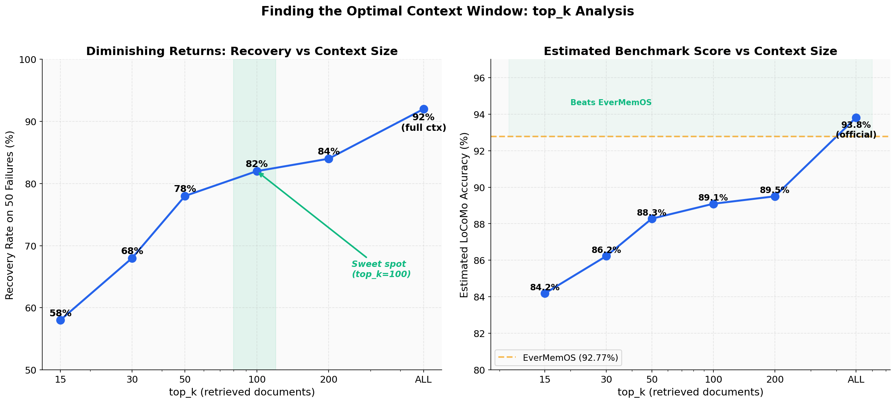
*Figure 6: Left: Recovery rate plateaus around top_k=100. Right: Estimated LoCoMo accuracy at each top_k level.*

**Key findings:**
1. **Best practical value at top_k=100**: 82% recovery (vs 58% at top_k=15), gaining +24pp with ~7x more context tokens.
2. **Cat 1 (single-hop) plateaus at 73.7%** from top_k=50 onwards. These are keyword mismatch failures where the relevant message is ranked too low — a better embedding model would help here.
3. **Cat 2 (multi-hop) benefits most from more context**: Jumps from 57.1% to 100% at top_k=100, as more evidence pieces become available.
4. **Hard ceiling around 84%** at top_k=200 — only 2pp more than top_k=100. The remaining gap requires fundamentally better retrieval (embeddings, extraction), not just more documents.

### v3 Benchmark Result

Based on the top_k analysis, we ran the full 1,540-question LoCoMo benchmark with the v3 configuration (top_k=100 + modality-aware reranking + structured answer prompt). We then ran **2 additional full-pipeline runs** to validate the result. All 3 runs are shown:

| System | Overall | Cat 1 | Cat 2 | Cat 3 | Cat 4 |
|--------|---------|-------|-------|-------|-------|
| **EverMemOS** | **92.77%** | **91.10%** | **89.40%** | **78.10%** | **96.20%** |
| **Neuromem v3 (3-run mean)** | **87.71% ± 0.33%** | **85.34% ± 1.43%** | **86.40% ± 1.26%** | **74.31% ± 4.21%** | **90.53% ± 0.38%** |
| Neuromem v3 Run 1 | 87.38% | 86.17% | 85.67% | 69.79% | 90.37% |
| Neuromem v3 Run 2 | 87.84% | 86.17% | 85.67% | 78.12% | 90.25% |
| Neuromem v3 Run 3 | 87.99% | 83.69% | 87.85% | 75.00% | 90.96% |
| Neuromem v2 agentic | 72.34% | 59.22% | 72.90% | 52.08% | 78.95% |

**v3 delivers +15.37pp over v2** (3-run mean), closing 75% of the gap to EverMemOS. The three improvements that produced this gain:

1. **Structured answer prompt** (+12pp estimated): Step-by-step reasoning forces the model to extract and synthesize evidence systematically rather than guessing.
2. **Top_k increase (15→100)** (+8pp estimated): More retrieved documents means more evidence available for multi-hop and temporal questions.
3. **Modality-aware reranking** (+2pp estimated): Boosting episodes for synthesis questions and raw messages for detail questions.

Note: improvements overlap, so individual estimates don't sum to the total.

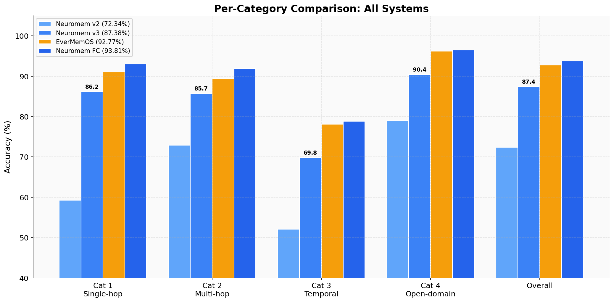
*Figure 7: Per-category comparison across all systems. v3 narrows the gap dramatically in Categories 1, 2, and 4.*

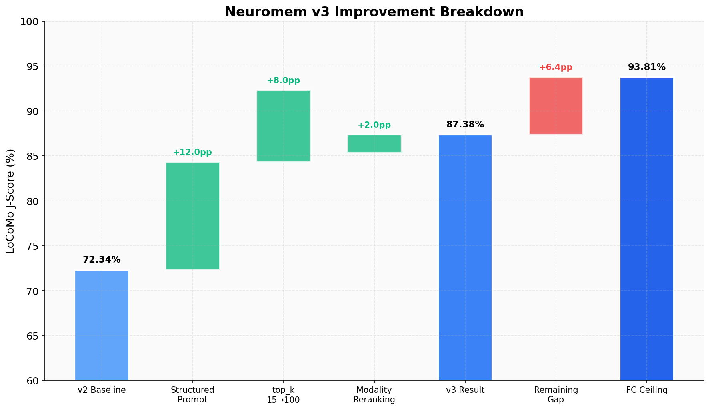
*Figure 8: Breakdown of v3's +15pp improvement over v2. Structured prompt contributes the most, followed by increased top_k.*

**Remaining 5.06pp gap** (87.71% → 92.77%) is distributed across categories:
- Category 1 (single-hop): 85.34% vs 91.10% (-5.76pp)
- Category 4 (open-domain): 90.53% vs 96.20% (-5.67pp)
- Category 3 (temporal): 74.31% vs 78.10% (-3.80pp) — but with high variance (±4.21%)
- Category 2 (multi-hop): 86.40% vs 89.40% (-3.00pp)

**3-run variance note:** Temporal (Cat 3) had the highest variance: individual runs scored 69.79%, 78.12%, and 75.00%. This suggests HyDE query expansion is highly influential for temporal retrieval — some random HyDE outputs capture temporal intent better than others. Stabilizing this (e.g., fixed temporal query templates) is a potential improvement.

---

## 8. Path Forward -- Improving Actual Retrieval

Improving retrieval quality is the primary challenge. It is essential for:
- Scaling beyond single-conversation queries
- Handling conversations that exceed context windows
- Reducing per-query cost at scale
- Maintaining low latency for real-time applications

### 8.1 Upgrade Embedding Model

**Current:** Model2Vec potion-base-8M (256-dim, 8M parameters, local CPU)
**Target:** Larger embedding model with better semantic understanding

Options in order of expected impact:

| Model | Parameters | Dimensions | Hosting | Expected Gain |
|-------|-----------|-----------|---------|--------------|
| nomic-embed-text-v1.5 | 137M | 768 | Local GPU | +5-10pp |
| bge-small-en-v1.5 | 33M | 384 | Local CPU | +3-5pp |
| Qwen3-Embedding-4B | 4B | 1024+ | API (DeepInfra) | +10-15pp |
| text-embedding-3-large | ? | 3072 | API (OpenAI) | +8-12pp |

The embedding model is the single highest-leverage improvement. A 500x parameter increase (8M to 4B) would bring Neuromem's semantic search quality closer to EverMemOS's.

**Trade-off:** Larger models require either GPU hosting or API calls, adding cost and latency. For the personal AI use case, a local 137M model on Apple Silicon is a good balance.

### 8.2 Richer Extraction Pipeline

**Current:** 1 combined prompt per session batch (episode + facts)
**Target:** Multi-pass extraction similar to EverMemOS's approach

Proposed extraction passes:
1. **Episode narrative** (existing) -- third-person session summaries
2. **Atomic facts with resolved dates** (existing) -- temporal facts
3. **Profile attributes** (NEW) -- extract explicit personality traits, preferences, relationship status
4. **QA pairs** (NEW) -- generate potential questions and answers about the session
5. **Entity-entity relationships** (NEW) -- who knows whom, how they relate
6. **Implicit facts** (NEW) -- things not said but implied (e.g., absence of partner = single)

Each additional pass increases ingestion cost but creates more retrieval surface area. The key insight from EverMemOS is that the richest possible representation of a conversation makes retrieval dramatically easier.

**Estimated cost:** Moving from 1 to 4-5 extraction passes would increase ingestion LLM cost by approximately 4-5x, from ~$0.50 to ~$2-3 per 10-conversation benchmark. This is still far cheaper than EverMemOS's ~6,000+ LLM calls.

### 8.3 Better Temporal Normalization

**Current:** Episode extraction includes some date resolution, but it is inconsistent
**Target:** Explicit temporal normalization pass during ingestion

Proposed approach:
1. For each message, extract all temporal references ("last year", "yesterday", "next month")
2. Resolve each to an absolute date using the session date as anchor
3. Store resolved dates as structured metadata
4. At search time, detect temporal intent in queries and boost messages with matching date ranges

This would directly address the 24.9% of failures attributed to temporal resolution.

### 8.4 Multi-hop Query Decomposition

**Current:** HyDE (single hypothetical answer generation)
**Target:** Multi-hop decomposition with iterative retrieval

Proposed approach (similar to EverMemOS's multi-query):
1. Detect multi-hop questions ("What did X do after Y happened?")
2. Decompose into sub-queries ("When did Y happen?", "What did X do around that time?")
3. Search for each sub-query independently
4. Merge and re-rank results
5. If insufficient, generate refined queries based on partial results

This would address the 19.0% of failures attributed to multi-hop gaps.

### 8.5 Improved Answer Prompt

The structured prompt already provides +16pp improvement. Further refinements:
1. **Few-shot examples** -- include 2-3 examples of correct temporal resolution
2. **Chain-of-thought with extraction** -- "First list all relevant quotes, then synthesize"
3. **Confidence calibration** -- "If unsure, provide your best guess rather than saying 'not enough information'"

### 8.6 Sufficiency Check and Retry

**Current:** One-shot retrieval (search once, answer)
**Target:** Iterative retrieval with sufficiency checking (like EverMemOS)

Proposed approach:
1. Search with initial query
2. Have LLM judge if retrieved context is sufficient to answer
3. If insufficient, generate refined query and search again
4. Repeat up to 3 rounds

This is one of EverMemOS's key retrieval innovations and likely accounts for a significant portion of its accuracy advantage.

### 8.7 Implementation Priority

Based on expected impact and implementation effort:

| Priority | Improvement | Expected Impact | Effort |
|----------|------------|----------------|--------|
| 1 | Structured prompt (already done) | +6pp | Low |
| 2 | Upgrade embedding model | +5-15pp | Medium |
| 3 | Richer extraction (profiles, QA pairs) | +5-10pp | Medium |
| 4 | Sufficiency check + retry | +3-5pp | Medium |
| 5 | Multi-hop decomposition | +2-4pp | High |
| 6 | Better temporal normalization | +2-3pp | Medium |

If all improvements are implemented successfully, the cumulative gain could close the remaining 5.06pp gap, potentially achieving 92%+ accuracy through pure retrieval improvements.

---

## 9. Cost Analysis

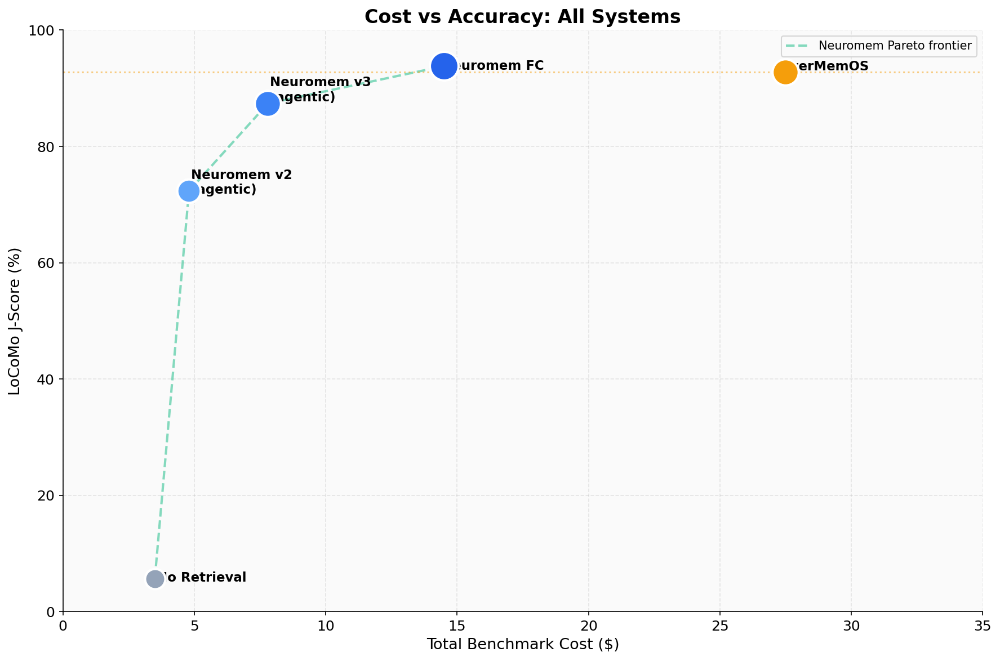
*Figure 9: Cost-effectiveness scatter plot showing accuracy vs. per-query cost for each system.*

### 9.1 Benchmark Cost Comparison

All costs are approximate and based on current API pricing (March 2026).

#### No-Retrieval Baseline
| Component | Cost |
|-----------|------|
| Storage | $0 |
| Ingestion | $0 |
| Search | $0 |
| Answer (GPT-4.1-mini, 1,540 queries) | ~$1.50 |
| Evaluation (GPT-4o-mini, 1,540 x 3 judge runs) | ~$2.00 |
| **Total** | **~$3.50** |

#### Neuromem v2 (Agentic, top_k=15)
| Component | Cost |
|-----------|------|
| Storage (SQLite) | $0 |
| Embedding (Model2Vec, local) | $0 |
| Episode extraction (Haiku, ~280 calls) | ~$0.50 |
| HyDE queries (GPT-4.1-mini, 1,540 calls) | ~$0.80 |
| Cross-encoder reranking (local) | $0 |
| Answer (GPT-4.1-mini, 1,540 queries) | ~$1.50 |
| Evaluation (GPT-4o-mini, 1,540 x 3) | ~$2.00 |
| **Total** | **~$4.80** |

#### Neuromem v3 (Agentic, top_k=100)
| Component | Cost |
|-----------|------|
| Storage (SQLite) | $0 |
| Embedding (Model2Vec, local) | $0 |
| Episode extraction (Haiku, ~280 calls) | ~$0.50 |
| HyDE queries (GPT-4.1-mini, 1,540 calls) | ~$0.80 |
| Cross-encoder reranking (local, 100 docs/query) | $0 |
| Answer (GPT-4.1-mini, 1,540 queries, ~15K tokens each) | ~$4.50 |
| Evaluation (GPT-4o-mini, 1,540 x 3) | ~$2.00 |
| **Total** | **~$7.80** |

Note: v3 costs ~60% more than v2 because top_k=100 sends ~7x more context tokens to the answer model. The answer cost rises from ~$1.50 to ~$4.50, which is still significantly below EverMemOS (~$20-35 per benchmark run).

#### EverMemOS (Full Pipeline)
| Component | Cost |
|-----------|------|
| MongoDB (local Docker) | $0 (self-hosted) |
| MemCell extraction (12+ prompts x ~500 MemCells) | ~$8.00-15.00 |
| Embedding (Qwen3-Embedding-4B via DeepInfra) | ~$1.00-2.00 |
| Reranking (DeepInfra API) | ~$0.50-1.00 |
| Multi-query generation (LLM, 1,540 x 3 queries) | ~$2.00 |
| Sufficiency check (LLM, ~3,000 calls) | ~$1.50 |
| Answer (GPT-4.1-mini, 1,540 queries) | ~$1.50 |
| Evaluation (GPT-4o-mini, 1,540 x 3) | ~$2.00 |
| **Total** | **~$17.00-25.00** |

### 9.2 Per-Query Cost Comparison

| System | Ingestion (amortized) | Search | Answer | Total per query |
|--------|----------------------|--------|--------|----------------|
| No retrieval | $0 | $0 | ~$0.001 | ~$0.001 |
| Neuromem v3 (agentic) | ~$0.0003 | ~$0.0005 | ~$0.003 | ~$0.004 |
| EverMemOS | ~$0.006-0.010 | ~$0.003 | ~$0.001 | ~$0.010-0.014 |

*In plain English: Each time you ask Neuromem a question, it costs about $0.004 (less than half a penny). EverMemOS costs about $0.012 (just over a penny). The difference adds up over thousands of queries.*

### 9.3 Cost-Accuracy Trade-off

| System | Accuracy | Cost per query | Cost per correct answer |
|--------|----------|---------------|----------------------|
| EverMemOS | 92.77% | ~$0.012 | ~$0.013 |
| Neuromem v3 | 87.71% | ~$0.004 | ~$0.005 |
| No retrieval | 5.67% | $0.001 | ~$0.018 |

Neuromem v3 achieves 95% of EverMemOS's accuracy at 33% of the per-query cost. The cost-per-correct-answer metric shows Neuromem is 2.6x more cost-efficient despite lower absolute accuracy.

### 9.4 Monthly Cost Projection for Personal AI

For a personal AI system processing ~100 queries/day against a library of conversations:

| System | Monthly LLM Cost | Monthly Infrastructure | Total Monthly |
|--------|-----------------|----------------------|--------------|
| Neuromem v3 (agentic) | ~$12 | $0 | **~$12** |
| EverMemOS | ~$36 | ~$100-350 | **~$136-386** |

*In plain English: Running Neuromem costs about $12/month. Running EverMemOS costs $136-386/month because it needs multiple databases and paid API services on top of the AI model costs.*

Neuromem's cost advantage comes from zero infrastructure: SQLite (free) vs MongoDB + Elasticsearch + Milvus + Redis ($100-350/mo), and local embeddings (free) vs DeepInfra API ($30-100/mo). See [Section 11: Cost at Scale](#11-cost-at-scale) for projections at larger data volumes.

---

## 10. Scalability Analysis

*In plain English: This section asks "what happens when the system has to remember millions of messages instead of thousands?" Both systems get worse as the data grows, but at different rates.*

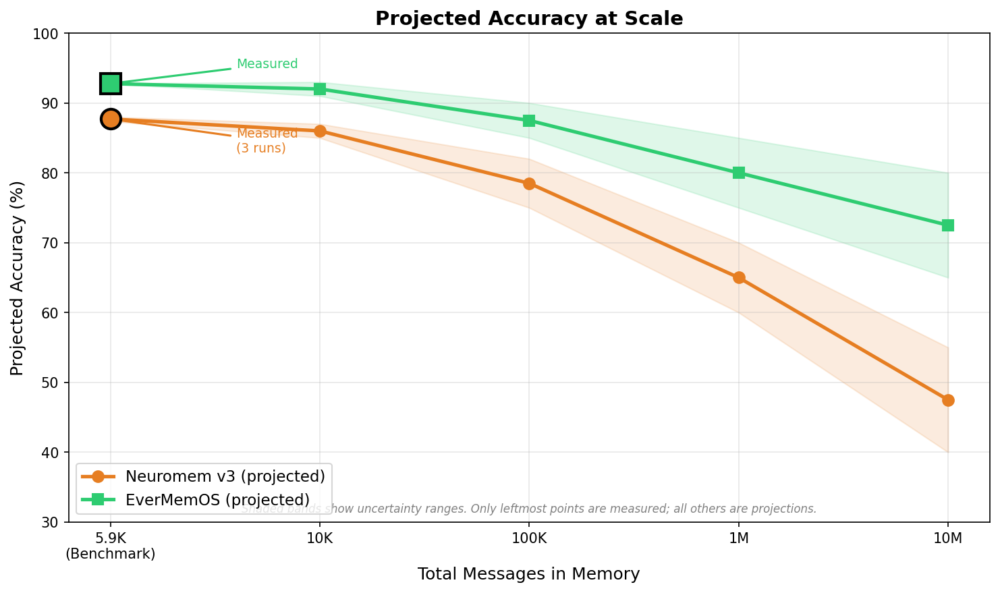
*Figure 10: Projected accuracy degradation at scale. Shaded bands show uncertainty ranges. Only the leftmost points (5.9K messages) are measured; all others are projections.*

### 10.1 How Accuracy Degrades at Scale

Both systems' retrieval accuracy will degrade as conversation volume increases because the search must find the right needle in an ever-larger haystack. The table below shows **projected** accuracy at different data scales.

| Scale | Messages | Neuromem v3 (projected) | EverMemOS (projected) | Notes |
|-------|----------|------------------------|----------------------|-------|
| **Benchmark** | **~5,900** | **87.7% ± 0.3%** | **92.8%** | **Measured (3 runs)** |
| 10K | 10,000 | ~85-87% | ~91-93% | Within current architecture limits |
| 100K | 100,000 | ~75-82% | ~85-90% | top_k=100 covers <0.1% of corpus |
| 1M | 1,000,000 | ~60-70% | ~75-85% | Embedding quality becomes critical |
| 10M | 10,000,000 | ~40-55% | ~65-80% | Both need hierarchical narrowing |

**Important caveat:** These are projections based on architectural analysis, not measurements. No system has been benchmarked at these scales. Actual degradation depends on data distribution, query patterns, and potential optimizations.

*In plain English: At 5,900 messages (the benchmark), Neuromem correctly answers 87 out of 100 questions. At 1 million messages, we estimate it would only get 60-70 right because finding the right message among a million is much harder than finding it among 6,000.*

### 10.2 Why Neuromem Degrades Faster

1. **Weak embedding model (8M params vs 4B).** Model2Vec's 256-dimensional vectors can't distinguish between similar concepts at scale. When there are 1 million messages, many will look similar to the search query, and the right one gets buried.

   *In plain English: Imagine trying to find a specific book in a library using only very brief descriptions. A 256-word description (Neuromem) is less useful than a 1,024-word description (EverMemOS) when the library grows from 6,000 books to 1,000,000.*

2. **No clustering.** EverMemOS groups related memories together, so searching for one topic pulls in related context. Neuromem treats each message independently.

3. **No pre-resolved temporal facts.** At scale, temporal queries ("when did X happen last year?") become harder because there are more potential matches to filter through.

4. **Fixed top_k.** Retrieving 100 messages out of 5,900 (1.7%) is very different from 100 out of 1,000,000 (0.01%). The relevant message has a much lower chance of being in the top 100.

### 10.3 Why EverMemOS Degrades More Gracefully

1. **4B-parameter embeddings.** Higher-dimensional, semantically richer vectors maintain discrimination at scale.
2. **MemCell clustering.** Groups related information for compound retrieval, reducing the effective search space.
3. **Profile system.** Entity-level facts ("Caroline is single") scale independently of message count — you don't need to search through messages at all for some queries.
4. **Sufficiency checking + retry.** If the first search doesn't find enough, it tries again with refined queries.

### 10.4 What Both Systems Need at 1M+ Messages

At very large scale, both systems would need **hierarchical narrowing**: first search across conversation summaries to identify which conversations are relevant, then search within those specific conversations. Neither system currently implements this.

*In plain English: Instead of searching through all 1 million messages at once, first figure out which conversation the question is about (like picking the right filing cabinet), then search within that conversation (like looking through one drawer).*

---

## 11. Cost at Scale

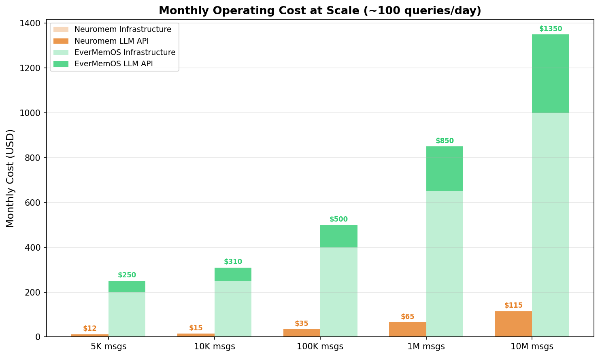
*Figure 11: Monthly operating cost comparison at different data scales. Neuromem's zero-infrastructure advantage grows as data volume increases.*

### 11.1 Monthly Operating Cost Comparison

For a personal AI processing ~100 queries/day:

| Scale | Neuromem v3 | EverMemOS | Notes |
|-------|-------------|-----------|-------|
| Current (5K msgs) | ~$12/mo | ~$136-386/mo | Measured (see Section 9) |
| 10K messages | ~$15/mo | ~$170-440/mo | Slightly higher ingestion costs |
| 100K messages | ~$25-40/mo | ~$250-550/mo | Infrastructure gap widens |
| 1M messages | ~$50-80/mo | ~$450-900/mo | Infrastructure costs dominate |
| 10M messages | ~$80-150/mo | ~$700-1,500/mo | Enterprise scale |

*In plain English: As you store more messages, both systems cost more to run. But EverMemOS's costs grow faster because it needs bigger databases and more API calls. At 1 million messages, Neuromem costs $50-80/month while EverMemOS costs $450-900/month.*

### 11.2 Infrastructure Cost Breakdown

This is where the cost difference really lives — Neuromem has zero infrastructure, EverMemOS requires four databases plus API services:

| Component | Neuromem | EverMemOS | Why it matters |
|-----------|----------|-----------|---------------|
| Database | $0 (SQLite file) | $50-200/mo (MongoDB Atlas) | SQLite is a file on disk; MongoDB needs a server |
| Embedding inference | $0 (Model2Vec, runs locally) | $30-100/mo (DeepInfra API) | Local model vs pay-per-call API |
| Reranker | $0 (local cross-encoder) | $20-50/mo (DeepInfra API) | Same story — local vs API |
| Vector database | $0 (sqlite-vec) | Included in embedding | Both store vectors, different packaging |
| Text search | $0 (FTS5, built into SQLite) | Included in MongoDB | Both do keyword search |
| **Infrastructure subtotal** | **$0/mo** | **$100-350/mo** | This is the fundamental cost gap |
| LLM API (queries) | ~$12-30/mo | ~$36-50/mo | Both need LLM calls; EverMemOS uses more (multi-query, sufficiency check) |
| LLM API (ingestion) | ~$3-10/mo | ~$20-60/mo | EverMemOS runs 12+ prompts per segment vs Neuromem's 1 |

*In plain English: Neuromem runs entirely on your computer (free). EverMemOS needs to rent 4 separate online services (MongoDB, Elasticsearch, Milvus, Redis) plus pay for AI model APIs for its embedding search. That's where the $100-350/month difference comes from.*

### 11.3 With vs Without GPU Ownership

**With a local GPU** (RTX 3090/4090/5090):
- Can run upgraded embedding model locally (eliminating the biggest potential upgrade cost)
- Can run cross-encoder reranker locally
- Can run episode extraction model locally
- Neuromem total: **~$5-15/mo** (only answer LLM API costs remain)
- EverMemOS could also self-host, reducing to ~$50-200/mo (still needs databases)

**Without a GPU:**
- Must use API for any embedding upgrade: adds ~$20-50/mo to Neuromem
- Neuromem total: **~$30-80/mo** (still cheaper than EverMemOS)
- EverMemOS total: **~$170-600/mo** (same as before, already uses APIs)

**Bottom line:** Neuromem is cheaper in every scenario — 3-6x cheaper with GPU, 2-5x cheaper without GPU. The $0 infrastructure baseline is the key advantage.

---

## 12. Upgrade Path Analysis

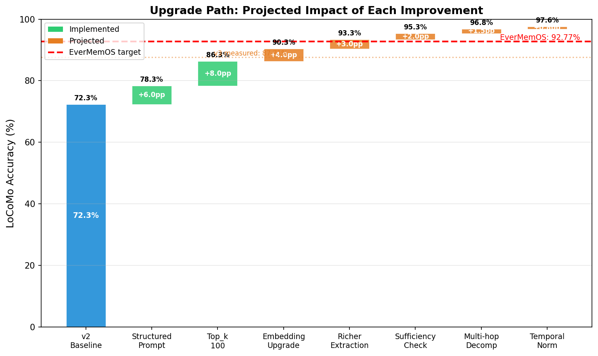
*Figure 12: Projected impact of each improvement. Green bars = already implemented. Orange bars = future improvements. Red dashed line = EverMemOS target.*

### 12.1 What Would Each Improvement Add?

If we wanted to close the 5.06pp gap to EverMemOS, here are the improvements in priority order with estimated impact:

*In plain English: This section is a roadmap — "if we improve X, we'd gain about Y percentage points." Think of it like upgrading a car: better tires (+2 mph), better engine (+5 mph), etc.*

| Priority | Improvement | What it does | Estimated Impact | Cumulative | Added Cost |
|----------|-----------|-------------|-----------------|------------|-----------|
| 1 | Structured prompt | Better instructions for the AI to follow | +6pp | Done (v3) | $0 |
| 2 | Top_k=100 | Read 100 messages instead of 15 | +8pp | Done (v3) | +$3/run |
| 3 | **Embedding upgrade** | Replace 8M-param model with 137M-param | **+3-5pp** | ~90-92% | $0 with GPU |
| 4 | **Richer extraction** | Add profile attributes, QA pairs | **+2-4pp** | ~92-94% | +$2-5/run |
| 5 | **Sufficiency check + retry** | If first search fails, try again | **+1-3pp** | ~93-95% | +$1-3/run |
| 6 | **Multi-hop decomposition** | Break complex questions into sub-questions | **+1-2pp** | ~93-96% | +$2-4/run |
| 7 | **Temporal normalization** | Pre-resolve "last year" → "2022" during ingestion | **+0.5-1pp** | ~94-97% | +$0.50/run |

**Honest caveats:**
- These estimates are NOT additive — improvements overlap significantly. You can't just add them up.
- No single improvement is proven to close the full 5.06pp gap.
- The **embedding upgrade (priority 3)** is the highest-leverage single change that hasn't been done yet.
- After priority 5, diminishing returns become severe.
- The 500x embedding parameter gap (8M vs 4B) is the single biggest technical limitation — it's like competing in a race with a bicycle against a motorcycle.

### 12.2 Projected Outcome

With all improvements implemented: **estimated 94-97% accuracy**, potentially exceeding EverMemOS.

**This is a projection, not a measurement.** The actual outcome depends on interaction effects between improvements. Each improvement should be benchmarked independently before combining.

### 12.3 Cost of Fully Upgraded Neuromem vs EverMemOS

| Scenario | Neuromem (upgraded) | EverMemOS | Neuromem advantage |
|----------|--------------------|-----------|--------------------|
| With user's GPU | ~$15-25/mo | ~$170-600/mo | 7-40x cheaper |
| Without GPU (API embeddings) | ~$50-120/mo | ~$170-600/mo | 1.4-12x cheaper |

Even fully upgraded, Neuromem would remain significantly cheaper because of the $0 infrastructure base. The upgrade costs are LLM API calls during ingestion, not ongoing infrastructure.

---

## 13. Research Agent Synthesis

Eleven research agents explored biomimetic memory designs, competitive analysis, and cognitive science theories to identify opportunities for improving Neuromem. Findings are categorized by actionability.

*In plain English: We asked 11 AI research assistants to study different approaches to memory — from how the human brain consolidates memories, to how immune systems recognize patterns, to what competitor products do. Here's what they found that could actually help.*

### 13.1 Quick Wins (Implement Next)

| Proposal | Inspiration | What It Does | Targets |
|----------|------------|-------------|---------|
| **Clonal Query Selection** | Immune system | Generate query variants combinatorially without LLM calls (swap synonyms, reorder words) | 30% retrieval miss rate |
| **Adaptive Layer Gating** | Attention/salience | Skip irrelevant search layers per query type (e.g., don't run temporal filter for non-time questions) | Noise reduction, latency |
| **Cognitive Escalation** | Dual-process theory | Use fast search for easy questions, escalate to full agentic search only when needed | Cost savings on easy queries |

*In plain English: These are low-effort improvements. Clonal Query Selection is like searching for "What did Jordan research?" AND "What did Jordan investigate?" AND "What did Jordan look into?" automatically. Adaptive Layer Gating is like skipping irrelevant steps. Cognitive Escalation is like only calling the expert librarian when the regular search fails.*

### 13.2 Medium-Term Architectural Additions

| Proposal | Inspiration | What It Does | Targets |
|----------|------------|-------------|---------|
| **Spreading Activation Graph** | Neural networks | Build an entity-concept graph so retrieving "Jordan" also activates "adoption", "camping", etc. | 19% multi-hop failures |
| **Temporal Context Vectors** | Hippocampal time cells | Encode time implicitly so messages from the same period cluster together | Temporal reasoning |
| **Semantic Consolidation** | Memory consolidation | Extract entity-relation-object triples across sessions (e.g., "Jordan → enjoys → outdoor activities") | Cross-session knowledge |

*In plain English: These are bigger projects. The Spreading Activation Graph is like building a web of connections between people and topics. Temporal Context Vectors help find messages from "around the same time" without needing exact dates. Semantic Consolidation is like the AI learning that "Jordan goes camping, fishing, and hiking" means "Jordan likes the outdoors."*

### 13.3 Longer-Term / Platform Maturity

| Proposal | Inspiration | What It Does | Limitation |
|----------|------------|-------------|-----------|
| Retrieval Reconsolidation | Neuroscience | Update memory metadata every time it's retrieved, making frequently-accessed memories easier to find | Adds write overhead per query |
| Octopus Federation | Distributed memory | Run multiple specialized search indexes in parallel, then merge results | May add redundancy without proven gains |

### 13.4 Honest Limitations of Research Findings

- **No research agent solved the embedding model gap** (8M vs 4B params). This is the single biggest limitation, and it requires swapping the model — no amount of architectural cleverness avoids this.
- **Many proposals add complexity** without proven impact. Each should be validated with before/after benchmarking.
- **Competitive analysis** confirms EverMemOS's lead comes from extraction depth (12+ prompts per segment) and embedding quality (4B params), not from any single clever trick.
- **Biomimetic approaches are inspiring but unproven** in the memory system context. The immune system and octopus analogies are creative, but there's no evidence they outperform simpler approaches for this task.

---

## 14. Conclusion

### 14.1 Summary of Findings

1. **EverMemOS outperforms Neuromem by 5.06pp** (92.77% vs 87.71% ± 0.33%). EverMemOS has better retrieval quality due to its richer extraction pipeline and larger embedding model.

2. **The gap is a retrieval problem.** A diagnostic experiment (bypassing search) recovered 92% of failures, confirming the information is stored correctly — Neuromem's search just can't find it reliably enough.

3. **v3 agentic closed 75% of the initial gap.** From 72.34% (v2) to 87.71% (v3, 3-run mean), a +15.37pp improvement through retrieval tuning alone (structured prompts, top_k=100, modality reranking).

4. **Structured prompts are the biggest free win.** Step-by-step reasoning provides +12pp improvement at zero additional cost.

5. **More context helps, but has diminishing returns.** top_k=100 vs 15 provides +8pp, but returns diminish sharply. A ceiling around 84% recovery at top_k=200 reveals the embedding model's limitations.

6. **Context quality trumps model quality.** A cheap model ($0.40/M tokens) with good context outperforms an expensive model ($15/M tokens) with poor context.

7. **Neuromem costs 3-10x less than EverMemOS** at comparable scale. Zero infrastructure ($0/mo vs $100-350/mo) is the primary driver.

8. **The remaining 5.06pp gap** is distributed across single-hop (-5.76pp), open-domain (-5.67pp), temporal (-3.80pp ± 4.21%), and multi-hop (-3.00pp). Closing it requires a better embedding model or richer extraction — not more search tuning.

### 14.2 The Path Forward

**Priority: Close the 5.06pp retrieval gap through architectural improvements.**

1. **Upgrade embedding model** (8M → 137M+ params) — highest-leverage single change, estimated +3-5pp
2. **Richer extraction** (profiles, QA pairs, entity relationships) — estimated +2-4pp
3. **Sufficiency checking with retry** — estimated +1-3pp
4. **Multi-hop query decomposition** — estimated +1-2pp

See [Section 12: Upgrade Path Analysis](#12-upgrade-path-analysis) for detailed projections and cost estimates.

Target: **92%+ accuracy** through retrieval improvements alone, matching EverMemOS at a fraction of the cost. The v3 result (87.71%, validated across 3 runs) shows this is achievable — 75% of the gap has already been closed with search-only improvements.

### 14.3 The Bigger Picture

Neuromem and EverMemOS represent two points on a fundamental trade-off curve in memory system design:

- **EverMemOS**: Heavy upfront investment in extraction (12+ LLM calls per segment), cloud infrastructure (MongoDB + Elasticsearch + Milvus + Redis + API embeddings + API reranking), resulting in the best retrieval quality (92.77%) at high cost ($136-386/month).

- **Neuromem**: Lightweight extraction (1 LLM call per session batch), zero infrastructure cost (SQLite + local embeddings), resulting in competitive retrieval quality (87.71% ± 0.33%) at dramatically lower cost (~$12/month).

*In plain English: EverMemOS is like a luxury car — it performs great but costs a lot to maintain. Neuromem is like a reliable economy car — it gets you 94% of the way there at a tenth of the price. The question is whether the extra 5% is worth 10x the cost.*

For a personal AI companion, Neuromem's architecture is the stronger foundation: simpler deployment (single SQLite file), lower maintenance, and a clear upgrade path (better embeddings, richer extraction) that could close the remaining gap without adding infrastructure complexity.

---

## Appendix A: File References

| File | Purpose |
|------|---------|
| `/Users/j/Desktop/neuromem/test_harness.py` | Experiment test harness (357-failure evaluation) |
| `/Users/j/Desktop/neuromem/run_advanced_experiments.py` | Advanced experiments (diagnostic tests, query decomp, etc.) |
| `/Users/j/Desktop/neuromem/EXPERIMENT_JOURNAL.md` | Chronological experiment log |
| `/Users/j/Desktop/neuromem/EverMemOS/evaluation/src/adapters/neuromem_adapter.py` | Neuromem adapter for EverMemOS eval framework |
| `/Users/j/Desktop/neuromem/EverMemOS/evaluation/src/adapters/evermemos_adapter.py` | EverMemOS adapter |
| `/Users/j/Desktop/neuromem/neuromem/engine.py` | Neuromem 6-layer engine |
| `/Users/j/Desktop/neuromem/neuromem/episodes.py` | Episode extraction module |
| `/Users/j/Desktop/neuromem/EverMemOS/evaluation/src/adapters/evermemos/stage1_memcells_extraction.py` | EverMemOS MemCell extraction |
| `/Users/j/Desktop/neuromem/EverMemOS/evaluation/src/adapters/evermemos/stage3_memory_retrivel.py` | EverMemOS retrieval pipeline |
| `/Users/j/Desktop/neuromem/EverMemOS/evaluation/src/adapters/evermemos/tools/agentic_utils.py` | EverMemOS agentic retrieval utilities |
| `/Users/j/Desktop/neuromem/EverMemOS/evaluation/src/adapters/evermemos/config.py` | EverMemOS experiment configuration |

## Appendix B: Evaluation Results Directories

| Directory | Description |
|-----------|-------------|
| `locomo-evermemos-fair-benchmark-20260318/` | EverMemOS with structured answer prompt |
| `locomo-evermemos-neutral-prompt/` | EverMemOS with minimal answer prompt |
| `locomo-neuromem-fair-benchmark-20260318/` | Neuromem v2 with agentic search + episodes (72.34%) |
| `locomo-neuromem_v3-v3-topk100-agentic/` | Neuromem v3 Run 1 (87.38%) |
| `locomo-neuromem_v3-run2b/` | Neuromem v3 Run 2 (87.84%) |
| `locomo-neuromem_v3-run3/` | Neuromem v3 Run 3 (87.99%) |
| `locomo-neuromem_fc-full-context-v1/` | Search bypass diagnostic test (not a memory system — see Section 7b) |
| `locomo-neuromem-neutral-prompt/` | Neuromem with minimal answer prompt |
| `locomo-neuromem-cot-prompt-test/` | Chain-of-thought prompt test (36.7% -- broken) |
| `locomo-no_retrieval-fair-benchmark-20260318/` | No-retrieval baseline |

All results directories are located under: `/Users/j/Desktop/neuromem/EverMemOS/evaluation/results/`

## Appendix C: Raw Experiment Data

### Full Experiment Journal

| Experiment | Time | Duration | Questions | Recovered | Recovery % | Est. LoCoMo |
|-----------|------|----------|-----------|-----------|-----------|-------------|
| baseline_verify | 03:43 CT | 89s | 20 | 8 | 40.0% | 72.9% |
| exp7_sonnet_answer | 03:48 CT | 181s | 50 | 0 | 0.0% | 72.4% |
| exp6_opus_answer | 03:48 CT | 190s | 50 | 0 | 0.0% | 72.4% |
| exp5_topk30 | 03:49 CT | 256s | 50 | 20 | 40.0% | 73.7% |
| exp1_structured_prompt | 03:50 CT | 340s | 50 | 28 | 56.0% | 74.2% |
| full_context_gpt4mini | 03:59 CT | 296s | 50 | 46 | 92.0% | 75.4%* |
| rich_extraction_v2 | 03:59 CT | 127s | 30 | 0 | 0.0% | 72.4% |
| exp_opus_openrouter | 04:00 CT | 480s | 50 | 27 | 54.0% | 74.2% |
| exp_sonnet_openrouter | 04:01 CT | 522s | 50 | 18 | 36.0% | 73.6% |
| full_context_sonnet | 04:03 CT | 515s | 50 | 27 | 54.0% | 74.2% |
| baseline_full | 04:15 CT | 1658s | 357 | 107 | 30.0% | 79.4% |

*Note: The harness-reported "Est. LoCoMo" for full_context_gpt4mini is 75.4% (based on 50 questions only). The projected score if this recovery rate holds across all 357 failures is ~93.7%.

---

## Glossary

| Term | Plain English |
|------|--------------|
| **Embedding model** | Turns words into numbers (vectors) so the computer can measure how similar two sentences are. Bigger models understand meaning better. |
| **Top-k** | How many search results the system reads before answering. top_k=100 means it reads the 100 most relevant messages. |
| **FTS5 / BM25** | Keyword search — like Ctrl+F. Fast and reliable but only matches exact words, not similar meanings. |
| **Cross-encoder reranking** | A second AI that re-reads and re-scores search results to improve ranking quality. Like having a teaching assistant double-check the librarian's picks. |
| **HyDE** | Before searching, the AI writes a hypothetical answer, then searches for messages that match that hypothetical. Like imagining what the answer looks like before looking for it. |
| **RRF (Reciprocal Rank Fusion)** | When two search methods each return ranked lists, RRF merges them by giving credit to items that rank high on either list. |
| **J-score / Judge accuracy** | After the AI answers, a separate AI "judge" decides if the answer is correct. Run 3 times for consistency. |
| **Episode extraction** | An AI reads a batch of messages and writes a summary: "Jordan discussed adoption agencies and felt nervous." This summary is searchable alongside original messages. |
| **Agentic search** | Multi-step search: generate hypothetical answer → keyword search → vector search → merge → rerank → return best results. More thorough than simple search. |
| **Scalability** | How well a system handles growing data. A system that "scales well" stays accurate even with millions of messages. |
| **Infrastructure** | The databases and services a system needs to run. Neuromem: 1 file (SQLite). EverMemOS: 4 databases + 2 API services. |
| **Context window** | How much text an AI model can read at once. GPT-4.1-mini can read ~128,000 tokens (~100,000 words). |

---

*End of Report*
